# TBSM WEB — Sistem Informasi Akademik & Bursa Kerja Khusus (BKK)
### Konsentrasi Keahlian Teknik dan Bisnis Sepeda Motor (TBSM) — SMK Negeri 1 Bangsri
*Binaan Resmi PT Astra Honda Motor (AHM)*

[](https://laravel.com)
[](https://filamentphp.com)
[](https://tailwindcss.com)
[](https://php.net)
[](https://mariadb.org)
[](https://vitejs.dev)

---

## Daftar Isi
1. [Gambaran Umum Proyek](#1-gambaran-umum-proyek)
2. [Flowchart Sistem Lengkap](#2-flowchart-sistem-lengkap)
   - [A. Flowchart Pengunjung Publik (User)](#a-flowchart-pengunjung-publik-user)
   - [B. Flowchart Administrator (Admin Panel)](#b-flowchart-administrator-admin-panel)
3. [Entity Relationship Diagram (ERD) Lengkap](#3-entity-relationship-diagram-erd-lengkap)
4. [Kamus Data Basis Data (Data Dictionary)](#4-kamus-data-basis-data-data-dictionary)
5. [Daftar Modul & Fitur Utama](#5-daftar-modul--fitur-utama)
   - [A. Frontend Publik](#a-frontend-publik)
   - [B. Backend Filament Admin Panel](#b-backend-filament-admin-panel)
6. [Teknologi & Spesifikasi Sistem](#6-teknologi--spesifikasi-sistem)
7. [Panduan Instalasi & Deployment](#7-panduan-instalasi--deployment)
8. [Struktur Direktori Proyek](#8-struktur-direktori-proyek)
9. [Daftar Rute Sistem (Route Directory)](#9-daftar-rute-sistem-route-directory)
10. [Panduan Pemeliharaan & Perintah CLI](#10-panduan-pemeliharaan--perintah-cli)

---

## 1. Gambaran Umum Proyek

**TBSM WEB** adalah Sistem Informasi Vokasi dan Manajemen Bursa Kerja Khusus (BKK) terpadu yang dirancang khusus untuk **Konsentrasi Keahlian Teknik dan Bisnis Sepeda Motor (TBSM) SMK Negeri 1 Bangsri**. Sekolah ini merupakan institusi kejuruan binaan resmi **PT Astra Honda Motor (AHM)**.

Sistem ini memadukan:
1. **Showcase Profil Vokasi Modern:** Kurikulum berbasis industri (*Kurikulum Merdeka & Standar Honda*), sarana bengkel standar AHASS, direktori guru bersertifikasi, dan galeri prestasi.
2. **Ekosistem Hubin & BKK (Link and Match):** Portal lowongan pekerjaan khusus alumni, direktori kemitraan MoU industri, pelacakan tempat Praktik Kerja Lapangan (PKL), serta *Tracer Study* keterserapan alumni (*Bekerja, Melanjutkan, Wirausaha / BMW*).
3. **Pusat Informasi & Layanan Publik:** Artikel berita, pengumuman resmi berlampiran, pusat unduhan berkas silabus/dokumen, galeri album foto/video, serta formulir kontak dengan pembatasan laju (*rate limiting*).

---

## 2. Flowchart Sistem Lengkap

> [!TIP]
> Dokumen mandiri lengkap khusus Flowchart User, Flowchart Admin, ERD Komprehensif, dan Kamus Data 26 tabel juga telah diekspor ke file markdown tersendiri: [FLOWCHART_DAN_ERD.md](FLOWCHART_DAN_ERD.md) dan [docs/FLOWCHART_DAN_ERD.md](docs/FLOWCHART_DAN_ERD.md).

### A. Flowchart Pengunjung Publik (User)

Diagram alur berikut menggambarkan seluruh perjalanan pengunjung (calon siswa, orang tua, siswa aktif, alumni, dan mitra industri) saat menelusuri website:

```mermaid
flowchart TD
    Start([Pengunjung Mengakses Website]) --> Landing[Akses Halaman Beranda /]
    
    Landing --> NavbarAction{Navigasi Navbar}
    
    %% Navigasi Utama
    NavbarAction -->|Klik Beranda| HeroSlider[Tampilan Beranda: Hero Slider, Statistik, 4 Pilar, Prestasi, Mitra]
    NavbarAction -->|Hover / Klik Beranda| SubnavBeranda[Sub-Navbar Horisontal Beranda: 01 Profil s/d 07 Instruktur]
    SubnavBeranda --> SmoothScroll[Scroll Halus Otomatis ke Section Pilihan]
    
    NavbarAction -->|Tentang| AboutPage[Halaman Profil /tentang]
    AboutPage --> AboutSections[Sejarah, Visi & Misi, Karakter Lulusan, Pimpinan Jurusan, Budaya 5S/5R]
    
    NavbarAction -->|Akademik| AcademicSubmenu{Pilih Menu Akademik}
    AcademicSubmenu -->|Program Keahlian| ProgramPage[Halaman Program /akademik/program]
    ProgramPage --> ModalSilabus[Klik 'Ringkasan Silabus PDF' -> Modal Dialog Alokasi JP & Download Silabus]
    ProgramPage --> CurriTab[Tab Peta Kurikulum: Fase E Kelas X, Fase F Kelas XI, Kelas XII Magang]
    ProgramPage --> CertifSection[Spesifikasi 4 Pilar & Lisensi Sertifikasi BNSP / AHM]
    AcademicSubmenu -->|Dewan Guru| TeacherPage[Direktori Guru /akademik/guru]
    TeacherPage --> TeacherDetail[Profil Pendidik, NIP, Spesialisasi & Sertifikasi Keahlian]
    AcademicSubmenu -->|Fasilitas Bengkel| FacilityPage[Galeri Fasilitas Bengkel /akademik/fasilitas]
    FacilityPage --> FacilityModal[Spesifikasi Alat AHASS, Lift Hidrolik, Alat Scanner HIDS, Standar K3]

    NavbarAction -->|Prestasi| AchievementPage[Katalog Prestasi /prestasi]
    AchievementPage --> FilterLevel[Filter Level: Sekolah, Kabupaten, Provinsi, Nasional, Internasional]
    FilterLevel --> AchievementDetail[Detail Prestasi /prestasi/slug & Foto Pendukung Dokumentasi]

    NavbarAction -->|Industri / Hubin| IndustrySubmenu{Pilih Menu Industri & BKK}
    IndustrySubmenu -->|Mitra Industri| PartnerPage[Direktori Mitra Industri /mitra-industri]
    PartnerPage --> PartnerDetail[Detail Kemitraan /mitra-industri/slug: MoU, Profil DUDI, Cabang Bengkel AHASS]
    IndustrySubmenu -->|Lowongan Kerja| JobPage[Portal Lowongan Kerja BKK /lowongan]
    JobPage --> JobFilter[Filter Posisi, Tipe Kerja Onsite/Hybrid, Rentang Gaji]
    JobFilter --> JobDetail[Detail Lowongan /lowongan/slug: Syarat, Deskripsi, Tombol Lamar via Email/URL]
    IndustrySubmenu -->|Magang PKL| InternshipPage[Informasi PKL Siswa /pkl]
    InternshipPage --> InternshipDetail[Detail Penempatan /pkl/id: Nama Bengkel, Mentor, Daftar Siswa Peserta]

    NavbarAction -->|Alumni| AlumniPage[Tracer Study Alumni /alumni]
    AlumniPage --> AlumniFilter[Filter Tahun Lulus & Status BMW: Bekerja, Melanjutkan, Wirausaha]
    AlumniFilter --> AlumniDetail[Profil Sukses Alumni /alumni/slug: Pekerjaan, Perusahaan, Kisah Sukses]

    NavbarAction -->|Galeri| GalleryPage[Pusat Galeri Media /galeri]
    GalleryPage --> AlbumFilter[Pilih Album Kegiatan]
    AlbumFilter --> AlbumDetail[Detail Album /galeri/slug: Lightbox Foto & Video Praktik]

    NavbarAction -->|Unduhan| DownloadPage[Pusat Berkas & Dokumen /unduhan]
    DownloadPage --> DownloadCat[Filter Kategori: Modul, Brosur, Formulir]
    DownloadCat --> FileDownload[Klik Unduh /download/slug/file -> Counter Download Bertambah Otomatis]

    NavbarAction -->|Hubungi Kami| ContactPage[Halaman Kontak /kontak]
    ContactPage --> FillForm[Pengunjung Mengisi Form: Nama, Email, Subjek, Pesan]
    FillForm --> ValidateForm{Validasi Data & Rate Limit 5 req/min}
    ValidateForm -->|Gagal / Melebihi Batas| ShowError[Tampilkan Pesan Peringatan Validasi / Throttle]
    ValidateForm -->|Sukses| SaveMessage[Pesan Masuk ke Tabel contact_messages & Muncul Notifikasi Sukses]

    ShowError --> FillForm
    SaveMessage --> EndUser([Selesai Interaksi Pengunjung])
```



---

### B. Flowchart Administrator (Admin Panel)

Diagram alur berikut menggambarkan alur kerja pengelola sistem melalui Filament Admin Panel:

```mermaid
flowchart TD
    AdminStart([Administrator Membuka Browser]) --> AdminLogin[Akses URL /admin/login]
    AdminLogin --> InputCreds[Input Email & Password]
    InputCreds --> AuthCheck{Autentikasi & Otorisasi Spatie Role 'admin'}
    
    AuthCheck -->|Kredensial Salah / Tidak Berhak| LoginFailed[Tampilkan Pesan Kesalahan Autentikasi]
    LoginFailed --> InputCreds
    
    AuthCheck -->|Otorisasi Berhasil| AdminDashboard[Masuk ke Filament Admin Dashboard /admin]
    
    AdminDashboard --> AdminMenu{Pilih Menu Kelola}

    %% Menu 1: Profil & Akademik
    AdminMenu -->|Profil & Akademik| ModulAkademik{Pilih Sub-Menu}
    ModulAkademik -->|Kelola Halaman Program| PageManageProg[ManageAcademicPrograms: 4 Tab Sticky Save]
    PageManageProg --> Tab1[Tab 1: Hero, Badge, Rasio 70:30, Mitra Utama]
    PageManageProg --> Tab2[Tab 2: 4 Pilar Kompetensi, Silabus PDF, Peta Kurikulum X-XII]
    PageManageProg --> Tab3[Tab 3: 6 Program Unggulan, 3 Sertifikasi BNSP/AHM]
    PageManageProg --> Tab4[Tab 4: 3 Jalur Karir, Roadmap 3 Tahun, Banner CTA]
    ModulAkademik -->|Master Program Studi| CrudProgram[CRUD Programs & Relasi Competencies]
    ModulAkademik -->|Direktori Guru| CrudTeachers[CRUD Teachers: NIP, Spesialisasi, Status Kajur, Foto]
    ModulAkademik -->|Fasilitas Bengkel| CrudFacilities[CRUD Facilities: Kategori, K3, Kapasitas, Foto Bengkel]
    ModulAkademik -->|Kelola Halaman Fasilitas| PageManageFac[ManageAcademicFacilities: Header & Deskripsi Fasilitas]

    %% Menu 2: Hubin & BKK
    AdminMenu -->|Hubin & BKK| ModulBKK{Pilih Sub-Menu}
    ModulBKK -->|Mitra Industri| CrudPartners[CRUD IndustryPartners: Profil DUDI, MoU Number, Logo]
    CrudPartners --> CrudBranches[CRUD IndustryPartnerBranches: Alamat Cabang, Google Maps, Kuota PKL]
    ModulBKK -->|Perjanjian Kerjasama| CrudMoU[CRUD Partnerships: Jenis Kerjasama, File Dokumen, Masa Berlaku]
    ModulBKK -->|Lowongan Kerja BKK| CrudJobs[CRUD JobVacancies: Kualifikasi, Tipe Kerja, Deadline, Link Lamar]
    ModulBKK -->|Praktik Kerja Lapangan| CrudPKL[CRUD Internships: Periode Magang & InternshipParticipants]
    ModulBKK -->|Tracer Study Alumni| CrudAlumni[CRUD Alumni: Status BMW, Perusahaan, Kisah Sukses, Foto]
    ModulBKK -->|Kelola Halaman Industri| PageManageInd[ManageIndustryPage: Statistik Serapan & Konten Hubin]

    %% Menu 3: Publikasi & Media
    AdminMenu -->|Publikasi & Media| ModulMedia{Pilih Sub-Menu}
    ModulMedia -->|Artikel & Berita| CrudPosts[CRUD Posts: Rich Editor, Kategori, Tags, Thumbnail, Status Draft/Publish]
    ModulMedia -->|Pengumuman Resmi| CrudAnnounce[CRUD Announcements: Judul, Isi, File Attachment, Toggle Aktif]
    ModulMedia -->|Katalog Prestasi| CrudAchieve[CRUD Achievements: Tingkat Lomba, Peringkat, Foto Pendukung]
    ModulMedia -->|Galeri Foto/Video| CrudGallery[CRUD GalleryAlbums & GalleryItems: Aspect Ratio, Video URL]
    ModulMedia -->|Pusat Unduhan| CrudDownloads[CRUD DownloadCategories & Downloads: File Storage, Counter Reset]

    %% Menu 4: Pesan & Pengaturan
    AdminMenu -->|Pesan & Pengaturan| ModulSettings{Pilih Sub-Menu}
    ModulSettings -->|Kotak Pesan Masuk| ViewMessages[Lihat ContactMessages: Baca Pesan Pengunjung, Tandai Sudah Dibaca]
    ModulSettings -->|Hero Slider Beranda| PageHeroSlider[ManageHeroSlider: Tambah/Edit Slide Gambar, Heading, Tombol CTA]
    ModulSettings -->|Header Sub-Halaman| PageHeaders[ManagePageHeaders: Kustomisasi Gambar Banner per Halaman]
    ModulSettings -->|Pengaturan Identitas| PageSettings[ManageSettings: Site Name, Logo, Kontak WhatsApp, Medsos, Alamat]
    ModulSettings -->|Audit Log Aktivitas| ViewActivityLog[ActivityLog: Rekam Jejak Admin, Event Insert/Update/Delete]

    %% Alur Penyimpanan
    Tab1 & Tab2 & Tab3 & Tab4 --> SaveDB[(Simpan ke Database MariaDB)]
    CrudProgram & CrudTeachers & CrudFacilities & PageManageFac --> SaveDB
    CrudPartners & CrudBranches & CrudMoU & CrudJobs & CrudPKL & CrudAlumni & PageManageInd --> SaveDB
    CrudPosts & CrudAnnounce & CrudAchieve & CrudGallery & CrudDownloads --> SaveDB
    ViewMessages & PageHeroSlider & PageHeaders & PageSettings --> SaveDB

    SaveDB --> LogActivity[Spatie ActivityLog Mencatat Transaksi Otomatis]
    LogActivity --> FeedbackNotification[Tampilkan Notifikasi Sukses Filament]
    
    FeedbackNotification --> AdminMenu
    AdminDashboard -->|Klik Keluar| AdminLogout[Logout & Invalidate Session]
    AdminLogout --> AdminEnd([Kembali ke Form Login])
```



---

## 3. Entity Relationship Diagram (ERD) Lengkap

Diagram relasi entitas berikut memetakan seluruh tabel basis data, tipe data, kunci primer, kunci asing, dan kardinalitas relasi antar-entitas:

```mermaid
erDiagram
    USERS ||--o{ POSTS : "menulis (user_id)"
    USERS ||--o| TEACHERS : "akun profil (user_id)"
    USERS ||--o| ALUMNI : "akun alumni (user_id)"
    USERS ||--o{ ACTIVITY_LOG : "melakukan aksi (causer_id)"

    CATEGORIES ||--o{ POSTS : "mengelompokkan (category_id)"
    CATEGORIES ||--o{ ACHIEVEMENTS : "kategori prestasi (category_id)"

    POSTS ||--|{ POST_TAG : "memiliki tag"
    TAGS ||--|{ POST_TAG : "dilekatkan ke post"

    PROGRAMS ||--o{ COMPETENCIES : "memiliki kompetensi (program_id)"

    ACHIEVEMENTS ||--o{ ACHIEVEMENT_PARTICIPANTS : "diikuti oleh (achievement_id)"

    INDUSTRY_PARTNERS ||--o{ INDUSTRY_PARTNER_BRANCHES : "memiliki cabang (industry_partner_id)"
    INDUSTRY_PARTNERS ||--o{ PARTNERSHIPS : "memiliki MoU (industry_partner_id)"
    INDUSTRY_PARTNERS ||--o{ INTERNSHIPS : "tempat PKL (industry_partner_id)"
    INDUSTRY_PARTNERS ||--o{ JOB_VACANCIES : "membuka lowongan (industry_partner_id)"

    PARTNERSHIPS ||--o{ INTERNSHIPS : "dasar hukum magang (partnership_id)"
    INTERNSHIPS ||--o{ INTERNSHIP_PARTICIPANTS : "diikuti siswa (internship_id)"

    GALLERY_ALBUMS ||--o{ GALLERY_ITEMS : "memuat dokumentasi (gallery_album_id)"

    DOWNLOAD_CATEGORIES ||--o{ DOWNLOADS : "mengelompokkan berkas (download_category_id)"

    USERS {
        bigint id PK
        varchar name
        varchar email UK
        timestamp email_verified_at
        varchar password
        varchar remember_token
        timestamp created_at
        timestamp updated_at
    }

    POSTS {
        bigint id PK
        varchar title
        varchar slug UK
        text excerpt
        longtext content
        varchar thumbnail
        enum status "draft, review, published"
        timestamp published_at
        bigint user_id FK
        bigint category_id FK
        timestamp created_at
        timestamp updated_at
    }

    CATEGORIES {
        bigint id PK
        varchar name
        varchar slug UK
        text description
        timestamp created_at
        timestamp updated_at
    }

    TAGS {
        bigint id PK
        varchar name
        varchar slug UK
        timestamp created_at
        timestamp updated_at
    }

    POST_TAG {
        bigint id PK
        bigint post_id FK
        bigint tag_id FK
    }

    ANNOUNCEMENTS {
        bigint id PK
        varchar title
        varchar slug UK
        longtext content
        varchar file_attachment
        tinyint is_active
        timestamp created_at
        timestamp updated_at
    }

    PROGRAMS {
        bigint id PK
        varchar name UK
        varchar slug UK
        varchar code
        varchar badge_text
        varchar specialization
        varchar specialization_tag
        text description
        text facility_description
        text lab_equipments
        longtext partners
        longtext industry_partners
        longtext partner_badges
        varchar thumbnail
        timestamp created_at
        timestamp updated_at
    }

    COMPETENCIES {
        bigint id PK
        bigint program_id FK
        varchar name
        varchar slug UK
        text description
        timestamp created_at
        timestamp updated_at
    }

    TEACHERS {
        bigint id PK
        bigint user_id FK
        varchar name
        varchar nip UK
        varchar position
        varchar specialization
        text bio
        tinyint is_head_of_department
        tinyint is_active
        varchar phone
        varchar photo
        timestamp created_at
        timestamp updated_at
    }

    FACILITIES {
        bigint id PK
        varchar name UK
        varchar slug UK
        varchar category
        text description
        text specifications
        varchar photo
        int quantity
        varchar capacity
        varchar safety_standards
        enum condition "good, fair, poor"
        int sort_order
        tinyint is_featured
        timestamp created_at
        timestamp updated_at
    }

    ACHIEVEMENTS {
        bigint id PK
        bigint category_id FK
        varchar title
        varchar slug UK
        enum level "school, district, city, province, national, international"
        varchar rank
        varchar organizer
        date date
        text description
        varchar photo
        longtext supporting_photos
        enum status "draft, published, archived"
        timestamp published_at
        varchar meta_title
        text meta_description
        timestamp created_at
        timestamp updated_at
    }

    ACHIEVEMENT_PARTICIPANTS {
        bigint id PK
        bigint achievement_id FK
        varchar student_name
        varchar student_id
        timestamp created_at
        timestamp updated_at
    }

    INDUSTRY_PARTNERS {
        bigint id PK
        varchar name UK
        varchar slug UK
        varchar industry_type
        text description
        varchar address
        varchar phone
        varchar email
        varchar website
        varchar mou_number
        date mou_start_date
        date mou_end_date
        varchar partnership_level
        varchar headquarters_city
        text curriculum_sync_info
        varchar logo
        varchar banner_image
        enum status "draft, published, archived"
        timestamp published_at
        varchar meta_title
        text meta_description
        timestamp created_at
        timestamp updated_at
    }

    INDUSTRY_PARTNER_BRANCHES {
        bigint id PK
        bigint industry_partner_id FK
        varchar name
        varchar branch_code
        varchar district
        varchar city
        text address
        varchar phone
        varchar whatsapp
        varchar google_maps_url
        varchar pic_name
        varchar pic_phone
        varchar internship_quota
        text facilities
        varchar photo
        tinyint is_main_branch
        tinyint is_active
        int sort_order
        timestamp created_at
        timestamp updated_at
    }

    PARTNERSHIPS {
        bigint id PK
        bigint industry_partner_id FK
        enum type "mou, internship, recruitment"
        varchar title
        date start_date
        date end_date
        text description
        varchar document_file
        enum status "active, expired, terminated"
        timestamp created_at
        timestamp updated_at
    }

    INTERNSHIPS {
        bigint id PK
        bigint industry_partner_id FK
        bigint partnership_id FK
        varchar title
        date start_date
        date end_date
        varchar status
        text description
        timestamp created_at
        timestamp updated_at
    }

    INTERNSHIP_PARTICIPANTS {
        bigint id PK
        bigint internship_id FK
        varchar student_name
        varchar student_id
        varchar role
        enum status "active, completed, dropped"
        timestamp created_at
        timestamp updated_at
    }

    JOB_VACANCIES {
        bigint id PK
        bigint industry_partner_id FK
        varchar title
        varchar slug UK
        varchar position
        longtext description
        text requirements
        text responsibilities
        varchar location
        varchar work_type
        varchar employment_type
        decimal salary_min
        decimal salary_max
        varchar salary_text
        varchar application_email
        varchar application_url
        datetime application_deadline
        date deadline
        varchar status
        timestamp published_at
        timestamp created_at
        timestamp updated_at
    }

    ALUMNI {
        bigint id PK
        bigint user_id FK
        varchar name
        varchar slug UK
        varchar student_id UK
        int graduation_year
        varchar photo
        tinyint is_public
        tinyint is_featured
        int featured_order
        varchar status
        varchar city
        varchar education
        varchar current_occupation
        varchar current_company
        text bio
        text achievements
        text success_story
        timestamp published_at
        varchar meta_title
        text meta_description
        timestamp created_at
        timestamp updated_at
    }

    GALLERY_ALBUMS {
        bigint id PK
        varchar title
        varchar slug UK
        text description
        date event_date
        varchar location
        varchar thumbnail
        varchar status
        int sort_order
        timestamp published_at
        varchar meta_title
        text meta_description
        timestamp created_at
        timestamp updated_at
    }

    GALLERY_ITEMS {
        bigint id PK
        bigint gallery_album_id FK
        varchar file_path
        varchar title
        varchar alt_text
        tinyint is_featured
        int sort_order
        enum type "image, video"
        varchar aspect_ratio
        text description
        timestamp created_at
        timestamp updated_at
    }

    DOWNLOAD_CATEGORIES {
        bigint id PK
        varchar name
        varchar slug UK
        text description
        timestamp created_at
        timestamp updated_at
    }

    DOWNLOADS {
        bigint id PK
        bigint download_category_id FK
        varchar title
        varchar slug UK
        text description
        varchar file_path
        varchar file_name
        varchar file_type
        bigint file_size
        varchar status
        tinyint is_public
        bigint download_count
        int sort_order
        timestamp published_at
        varchar meta_title
        text meta_description
        timestamp created_at
        timestamp updated_at
    }

    CONTACT_MESSAGES {
        bigint id PK
        varchar name
        varchar email
        varchar subject
        text message
        tinyint is_read
        timestamp created_at
        timestamp updated_at
    }

    SETTINGS {
        bigint id PK
        varchar key UK
        text value
        varchar type
        timestamp created_at
        timestamp updated_at
    }

    ACTIVITY_LOG {
        bigint id PK
        varchar log_name
        text description
        varchar subject_type
        bigint subject_id
        varchar event
        varchar causer_type
        bigint causer_id
        longtext properties
        uuid batch_uuid
        timestamp created_at
        timestamp updated_at
    }
```



---

## 4. Kamus Data Basis Data (Data Dictionary)

Berikut rincian ringkas seluruh tabel utama dalam sistem basis data:

| Nama Tabel | Peran & Deskripsi | Relasi Entitas |
| :--- | :--- | :--- |
| `users` | Akun pengguna sistem (Administrator dan Editor) | Memiliki relasi 1:M ke `posts`, 1:1 ke `teachers`, dan 1:1 ke `alumni`. |
| `posts` | Artikel berita, liputan kegiatan bengkel, dan edukasi otomotif | Berelasi Many-to-One ke `categories` dan Many-to-Many ke `tags`. |
| `categories` | Kategori taksonomi untuk artikel berita dan pengelompokan prestasi | Berelasi 1:M ke `posts` dan `achievements`. |
| `tags` & `post_tag` | Tagar penanda topik artikel berita | Tabel pivot relasi Many-to-Many antara `posts` dan `tags`. |
| `announcements` | Pengumuman resmi akademik dan pembekalan industri | Berisi informasi penting dengan lampiran dokumen berkas resmi. |
| `programs` | Master data konsentrasi keahlian TBSM | Memiliki relasi 1:M ke tabel `competencies`. |
| `competencies` | Butir spesifikasi capaian teknis turunan program keahlian | Relasi Many-to-One dengan tabel `programs`. |
| `teachers` | Data dewan guru dan instruktur bersertifikasi | Relasi opsional ke `users`; memuat penanda kepala jurusan (*is_head_of_department*). |
| `facilities` | Inventaris sarana bengkel praktik standar AHASS | Memuat detail kapasitas, kondisi alat, dan foto sarana laboratorium. |
| `achievements` | Katalog capaian prestasi dan kejuaraan siswa | Berelasi Many-to-One ke `categories` dan 1:M ke `achievement_participants`. |
| `achievement_participants` | Nama-nama siswa peraih medali dalam setiap ajang | Relasi Many-to-One ke tabel induk `achievements`. |
| `industry_partners` | Direktori mitra industri dan DUDI (Astra Honda Motor, dll.) | Memiliki relasi 1:M ke cabang, MoU, PKL, dan lowongan kerja. |
| `industry_partner_branches` | Sebaran jaringan bengkel AHASS dan kantor cabang rekanan | Menyimpan alamat detail, Google Maps URL, PIC, dan kuota magang siswa. |
| `partnerships` | Perjanjian kerjasama (MoU), magang, dan rekrutmen | Relasi Many-to-One ke `industry_partners` dan 1:M ke `internships`. |
| `internships` | Program Praktik Kerja Lapangan (PKL) terjadwal | Berelasi ke mitra industri dan memiliki relasi 1:M ke peserta siswa. |
| `internship_participants` | Daftar siswa yang ditempatkan pada program PKL terkait | Menyimpan NISN/ID siswa, peran mekanik, dan status penyelesaian PKL. |
| `job_vacancies` | Lowongan pekerjaan terverifikasi Bursa Kerja Khusus (BKK) | Relasi ke `industry_partners`; memuat persyaratan, gaji, dan deadline lamaran. |
| `alumni` | Data penelusuran tamatan (*Tracer Study*) | Menyimpan status karir (Bekerja, Melanjutkan, Wirausaha), instansi, dan kisah sukses. |
| `gallery_albums` | Wadah album kegiatan sekolah dan praktikum bengkel | Memiliki relasi 1:M ke tabel `gallery_items`. |
| `gallery_items` | Foto dan video dokumentasi kegiatan | Memuat path berkas, tipe media, aspect ratio, dan status featured. |
| `download_categories` | Kategori berkas unduhan publik | Mengelompokkan berkas unduhan publik (Modul, Brosur, Formulir). |
| `downloads` | File dokumen publik yang dapat diunduh | Menyimpan path file, ukuran, dan penghitung otomatis jumlah unduhan (*download_count*). |
| `contact_messages` | Kotak masuk pesan pertanyaan dari formulir kontak | Menyimpan nama pengirim, email, subjek, pesan, dan status baca (*is_read*). |
| `settings` | Konfigurasi global situs berbasis pasangan key-value | Digunakan oleh `SettingsService` untuk teks dinamis, slider, logo, dan kontak. |
| `activity_log` | Rekam jejak audit aktivitas administrator (*Spatie ActivityLog*) | Menyimpan aksi CRUD, user pelaku, atribut data lama, dan atribut data baru. |

---

## 5. Daftar Modul & Fitur Utama

### A. Frontend Publik

1. **Beranda Interaktif (`/`):**
   - **Hero Slider Banner:** Menampilkan sorotan kejuruan secara dinamis dari pengaturan admin.
   - **Sub-Navbar Horisontal Beranda:** Bilah navigasi turunan terpusat (*centered*) yang dapat digeser mulus menuju 7 section utama (`01 Profil`, `02 Keunggulan`, `03 Program`, `04 Fasilitas`, `05 Industri`, `06 Prestasi`, `07 Instruktur`).
   - **Logika Cerdas Hover & Pin-Click:** Muncul saat kursor diarahkan ke tombol Beranda, otomatis menutup saat kursor menjauh (toleransi 250ms), atau terkunci tetap terbuka saat tombol Beranda diklik hingga diklik kembali.
   - **Animasi GPU-Accelerated:** Transisi mulus berbasis kurva `cubic-bezier(0.16, 1, 0.3, 1)` tanpa *layout shift*.
2. **Profil & Visi Misi (`/tentang`):**
   - Sejarah berdirinya jurusan TBSM dan kemitraan Astra Honda Motor.
   - Visi, Misi, Karakter Lulusan (3 Pilar Nilai), dan profil Kepala Program Keahlian.
   - Penataan desain konsisten dengan *token border-radius* otomotif (`rounded-sm sm:rounded-[2px]`).
3. **Program & Kurikulum Vokasi (`/akademik/program`):**
   - 4 Pilar Spesifikasi Kompetensi: *Mesin (Engine)*, *Sasis (Chassis)*, *Kelistrikan (Electrical)*, dan *Manajemen Bengkel*.
   - Tab Interaktif Kurikulum Merdeka (Fase E Kelas X, Fase F Kelas XI, dan Praktik Industri Kelas XII).
   - Modal Dialog Ringkasan Silabus lengkap dengan tombol unduh berkas PDF resmi.
   - Rincian lisensi kejuruan: UKK Kemendikbud, BNSP/LSP-P1 (SKKNI), dan Sertifikasi Astra Honda Motor.
   - 3 Prospek Karir & Roadmap Belajar 3 Tahun.
4. **Fasilitas Bengkel AHASS (`/akademik/fasilitas`):**
   - Galeri fasilitas bengkel modern berstandar bengkel resmi: bike lift hidrolik, HIDS scanner injeksi, Special Service Tools (SST), exhaust gas suction, dan ruang overhaul.
5. **Direktori Dewan Guru (`/akademik/guru`):**
   - Profil instruktur dan tenaga pendidik kejuruan lengkap dengan NIP, jabatan, dan sertifikasi keahlian.
6. **Prestasi & Kejuaraan (`/prestasi`):**
   - Etalase capaian juara siswa pada ajang LKS Otomotif dan Kontes Honda dari tingkat kabupaten hingga nasional beserta foto pendukung.
7. **Bursa Kerja Khusus & Kemitraan (`/mitra-industri`, `/lowongan`, `/pkl`, `/alumni`):**
   - **Mitra Industri:** Portofolio MoU bersama PT Astra Honda Motor dan jaringan AHASS se-Karesidenan Pati lengkap dengan sebaran cabang.
   - **Lowongan Kerja:** Papan lowongan pekerjaan terverifikasi BKK untuk alumni dengan fitur filter dan kontak pelamaran.
   - **Praktik Kerja Lapangan (PKL):** Data bengkel penempatan magang 6 bulan beserta daftar siswa dan mentor.
   - **Tracer Study:** Formulir penelusuran alumni dan statistik keterserapan tamatan (BMW).
8. **Pusat Media & Berkas (`/galeri`, `/unduhan`):**
   - Album dokumentasi foto/video kegiatan bengkel dengan rasio aspek teratur.
   - Download center dengan penghitung otomatis frekuensi unduhan.
9. **Kontak & Layanan Publik (`/kontak`):**
   - Alamat sekolah, Google Maps interaktif, nomor hotline WhatsApp, serta formulir pengiriman pesan publik dengan pengamanan *rate-limiting* (maksimal 5 request per menit).

---

### B. Backend Filament Admin Panel

Admin Panel dapat diakses melalui URL `/admin` dengan kapabilitas lengkap:

1. **Autentikasi & Hak Akses:**
   - Dikelola menggunakan `Spatie Laravel-Permission`.
   - Dilengkapi `Spatie ActivityLog` untuk merekam setiap operasi penambahan, perubahan, dan penghapusan data.
2. **Pusat Kendali Akademik (`ManageAcademicPrograms`):**
   - Form komprehensif 4 Tab dengan tombol simpan melayang (*Sticky Save Bar*).
   - Mengatur hero badge, rasio jam praktikum/teori, butir 4 pilar kompetensi, unggahan silabus kurikulum PDF, 6 program unggulan, 3 sertifikasi keahlian, hingga roadmap 3 tahun.
3. **Pusat Kendali Fasilitas Bengkel (`ManageAcademicFacilities`):**
   - Mengatur header, deskripsi pengantar, dan sorotan sarana bengkel praktik.
4. **Pusat Kendali Hubin & BKK (`ManageIndustryPage`):**
   - Mengatur parameter statistik kemitraan, serapan kerja, dan pengantar kerjasama DUDI.
5. **Pengaturan Visual & Identitas Situs:**
   - **`ManageHeroSlider`:** Menambah, mengurutkan, dan mengatur tombol aksi pada slider beranda.
   - **`ManagePageHeaders`:** Menyesuaikan gambar latar belakang header untuk setiap sub-halaman.
   - **`ManageSettings`:** Mengatur nama situs, logo resmi, kontak WhatsApp, email, dan alamat institusi.
6. **Kotak Masuk Pesan Publik (`ContactMessages`):**
   - Melihat daftar pesan pertanyaan dari formulir kontak dan menandai status tindak lanjut.
7. **Manajemen Konten Standar (CRUD):**
   - Posts, Categories, Tags, Announcements, Achievements, Facilities, Programs, Teachers, IndustryPartners, Branches, JobVacancies, Internships, Alumni, GalleryAlbums, Downloads.

---

## 6. Teknologi & Spesifikasi Sistem

| Lapisan Sistem | Teknologi / Pustaka | Keterangan Versi |
| :--- | :--- | :--- |
| **Bahasa Pemrograman** | PHP | Versi 8.2 atau lebih tinggi |
| **Framework Backend** | Laravel | Versi 11.x / 12.x |
| **Panel Administrator** | Filament PHP | Versi 3.x |
| **Framework Tampilan** | Laravel Blade | Komponen modular dan terstruktur |
| **Desain & CSS** | Tailwind CSS | Versi 4.x (Vite build) |
| **Database Server** | MariaDB / MySQL | 11.x / 8.x |
| **Kompilasi Aset** | Vite & Rollup | Vite 8.x |
| **Otorisasi & Akses** | Spatie Laravel-Permission | Role-based Access Control |
| **Audit Trail** | Spatie Laravel-Activitylog | Pencatatan otomatis log aktivitas admin |
| **SEO & Skema** | Schema.org JSON-LD | Sitemap XML otomatis & optimasi meta tag |

---

## 7. Panduan Instalasi & Deployment

Ikuti langkah-langkah berikut untuk menyiapkan proyek pada lingkungan lokal atau server produksi:

### 1. Kloning Repositori
```bash
git clone https://github.com/rayyanqatrunada/toweb.git
cd toweb
```

### 2. Instal Dependensi Backend (Composer)
```bash
composer install --no-interaction --prefer-dist --optimize-autoloader
```

### 3. Instal Dependensi Frontend (NPM)
```bash
npm install
```

### 4. Konfigurasi Lingkungan (`.env`)
Salin file konfigurasi template dan sesuaikan kredensial basis data:
```bash
cp .env.example .env
```
Sesuaikan konfigurasi berikut di dalam `.env`:
```dotenv
APP_NAME="TBSM SMKN 1 Bangsri"
APP_ENV=local
APP_KEY=
APP_DEBUG=true
APP_TIMEZONE="Asia/Jakarta"
APP_URL=http://localhost:8000

DB_CONNECTION=mariadb
DB_HOST=127.0.0.1
DB_PORT=3306
DB_DATABASE=tbsm_db
DB_USERNAME=root
DB_PASSWORD=
```

### 5. Generate Application Key
```bash
php artisan key:generate
```

### 6. Jalankan Migrasi & Seeder Basis Data
```bash
php artisan migrate --seed
```

### 7. Buat Symlink Storage Publik
Pastikan folder storage publik terhubung agar berkas dan foto dapat diakses oleh browser:
```bash
php artisan storage:link
```

### 8. Kompilasi Aset Frontend
Untuk pengembangan lokal (*hot reload*):
```bash
npm run dev
```
Untuk rilis produksi:
```bash
npm run build
```

### 9. Jalankan Server Lokal
```bash
php artisan serve
```
Akses aplikasi:
- **Halaman Web Publik:** `http://localhost:8000`
- **Panel Administrator:** `http://localhost:8000/admin`

---

## 8. Struktur Direktori Proyek

```
toweb/
├── app/
│   ├── Filament/                # Konfigurasi Admin Panel
│   │   ├── Pages/               # Halaman kustom (ManageAcademicPrograms, ManageSettings, dll.)
│   │   └── Resources/           # 17 Resource CRUD Filament
│   ├── Http/
│   │   ├── Controllers/Frontend/ # Controller halaman web publik
│   │   └── Middleware/          # Middleware proteksi sistem
│   ├── Models/                  # 24 Model Eloquent ORM
│   ├── Providers/               # Service Providers (AdminPanelProvider, dll.)
│   └── Services/                # Layanan internal (SettingsService)
├── bootstrap/                   # File bootstrap aplikasi & middleware configuration
├── config/                      # File konfigurasi sistem Laravel
├── database/
│   ├── factories/               # Model factories untuk testing
│   ├── migrations/              # 56 File migrasi skema basis data
│   └── seeders/                 # Database seeders
├── public/                      # Entry point publik (index.php, build assets, storage symlink)
├── resources/
│   ├── css/                     # Sumber Tailwind CSS v4
│   ├── js/                      # Sumber script frontend
│   └── views/
│       ├── components/          # Komponen Blade (Navbar, Footer, Sub-navbar, Layouts)
│       │   ├── frontend/home/   # 13 Komponen section beranda utama
│       │   └── frontend/ui/     # Atomik komponen UI (Button, Badge, Eyebrow, Divider)
│       └── frontend/            # Tampilan halaman publik (about, academic, jobs, dll.)
├── routes/
│   ├── console.php              # Perintah artisan terjadwal
│   └── web.php                  # Seluruh deklarasi rute web publik
├── storage/                     # Berkas unggahan pengguna, berkas sesi, dan cache
└── tests/                       # 67 Unit & Feature Tests PHPUnit (100% lulus)
```

---

## 9. Daftar Rute Sistem (Route Directory)

| Rute URL | HTTP Method | Nama Route | Pengendali (Controller) | Fungsi |
| :--- | :--- | :--- | :--- | :--- |
| `/` | `GET` | `home` | `HomeController@index` | Menampilkan halaman Beranda utama |
| `/tentang` | `GET` | `about` | `HomeController@about` | Menampilkan profil sejarah, visi misi & pimpinan |
| `/akademik/program` | `GET` | `academic.programs` | `AcademicController@programs` | Kurikulum, 4 pilar kompetensi & silabus |
| `/akademik/guru` | `GET` | `academic.teachers` | `AcademicController@teachers` | Direktori dewan guru & instruktur |
| `/akademik/fasilitas` | `GET` | `academic.facilities` | `AcademicController@facilities` | Galeri sarana & bengkel praktik AHASS |
| `/prestasi` | `GET` | `achievements.index` | `AchievementController@index` | Katalog prestasi & kejuaraan siswa |
| `/prestasi/{slug}` | `GET` | `achievements.show` | `AchievementController@show` | Detail medali & foto pendukung dokumentasi |
| `/mitra-industri` | `GET` | `partnership.index` | `PartnershipController@index` | Direktori kemitraan industri MoU |
| `/mitra-industri/{slug}` | `GET` | `partnership.show` | `PartnershipController@show` | Detail profil industri & sebaran cabang bengkel |
| `/pkl` | `GET` | `internships.index` | `InternshipController@index` | Informasi penempatan magang siswa |
| `/pkl/{id}` | `GET` | `internships.show` | `InternshipController@show` | Detail penempatan PKL & mentor bengkel |
| `/lowongan` | `GET` | `jobs.index` | `JobController@index` | Portal lowongan pekerjaan BKK |
| `/lowongan/{slug}` | `GET` | `jobs.show` | `JobController@show` | Detail kualifikasi pekerjaan & formulir lamaran |
| `/alumni` | `GET` | `alumni.index` | `AlumniController@index` | Penelusuran jejak alumni (*Tracer Study*) |
| `/alumni/{slug}` | `GET` | `alumni.show` | `AlumniController@show` | Kisah sukses & riwayat karir alumni |
| `/galeri` | `GET` | `gallery.index` | `GalleryController@index` | Galeri album foto & video kejuruan |
| `/galeri/{slug}` | `GET` | `gallery.show` | `GalleryController@show` | Detail album dokumentasi kegiatan |
| `/berita` | `GET` | `news.index` | `NewsController@index` | Publikasi artikel & berita kejuruan |
| `/berita/{slug}` | `GET` | `news.show` | `NewsController@show` | Tampilan lengkap artikel berita |
| `/pengumuman` | `GET` | `announcements.index` | `NewsController@announcements` | Daftar pengumuman resmi kejuruan |
| `/pengumuman/{slug}` | `GET` | `announcements.show` | `NewsController@announcementShow` | Detail pengumuman & unduh berkas lampiran |
| `/unduhan` | `GET` | `download.index` | `DownloadController@index` | Pusat unduhan berkas publik |
| `/download/{slug}/file` | `GET` | `download.file` | `DownloadController@download` | Handler unduhan berkas dengan increment counter |
| `/kontak` | `GET` | `contact.index` | `ContactController@index` | Halaman formulir kontak & lokasi sekolah |
| `/kontak` | `POST` | `contact.store` | `ContactController@store` | Simpan pesan masuk (Throttle: 5 req/min) |
| `/sitemap.xml` | `GET` | `sitemap` | `SitemapController@index` | File XML sitemap untuk search engine |
| `/robots.txt` | `GET` | - | Closure | Konfigurasi perayap mesin pencari |
| `/admin/*` | `GET/POST` | `filament.*` | `Filament Admin Panel` | Seluruh dashboard kendali administrator |

---

## 10. Panduan Pemeliharaan & Perintah CLI

Jalankan perintah-perintah berikut saat melakukan pembaruan konten, konfigurasi, atau perbaikan performa:

```bash
# 1. Bersihkan Cache Tampilan Blade
php artisan view:clear

# 2. Bersihkan Cache Konfigurasi & Rute
php artisan config:clear
php artisan route:clear

# 3. Jalankan Pengujian Otomatis (PHPUnit)
php artisan test

# 4. Bangun Ulang Aset Produksi (Tailwind CSS v4 & JS)
npm run build

# 5. Optimalkan Konfigurasi untuk Produksi
php artisan config:cache
php artisan route:cache
php artisan view:cache
```

---

## Lisensi & Hak Cipta
Hak Cipta &copy; 2026 **Konsentrasi Keahlian Teknik dan Bisnis Sepeda Motor (TBSM) — SMK Negeri 1 Bangsri**. Seluruh hak cipta dilindungi undang-undang.
Dikelola bekerjasama dengan **PT Astra Honda Motor (AHM)** untuk kemajuan pendidikan vokasi kejuruan otomotif Indonesia.
