# DOKUMENTASI SISTEM INFORMASI TBSM SMKN 1 BANGSRI
## LAPORAN ENTITY RELATIONSHIP DIAGRAM (ERD) & KAMUS DATA BASIS DATA

**Aplikasi:** TBSM WEB — Sistem Informasi Vokasi & Bursa Kerja Khusus (BKK)  
**Institusi:** Konsentrasi Keahlian Teknik dan Bisnis Sepeda Motor (TBSM) — SMK Negeri 1 Bangsri  
**Kemitraan Industri:** Binaan Resmi PT Astra Honda Motor (AHM)  
**Teknologi:** Laravel 11/12, Filament PHP v3, Tailwind CSS v4, MariaDB 11.x, Spatie ActivityLog  

---

## DAFTAR ISI
1. [Pendahuluan & Ruang Lingkup Basis Data](#1-pendahuluan--ruang-lingkup-basis-data)
2. [Entity Relationship Diagram (ERD) Lengkap](#2-entity-relationship-diagram-erd-lengkap)
   - [2.1 Diagram Konseptual & Fisik Mermaid ERD](#21-diagram-konseptual--fisik-mermaid-erd)
   - [2.2 Matriks Relasi Antar-Entitas & Integritas Kunci Asing](#22-matriks-relasi-antar-entitas--integritas-kunci-asing)
3. [Kamus Data Basis Data (Data Dictionary)](#3-kamus-data-basis-data-data-dictionary)
   - [Tabel 01: users](#tabel-01-users)
   - [Tabel 02: posts](#tabel-02-posts)
   - [Tabel 03: categories](#tabel-03-categories)
   - [Tabel 04: tags](#tabel-04-tags)
   - [Tabel 05: post_tag](#tabel-05-post_tag)
   - [Tabel 06: announcements](#tabel-06-announcements)
   - [Tabel 07: programs](#tabel-07-programs)
   - [Tabel 08: competencies](#tabel-08-competencies)
   - [Tabel 09: teachers](#tabel-09-teachers)
   - [Tabel 10: facilities](#tabel-10-facilities)
   - [Tabel 11: achievements](#tabel-11-achievements)
   - [Tabel 12: achievement_participants](#tabel-12-achievement_participants)
   - [Tabel 13: industry_partners](#tabel-13-industry_partners)
   - [Tabel 14: industry_partner_branches](#tabel-14-industry_partner_branches)
   - [Tabel 15: partnerships](#tabel-15-partnerships)
   - [Tabel 16: internships](#tabel-16-internships)
   - [Tabel 17: internship_participants](#tabel-17-internship_participants)
   - [Tabel 18: job_vacancies](#tabel-18-job_vacancies)
   - [Tabel 19: alumni](#tabel-19-alumni)
   - [Tabel 20: gallery_albums](#tabel-20-gallery_albums)
   - [Tabel 21: gallery_items](#tabel-21-gallery_items)
   - [Tabel 22: download_categories](#tabel-22-download_categories)
   - [Tabel 23: downloads](#tabel-23-downloads)
   - [Tabel 24: contact_messages](#tabel-24-contact_messages)
   - [Tabel 25: settings](#tabel-25-settings)
   - [Tabel 26: activity_log](#tabel-26-activity_log)
4. [Aturan Bisnis (Business Rules) & Penjaminan Integritas](#4-aturan-bisnis-business-rules--penjaminan-integritas)
5. [Tautan Terkait: Laporan Flowchart Sistem](#5-tautan-terkait-laporan-flowchart-sistem)

---

## 1. PENDAHULUAN & RUANG LINGKUP BASIS DATA

Basis data sistem informasi **TBSM SMKN 1 Bangsri** (`tbsm_db`) dibangun di atas sistem manajemen basis data relasional **MariaDB 11.x** (kompatibel penuh dengan MySQL 8.x) dengan memanfaatkan arsitektur ORM Eloquent pada kerangka kerja **Laravel 11/12**. Basis data ini dirancang secara terstruktur dan terotomatisasi untuk menopang seluruh operasional portal profil kejuruan vokasi, manajemen bursa kerja khusus (BKK), direktori kemitraan dunia usaha dan dunia industri (DUDI / bengkel resmi AHASS), pelacakan lulusan (Tracer Study), serta audit log aktivitas pengelola sistem.

Struktur relasional mengadopsi prinsip normalisasi ketiga (3NF) untuk mencegah redundansi dan anomali pembaruan, dilengkapi penegakan integritas referensial melalui Foreign Key Constraints (`CASCADE`, `SET NULL`, dan `RESTRICT`). Setiap entitas data didukung oleh indeks unik ramah mesin pencari (SEO-friendly slugs), pelacak waktu penciptaan dan modifikasi (`created_at`, `updated_at`), serta pencatatan audit trail otomatis berbasis paket *Spatie ActivityLog*.

Dokumen ini memuat Entity Relationship Diagram (ERD) lengkap, matriks integritas kunci asing, kamus data terperinci untuk ke-26 tabel, serta aturan bisnis yang menjamin konsistensi seluruh alur relasional sistem.

---

## 2. ENTITY RELATIONSHIP DIAGRAM (ERD) LENGKAP

### 2.1 Diagram Konseptual & Fisik Mermaid ERD

Diagram berikut memetakan seluruh 26 tabel entitas utama di basis data MariaDB `tbsm_db` beserta kunci primer (PK), kunci asing (FK), indeks unik (UK), tipe data, dan kardinalitas relasi:

```mermaid
erDiagram
    USERS ||--o{ POSTS : "menulis (user_id)"
    USERS ||--o| TEACHERS : "akun profil (user_id)"
    USERS ||--o| ALUMNI : "akun tracer study (user_id)"
    USERS ||--o{ ACTIVITY_LOG : "melakukan aksi (causer_id)"

    CATEGORIES ||--o{ POSTS : "klasifikasi (category_id)"
    CATEGORIES ||--o{ ACHIEVEMENTS : "bidang lomba (category_id)"

    POSTS ||--|{ POST_TAG : "memiliki label"
    TAGS ||--|{ POST_TAG : "dilekatkan ke post"

    PROGRAMS ||--o{ COMPETENCIES : "memiliki kompetensi (program_id)"

    ACHIEVEMENTS ||--o{ ACHIEVEMENT_PARTICIPANTS : "diikuti oleh (achievement_id)"

    INDUSTRY_PARTNERS ||--o{ INDUSTRY_PARTNER_BRANCHES : "memiliki cabang (industry_partner_id)"
    INDUSTRY_PARTNERS ||--o{ PARTNERSHIPS : "memiliki MoU (industry_partner_id)"
    INDUSTRY_PARTNERS ||--o{ INTERNSHIPS : "lokasi PKL (industry_partner_id)"
    INDUSTRY_PARTNERS ||--o{ JOB_VACANCIES : "membuka lowongan (industry_partner_id)"

    PARTNERSHIPS ||--o{ INTERNSHIPS : "dasar hukum magang (partnership_id)"
    INTERNSHIPS ||--o{ INTERNSHIP_PARTICIPANTS : "daftar siswa (internship_id)"

    GALLERY_ALBUMS ||--o{ GALLERY_ITEMS : "memuat dokumentasi (gallery_album_id)"

    DOWNLOAD_CATEGORIES ||--o{ DOWNLOADS : "mengelompokkan berkas (download_category_id)"

    USERS {
        bigint id PK
        varchar name
        varchar email UK
        timestamp email_verified_at
        varchar password
        varchar remember_token
        timestamp created_at
        timestamp updated_at
    }

    CATEGORIES {
        bigint id PK
        varchar name
        varchar slug UK
        text description
        timestamp created_at
        timestamp updated_at
    }

    TAGS {
        bigint id PK
        varchar name
        varchar slug UK
        timestamp created_at
        timestamp updated_at
    }

    POSTS {
        bigint id PK
        varchar title
        varchar slug UK
        text excerpt
        longtext content
        varchar thumbnail
        enum status "draft, review, published"
        timestamp published_at
        bigint user_id FK
        bigint category_id FK
        timestamp created_at
        timestamp updated_at
    }

    POST_TAG {
        bigint id PK
        bigint post_id FK
        bigint tag_id FK
    }

    ANNOUNCEMENTS {
        bigint id PK
        varchar title
        varchar slug UK
        longtext content
        varchar file_attachment
        tinyint is_active
        timestamp created_at
        timestamp updated_at
    }

    PROGRAMS {
        bigint id PK
        varchar name UK
        varchar slug UK
        varchar code
        varchar badge_text
        varchar specialization
        varchar specialization_tag
        text description
        text facility_description
        text lab_equipments
        longtext partners
        longtext industry_partners
        longtext partner_badges
        varchar thumbnail
        timestamp created_at
        timestamp updated_at
    }

    COMPETENCIES {
        bigint id PK
        bigint program_id FK
        varchar name
        varchar slug UK
        text description
        timestamp created_at
        timestamp updated_at
    }

    TEACHERS {
        bigint id PK
        bigint user_id FK
        varchar name
        varchar nip UK
        varchar position
        varchar specialization
        text bio
        tinyint is_head_of_department
        tinyint is_active
        varchar phone
        varchar photo
        timestamp created_at
        timestamp updated_at
    }

    FACILITIES {
        bigint id PK
        varchar name UK
        varchar slug UK
        varchar category
        text description
        text specifications
        varchar photo
        int quantity
        varchar capacity
        varchar safety_standards
        enum condition "good, fair, poor"
        int sort_order
        tinyint is_featured
        timestamp created_at
        timestamp updated_at
    }

    ACHIEVEMENTS {
        bigint id PK
        bigint category_id FK
        varchar title
        varchar slug UK
        enum level "school, district, city, province, national, international"
        varchar rank
        varchar organizer
        date date
        text description
        varchar photo
        longtext supporting_photos
        enum status "draft, published, archived"
        timestamp published_at
        varchar meta_title
        text meta_description
        timestamp created_at
        timestamp updated_at
    }

    ACHIEVEMENT_PARTICIPANTS {
        bigint id PK
        bigint achievement_id FK
        varchar student_name
        varchar student_id
        timestamp created_at
        timestamp updated_at
    }

    INDUSTRY_PARTNERS {
        bigint id PK
        varchar name UK
        varchar slug UK
        varchar industry_type
        text description
        varchar address
        varchar phone
        varchar email
        varchar website
        varchar mou_number
        date mou_start_date
        date mou_end_date
        varchar partnership_level
        varchar headquarters_city
        text curriculum_sync_info
        varchar logo
        varchar banner_image
        enum status "draft, published, archived"
        timestamp published_at
        varchar meta_title
        text meta_description
        timestamp created_at
        timestamp updated_at
    }

    INDUSTRY_PARTNER_BRANCHES {
        bigint id PK
        bigint industry_partner_id FK
        varchar name
        varchar branch_code
        varchar district
        varchar city
        text address
        varchar phone
        varchar whatsapp
        varchar google_maps_url
        varchar pic_name
        varchar pic_phone
        varchar internship_quota
        text facilities
        varchar photo
        tinyint is_main_branch
        tinyint is_active
        int sort_order
        timestamp created_at
        timestamp updated_at
    }

    PARTNERSHIPS {
        bigint id PK
        bigint industry_partner_id FK
        enum type "mou, internship, recruitment"
        varchar title
        date start_date
        date end_date
        text description
        varchar document_file
        enum status "active, expired, terminated"
        timestamp created_at
        timestamp updated_at
    }

    INTERNSHIPS {
        bigint id PK
        bigint industry_partner_id FK
        bigint partnership_id FK
        varchar title
        date start_date
        date end_date
        varchar status
        text description
        timestamp created_at
        timestamp updated_at
    }

    INTERNSHIP_PARTICIPANTS {
        bigint id PK
        bigint internship_id FK
        varchar student_name
        varchar student_id
        varchar role
        enum status "active, completed, dropped"
        timestamp created_at
        timestamp updated_at
    }

    JOB_VACANCIES {
        bigint id PK
        bigint industry_partner_id FK
        varchar title
        varchar slug UK
        varchar position
        longtext description
        text requirements
        text responsibilities
        varchar location
        varchar work_type
        varchar employment_type
        decimal salary_min
        decimal salary_max
        varchar salary_text
        varchar application_email
        varchar application_url
        datetime application_deadline
        date deadline
        varchar status
        timestamp published_at
        timestamp created_at
        timestamp updated_at
    }

    ALUMNI {
        bigint id PK
        bigint user_id FK
        varchar name
        varchar slug UK
        varchar student_id UK
        int graduation_year
        varchar photo
        tinyint is_public
        tinyint is_featured
        int featured_order
        varchar status
        varchar city
        varchar education
        varchar current_occupation
        varchar current_company
        text bio
        text achievements
        text success_story
        timestamp published_at
        varchar meta_title
        text meta_description
        timestamp created_at
        timestamp updated_at
    }

    GALLERY_ALBUMS {
        bigint id PK
        varchar title
        varchar slug UK
        text description
        date event_date
        varchar location
        varchar thumbnail
        varchar status
        int sort_order
        timestamp published_at
        varchar meta_title
        text meta_description
        timestamp created_at
        timestamp updated_at
    }

    GALLERY_ITEMS {
        bigint id PK
        bigint gallery_album_id FK
        varchar file_path
        varchar title
        varchar alt_text
        tinyint is_featured
        int sort_order
        enum type "image, video"
        varchar aspect_ratio
        text description
        timestamp created_at
        timestamp updated_at
    }

    DOWNLOAD_CATEGORIES {
        bigint id PK
        varchar name
        varchar slug UK
        text description
        timestamp created_at
        timestamp updated_at
    }

    DOWNLOADS {
        bigint id PK
        bigint download_category_id FK
        varchar title
        varchar slug UK
        text description
        varchar file_path
        varchar file_name
        varchar file_type
        bigint file_size
        varchar status
        tinyint is_public
        bigint download_count
        int sort_order
        timestamp published_at
        varchar meta_title
        text meta_description
        timestamp created_at
        timestamp updated_at
    }

    CONTACT_MESSAGES {
        bigint id PK
        varchar name
        varchar email
        varchar subject
        text message
        tinyint is_read
        timestamp created_at
        timestamp updated_at
    }

    SETTINGS {
        bigint id PK
        varchar key UK
        text value
        varchar type
        timestamp created_at
        timestamp updated_at
    }

    ACTIVITY_LOG {
        bigint id PK
        varchar log_name
        text description
        varchar subject_type
        bigint subject_id
        varchar event
        varchar causer_type
        bigint causer_id
        longtext properties
        uuid batch_uuid
        timestamp created_at
        timestamp updated_at
    }
```

---

### 2.2 Matriks Relasi Antar-Entitas & Integritas Kunci Asing

Tabel berikut merangkum seluruh relasi foreign key, tipe kardinalitas, aksi referensial ON DELETE, dan tujuan bisnis dalam sistem:

| Tabel Asal (Child) | Kunci Asing (FK) | Tabel Rujukan (Parent) | Kunci Primer (PK) | Kardinalitas | Aturan ON DELETE | Penjelasan Bisnis |
| :--- | :--- | :--- | :--- | :---: | :---: | :--- |
| `posts` | `user_id` | `users` | `id` | N : 1 | `CASCADE` / `SET NULL` | Setiap artikel berita ditulis oleh seorang user/admin terdaftar. |
| `posts` | `category_id` | `categories` | `id` | N : 1 | `RESTRICT` / `SET NULL` | Mengelompokkan artikel ke dalam kategori berita/kegiatan. |
| `post_tag` | `post_id` | `posts` | `id` | N : 1 | `CASCADE` | Pivot table relasi Many-to-Many antara artikel berita dan tag. |
| `post_tag` | `tag_id` | `tags` | `id` | N : 1 | `CASCADE` | Pivot table relasi Many-to-Many antara artikel berita dan tag. |
| `teachers` | `user_id` | `users` | `id` | 1 : 1 (Nullable) | `SET NULL` | Menghubungkan profil pendidik dengan akun login aplikasi. |
| `competencies` | `program_id` | `programs` | `id` | N : 1 | `CASCADE` | Unit kompetensi keahlian yang menjadi bagian dari program studi. |
| `achievements` | `category_id` | `categories` | `id` | N : 1 | `SET NULL` | Klasifikasi bidang lomba prestasi (misal: LKS Otomotif). |
| `achievement_participants` | `achievement_id` | `achievements` | `id` | N : 1 | `CASCADE` | Daftar siswa atau tim yang berpartisipasi dalam suatu kejuaraan. |
| `industry_partner_branches`| `industry_partner_id`| `industry_partners` | `id` | N : 1 | `CASCADE` | Cabang-cabang bengkel AHASS di bawah naungan PT mitra industri. |
| `partnerships` | `industry_partner_id`| `industry_partners` | `id` | N : 1 | `CASCADE` | Rekaman MoU dan perjanjian legal kerjasama dengan DUDI. |
| `internships` | `industry_partner_id`| `industry_partners` | `id` | N : 1 | `CASCADE` | Penyelenggaraan gelombang Praktik Kerja Lapangan di mitra industri. |
| `internships` | `partnership_id` | `partnerships` | `id` | N : 1 (Nullable) | `SET NULL` | Dasar hukum MoU yang memayungi pelaksanaan program magang. |
| `internship_participants` | `internship_id` | `internships` | `id` | N : 1 | `CASCADE` | Daftar siswa yang ditempatkan pada gelombang magang tertentu. |
| `job_vacancies` | `industry_partner_id`| `industry_partners` | `id` | N : 1 | `CASCADE` | Lowongan kerja yang dibuka langsung oleh mitra industri binaan. |
| `alumni` | `user_id` | `users` | `id` | 1 : 1 (Nullable) | `SET NULL` | Akun pengguna bagi alumni yang mengisi kuesioner tracer study. |
| `gallery_items` | `gallery_album_id` | `gallery_albums` | `id` | N : 1 | `CASCADE` | Berkas foto atau video dokumentasi yang berada dalam album tertentu. |
| `downloads` | `download_category_id` | `download_categories` | `id` | N : 1 | `RESTRICT` | Kategori penataan berkas unduhan publik. |
| `activity_log` | `causer_id` | `users` | `id` | N : 1 (Polymorphic) | `SET NULL` | Pengguna yang menjadi pelaku aksi manipulasi data di panel admin. |

---

## 3. KAMUS DATA BASIS DATA (DATA DICTIONARY)

Berikut adalah kamus data lengkap untuk seluruh 26 tabel aplikasi di database `tbsm_db`:

### Tabel 01: `users`
Menyimpan akun pengguna dan administrator yang memiliki hak akses login ke Filament Admin Panel.
| Nama Kolom | Tipe Data | Nullable | Nilai Default | Keterangan & Relasi |
| :--- | :--- | :---: | :---: | :--- |
| `id` | `BIGINT UNSIGNED` | Tidak | Auto Increment | Primary Key (PK) |
| `name` | `VARCHAR(255)` | Tidak | - | Nama lengkap pengguna / administrator |
| `email` | `VARCHAR(255)` | Tidak | - | Alamat surel unik untuk autentikasi (Unique Key) |
| `email_verified_at` | `TIMESTAMP` | Ya | `NULL` | Waktu verifikasi email |
| `password` | `VARCHAR(255)` | Tidak | - | Kata sandi terenkripsi (Bcrypt / Argon2id) |
| `remember_token` | `VARCHAR(100)` | Ya | `NULL` | Token sesi remember-me Laravel |
| `created_at` | `TIMESTAMP` | Ya | `NULL` | Waktu data akun dibuat |
| `updated_at` | `TIMESTAMP` | Ya | `NULL` | Waktu data akun terakhir diubah |

---

### Tabel 02: `posts`
Menyimpan artikel warta, berita jurusan, liputan kegiatan, dan dokumentasi akademik.
| Nama Kolom | Tipe Data | Nullable | Nilai Default | Keterangan & Relasi |
| :--- | :--- | :---: | :---: | :--- |
| `id` | `BIGINT UNSIGNED` | Tidak | Auto Increment | Primary Key (PK) |
| `title` | `VARCHAR(255)` | Tidak | - | Judul artikel |
| `slug` | `VARCHAR(255)` | Tidak | - | Slug URL unik ramah SEO (Unique Key) |
| `excerpt` | `TEXT` | Ya | `NULL` | Ringkasan singkat cuplikan artikel |
| `content` | `LONGTEXT` | Tidak | - | Isi lengkap artikel (HTML Rich Text) |
| `thumbnail` | `VARCHAR(255)` | Ya | `NULL` | Lokasi berkas gambar cover artikel di disk storage |
| `status` | `ENUM('draft', 'review', 'published')` | Tidak | `'draft'` | Status alur penerbitan artikel |
| `published_at` | `TIMESTAMP` | Ya | `NULL` | Tanggal dan waktu artikel dirilis ke publik |
| `user_id` | `BIGINT UNSIGNED` | Tidak | - | Foreign Key (FK) merujuk ke `users.id` |
| `category_id` | `BIGINT UNSIGNED` | Ya | `NULL` | Foreign Key (FK) merujuk ke `categories.id` |
| `created_at` | `TIMESTAMP` | Ya | `NULL` | Waktu pembuatan record |
| `updated_at` | `TIMESTAMP` | Ya | `NULL` | Waktu pembaruan record |

---

### Tabel 03: `categories`
Menyimpan kategori taksonomi untuk mengelompokkan artikel warta dan prestasi.
| Nama Kolom | Tipe Data | Nullable | Nilai Default | Keterangan & Relasi |
| :--- | :--- | :---: | :---: | :--- |
| `id` | `BIGINT UNSIGNED` | Tidak | Auto Increment | Primary Key (PK) |
| `name` | `VARCHAR(255)` | Tidak | - | Nama label kategori |
| `slug` | `VARCHAR(255)` | Tidak | - | URL slug unik (Unique Key) |
| `description` | `TEXT` | Ya | `NULL` | Deskripsi penjelasan lingkup kategori |
| `created_at` | `TIMESTAMP` | Ya | `NULL` | Waktu data dibuat |
| `updated_at` | `TIMESTAMP` | Ya | `NULL` | Waktu data diubah |

---

### Tabel 04: `tags`
Menyimpan kata kunci atau tag untuk pengindeksan multi-topik pada artikel warta.
| Nama Kolom | Tipe Data | Nullable | Nilai Default | Keterangan & Relasi |
| :--- | :--- | :---: | :---: | :--- |
| `id` | `BIGINT UNSIGNED` | Tidak | Auto Increment | Primary Key (PK) |
| `name` | `VARCHAR(255)` | Tidak | - | Nama tag kata kunci |
| `slug` | `VARCHAR(255)` | Tidak | - | Slug unik tag untuk pencarian (Unique Key) |
| `created_at` | `TIMESTAMP` | Ya | `NULL` | Waktu data dibuat |
| `updated_at` | `TIMESTAMP` | Ya | `NULL` | Waktu data diubah |

---

### Tabel 05: `post_tag`
Tabel pivot relasi Many-to-Many antara artikel (`posts`) dan label kata kunci (`tags`).
| Nama Kolom | Tipe Data | Nullable | Nilai Default | Keterangan & Relasi |
| :--- | :--- | :---: | :---: | :--- |
| `id` | `BIGINT UNSIGNED` | Tidak | Auto Increment | Primary Key (PK) |
| `post_id` | `BIGINT UNSIGNED` | Tidak | - | Foreign Key (FK) merujuk ke `posts.id` |
| `tag_id` | `BIGINT UNSIGNED` | Tidak | - | Foreign Key (FK) merujuk ke `tags.id` |

---

### Tabel 06: `announcements`
Menyimpan pengumuman resmi berkas akademik atau warta kedinasan sekolah.
| Nama Kolom | Tipe Data | Nullable | Nilai Default | Keterangan & Relasi |
| :--- | :--- | :---: | :---: | :--- |
| `id` | `BIGINT UNSIGNED` | Tidak | Auto Increment | Primary Key (PK) |
| `title` | `VARCHAR(255)` | Tidak | - | Judul surat atau pengumuman |
| `slug` | `VARCHAR(255)` | Tidak | - | Slug unik URL (Unique Key) |
| `content` | `LONGTEXT` | Tidak | - | Teks isi lengkap pengumuman |
| `file_attachment` | `VARCHAR(255)` | Ya | `NULL` | Lokasi berkas PDF surat keputusan / edaran |
| `is_active` | `TINYINT(1)` | Tidak | `1` | Status penayangan di bar pengumuman publik |
| `created_at` | `TIMESTAMP` | Ya | `NULL` | Waktu data dibuat |
| `updated_at` | `TIMESTAMP` | Ya | `NULL` | Waktu data diubah |

---

### Tabel 07: `programs`
Menyimpan profil program konsentrasi keahlian Teknik dan Bisnis Sepeda Motor.
| Nama Kolom | Tipe Data | Nullable | Nilai Default | Keterangan & Relasi |
| :--- | :--- | :---: | :---: | :--- |
| `id` | `BIGINT UNSIGNED` | Tidak | Auto Increment | Primary Key (PK) |
| `name` | `VARCHAR(255)` | Tidak | - | Nama resmi program keahlian |
| `slug` | `VARCHAR(255)` | Tidak | - | Slug unik URL (Unique Key) |
| `code` | `VARCHAR(50)` | Ya | `NULL` | Kode kompetensi kejuruan |
| `badge_text` | `VARCHAR(255)` | Ya | `NULL` | Label banner (misal: "Binaan Resmi PT AHM") |
| `specialization` | `VARCHAR(255)` | Ya | `NULL` | Peminatan khusus |
| `specialization_tag` | `VARCHAR(255)` | Ya | `NULL` | Tagline peminatan |
| `description` | `TEXT` | Ya | `NULL` | Narasi penjelasan visi keilmuan program |
| `facility_description` | `TEXT` | Ya | `NULL` | Gambaran ringkas fasilitas bengkel |
| `lab_equipments` | `TEXT` | Ya | `NULL` | Ringkasan peralatan laboratorium mekanik |
| `partners` | `LONGTEXT` | Ya | `NULL` | JSON / Teks daftar institusi pendukung |
| `industry_partners` | `LONGTEXT` | Ya | `NULL` | JSON daftar mitra industri binaan |
| `partner_badges` | `LONGTEXT` | Ya | `NULL` | JSON badge kemitraan |
| `thumbnail` | `VARCHAR(255)` | Ya | `NULL` | Foto utama bengkel/kegiatan praktik |
| `created_at` | `TIMESTAMP` | Ya | `NULL` | Waktu pembuatan data |
| `updated_at` | `TIMESTAMP` | Ya | `NULL` | Waktu modifikasi data |

---

### Tabel 08: `competencies`
Menyimpan capaian kompetensi dasar dan keahlian teknis otomotif sepeda motor.
| Nama Kolom | Tipe Data | Nullable | Nilai Default | Keterangan & Relasi |
| :--- | :--- | :---: | :---: | :--- |
| `id` | `BIGINT UNSIGNED` | Tidak | Auto Increment | Primary Key (PK) |
| `program_id` | `BIGINT UNSIGNED` | Tidak | - | Foreign Key (FK) merujuk ke `programs.id` |
| `name` | `VARCHAR(255)` | Tidak | - | Nama modul kompetensi (misal: "Injeksi PGM-FI") |
| `slug` | `VARCHAR(255)` | Tidak | - | Slug URL kompetensi (Unique Key) |
| `description` | `TEXT` | Ya | `NULL` | Rincian materi kompetensi kejuruan |
| `created_at` | `TIMESTAMP` | Ya | `NULL` | Waktu pembuatan data |
| `updated_at` | `TIMESTAMP` | Ya | `NULL` | Waktu pembaruan data |

---

### Tabel 09: `teachers`
Menyimpan data tenaga pendidik kejuruan, instruktur bengkel, dan pimpinan program studi.
| Nama Kolom | Tipe Data | Nullable | Nilai Default | Keterangan & Relasi |
| :--- | :--- | :---: | :---: | :--- |
| `id` | `BIGINT UNSIGNED` | Tidak | Auto Increment | Primary Key (PK) |
| `user_id` | `BIGINT UNSIGNED` | Ya | `NULL` | Foreign Key (FK) ke `users.id` (1:1 opsional) |
| `name` | `VARCHAR(255)` | Tidak | - | Nama lengkap pendidik beserta gelar |
| `nip` | `VARCHAR(50)` | Ya | `NULL` | Nomor Induk Pegawai (Unique Key) |
| `position` | `VARCHAR(255)` | Ya | `NULL` | Jabatan kedinasan (misal: Guru Produktif) |
| `specialization` | `VARCHAR(255)` | Ya | `NULL` | Bidang keahlian teknis (Chasis, Engine, Kelistrikan) |
| `bio` | `TEXT` | Ya | `NULL` | Profil biografi dan riwayat sertifikasi |
| `is_head_of_department` | `TINYINT(1)` | Tidak | `0` | Penanda Kepala Konsentrasi Keahlian (Kajur) |
| `is_active` | `TINYINT(1)` | Tidak | `1` | Status aktif mengajar |
| `phone` | `VARCHAR(50)` | Ya | `NULL` | Nomor kontak resmi |
| `photo` | `VARCHAR(255)` | Ya | `NULL` | Berkas foto potret formal |
| `created_at` | `TIMESTAMP` | Ya | `NULL` | Waktu data dibuat |
| `updated_at` | `TIMESTAMP` | Ya | `NULL` | Waktu data diubah |

---

### Tabel 10: `facilities`
Menyimpan inventaris sarana bengkel, mesin praktik, pit kerja AHASS, dan laboratorium.
| Nama Kolom | Tipe Data | Nullable | Nilai Default | Keterangan & Relasi |
| :--- | :--- | :---: | :---: | :--- |
| `id` | `BIGINT UNSIGNED` | Tidak | Auto Increment | Primary Key (PK) |
| `name` | `VARCHAR(255)` | Tidak | - | Nama sarana / fasilitas / alat |
| `slug` | `VARCHAR(255)` | Tidak | - | Slug URL unik sarana (Unique Key) |
| `category` | `VARCHAR(100)` | Ya | `NULL` | Kategori (Bengkel Mesin, Lab Kelistrikan, Pit AHASS) |
| `description` | `TEXT` | Ya | `NULL` | Deskripsi dan fungsi pemakaian |
| `specifications` | `TEXT` | Ya | `NULL` | Spesifikasi teknis alat industri |
| `photo` | `VARCHAR(255)` | Ya | `NULL` | Berkas foto dokumentasi sarana |
| `quantity` | `INT` | Ya | `1` | Jumlah unit yang tersedia di sekolah |
| `capacity` | `VARCHAR(100)` | Ya | `NULL` | Kapasitas tampung siswa per sesi |
| `safety_standards` | `VARCHAR(255)` | Ya | `NULL` | Standar K3 (Helm, Safety Shoes, Kacamata) |
| `condition` | `ENUM('good', 'fair', 'poor')` | Tidak | `'good'` | Kondisi kelaikan alat |
| `sort_order` | `INT` | Tidak | `0` | Urutan penayangan di grid galeri |
| `is_featured` | `TINYINT(1)` | Tidak | `0` | Ditampilkan di highlight beranda |
| `created_at` | `TIMESTAMP` | Ya | `NULL` | Waktu data dibuat |
| `updated_at` | `TIMESTAMP` | Ya | `NULL` | Waktu data diubah |

---

### Tabel 11: `achievements`
Menyimpan rekam jejak prestasi kejuaraan, Lomba Kompetensi Siswa (LKS), dan kontes mekanik.
| Nama Kolom | Tipe Data | Nullable | Nilai Default | Keterangan & Relasi |
| :--- | :--- | :---: | :---: | :--- |
| `id` | `BIGINT UNSIGNED` | Tidak | Auto Increment | Primary Key (PK) |
| `category_id` | `BIGINT UNSIGNED` | Ya | `NULL` | Foreign Key (FK) merujuk ke `categories.id` |
| `title` | `VARCHAR(255)` | Tidak | - | Nama kejuaraan atau kompetisi |
| `slug` | `VARCHAR(255)` | Tidak | - | Slug URL unik prestasi (Unique Key) |
| `level` | `ENUM('school', 'district', 'city', 'province', 'national', 'international')` | Tidak | `'school'` | Tingkatan lomba |
| `rank` | `VARCHAR(50)` | Ya | `NULL` | Peringkat juara (Juara 1, Medali Emas, Harapan) |
| `organizer` | `VARCHAR(255)` | Ya | `NULL` | Institusi penyelenggara (Kemendikbud, PT AHM) |
| `date` | `DATE` | Ya | `NULL` | Tanggal pelaksanaan kejuaraan |
| `description` | `TEXT` | Ya | `NULL` | Narasi perjuangan dan pencapaian lomba |
| `photo` | `VARCHAR(255)` | Ya | `NULL` | Foto utama piala / podium juara |
| `supporting_photos` | `LONGTEXT` | Ya | `NULL` | JSON array foto pendukung dokumentasi |
| `status` | `ENUM('draft', 'published', 'archived')` | Tidak | `'published'` | Status penayangan |
| `published_at` | `TIMESTAMP` | Ya | `NULL` | Tanggal penayangan |
| `meta_title` | `VARCHAR(255)` | Ya | `NULL` | Meta title tag SEO |
| `meta_description` | `TEXT` | Ya | `NULL` | Meta description tag SEO |
| `created_at` | `TIMESTAMP` | Ya | `NULL` | Waktu data dibuat |
| `updated_at` | `TIMESTAMP` | Ya | `NULL` | Waktu data diubah |

---

### Tabel 12: `achievement_participants`
Menyimpan nama-nama siswa delegasi atau anggota tim peraih penghargaan prestasi.
| Nama Kolom | Tipe Data | Nullable | Nilai Default | Keterangan & Relasi |
| :--- | :--- | :---: | :---: | :--- |
| `id` | `BIGINT UNSIGNED` | Tidak | Auto Increment | Primary Key (PK) |
| `achievement_id` | `BIGINT UNSIGNED` | Tidak | - | Foreign Key (FK) merujuk ke `achievements.id` |
| `student_name` | `VARCHAR(255)` | Tidak | - | Nama lengkap siswa peserta |
| `student_id` | `VARCHAR(50)` | Ya | `NULL` | Nomor Induk Siswa (NIS / NISN) |
| `created_at` | `TIMESTAMP` | Ya | `NULL` | Waktu pembuatan data |
| `updated_at` | `TIMESTAMP` | Ya | `NULL` | Waktu pembaruan data |

---

### Tabel 13: `industry_partners`
Menyimpan profil perusahaan rekanan DUDI dan industri otomotif binaan resmi.
| Nama Kolom | Tipe Data | Nullable | Nilai Default | Keterangan & Relasi |
| :--- | :--- | :---: | :---: | :--- |
| `id` | `BIGINT UNSIGNED` | Tidak | Auto Increment | Primary Key (PK) |
| `name` | `VARCHAR(255)` | Tidak | - | Nama resmi perusahaan / korporasi |
| `slug` | `VARCHAR(255)` | Tidak | - | Slug URL profil mitra (Unique Key) |
| `industry_type` | `VARCHAR(100)` | Ya | `NULL` | Bidang bisnis (Dealer Resmi, AHASS, Manufaktur) |
| `description` | `TEXT` | Ya | `NULL` | Profil perusahaan dan rekam jejak |
| `address` | `VARCHAR(255)` | Ya | `NULL` | Alamat kantor pusat |
| `phone` | `VARCHAR(50)` | Ya | `NULL` | Nomor telepon resmi kantor |
| `email` | `VARCHAR(100)` | Ya | `NULL` | Email narahubung korporat |
| `website` | `VARCHAR(255)` | Ya | `NULL` | Situs web resmi mitra |
| `mou_number` | `VARCHAR(100)` | Ya | `NULL` | Nomor dokumen nota kesepahaman MoU |
| `mou_start_date` | `DATE` | Ya | `NULL` | Tanggal awal berlakunya kerjasama |
| `mou_end_date` | `DATE` | Ya | `NULL` | Tanggal berakhirnya kerjasama MoU |
| `partnership_level` | `VARCHAR(50)` | Ya | `NULL` | Kelas kerjasama (Binaan Utama / Grade A+) |
| `headquarters_city` | `VARCHAR(100)` | Ya | `NULL` | Kota kantor pusat |
| `curriculum_sync_info` | `TEXT` | Ya | `NULL` | Catatan sinkronisasi kurikulum industri |
| `logo` | `VARCHAR(255)` | Ya | `NULL` | Berkas logo resmi format PNG/SVG |
| `banner_image` | `VARCHAR(255)` | Ya | `NULL` | Banner cover profil kemitraan |
| `status` | `ENUM('draft', 'published', 'archived')` | Tidak | `'published'` | Status tayang |
| `published_at` | `TIMESTAMP` | Ya | `NULL` | Tanggal tayang |
| `meta_title` | `VARCHAR(255)` | Ya | `NULL` | Meta title tag SEO |
| `meta_description` | `TEXT` | Ya | `NULL` | Meta description tag SEO |
| `created_at` | `TIMESTAMP` | Ya | `NULL` | Waktu data dibuat |
| `updated_at` | `TIMESTAMP` | Ya | `NULL` | Waktu data diubah |

---

### Tabel 14: `industry_partner_branches`
Menyimpan jaringan outlet/cabang bengkel AHASS di tingkat kecamatan dan kabupaten.
| Nama Kolom | Tipe Data | Nullable | Nilai Default | Keterangan & Relasi |
| :--- | :--- | :---: | :---: | :--- |
| `id` | `BIGINT UNSIGNED` | Tidak | Auto Increment | Primary Key (PK) |
| `industry_partner_id` | `BIGINT UNSIGNED` | Tidak | - | Foreign Key (FK) ke `industry_partners.id` |
| `name` | `VARCHAR(255)` | Tidak | - | Nama cabang bengkel (misal: AHASS Bangsri Motor) |
| `branch_code` | `VARCHAR(50)` | Ya | `NULL` | Kode bengkel resmi Honda |
| `district` | `VARCHAR(100)` | Ya | `NULL` | Nama kecamatan lokasi bengkel |
| `city` | `VARCHAR(100)` | Ya | `NULL` | Nama kota / kabupaten |
| `address` | `TEXT` | Ya | `NULL` | Alamat lengkap jalan |
| `phone` | `VARCHAR(50)` | Ya | `NULL` | Nomor telepon bengkel |
| `whatsapp` | `VARCHAR(50)` | Ya | `NULL` | Nomor WhatsApp service advisor |
| `google_maps_url` | `VARCHAR(500)` | Ya | `NULL` | URL tautan Google Maps penunjuk lokasi |
| `pic_name` | `VARCHAR(255)` | Ya | `NULL` | Nama Kepala Bengkel / PIC PKL |
| `pic_phone` | `VARCHAR(50)` | Ya | `NULL` | Kontak WhatsApp PIC bengkel |
| `internship_quota` | `VARCHAR(50)` | Ya | `NULL` | Daya tampung kuota magang siswa |
| `facilities` | `TEXT` | Ya | `NULL` | Fasilitas yang ada di cabang |
| `photo` | `VARCHAR(255)` | Ya | `NULL` | Foto fasad depan bengkel cabang |
| `is_main_branch` | `TINYINT(1)` | Tidak | `0` | Penanda cabang utama pusat |
| `is_active` | `TINYINT(1)` | Tidak | `1` | Status operasional cabang |
| `sort_order` | `INT` | Tidak | `0` | Urutan penataan list |
| `created_at` | `TIMESTAMP` | Ya | `NULL` | Waktu data dibuat |
| `updated_at` | `TIMESTAMP` | Ya | `NULL` | Waktu data diubah |

---

### Tabel 15: `partnerships`
Menyimpan riwayat dokumen legal Memorandum of Understanding (MoU) dan kontrak kerja.
| Nama Kolom | Tipe Data | Nullable | Nilai Default | Keterangan & Relasi |
| :--- | :--- | :---: | :---: | :--- |
| `id` | `BIGINT UNSIGNED` | Tidak | Auto Increment | Primary Key (PK) |
| `industry_partner_id` | `BIGINT UNSIGNED` | Tidak | - | Foreign Key (FK) ke `industry_partners.id` |
| `type` | `ENUM('mou', 'internship', 'recruitment')` | Tidak | `'mou'` | Tipe perjanjian kerjasama |
| `title` | `VARCHAR(255)` | Tidak | - | Judul kesepakatan kerjasama |
| `start_date` | `DATE` | Ya | `NULL` | Tanggal penandatanganan kesepakatan |
| `end_date` | `DATE` | Ya | `NULL` | Tanggal berakhir masa kesepakatan |
| `description` | `TEXT` | Ya | `NULL` | Poin-poin kesepakatan bersama |
| `document_file` | `VARCHAR(255)` | Ya | `NULL` | Berkas scan dokumen PDF bertanda tangan |
| `status` | `ENUM('active', 'expired', 'terminated')` | Tidak | `'active'` | Status keberlakuan hukum dokumen |
| `created_at` | `TIMESTAMP` | Ya | `NULL` | Waktu pembuatan data |
| `updated_at` | `TIMESTAMP` | Ya | `NULL` | Waktu pembaruan data |

---

### Tabel 16: `internships`
Menyimpan agenda gelombang pelaksanaan Praktik Kerja Lapangan (PKL) siswa di bengkel rekanan.
| Nama Kolom | Tipe Data | Nullable | Nilai Default | Keterangan & Relasi |
| :--- | :--- | :---: | :---: | :--- |
| `id` | `BIGINT UNSIGNED` | Tidak | Auto Increment | Primary Key (PK) |
| `industry_partner_id` | `BIGINT UNSIGNED` | Tidak | - | Foreign Key (FK) ke `industry_partners.id` |
| `partnership_id` | `BIGINT UNSIGNED` | Ya | `NULL` | Foreign Key (FK) merujuk ke `partnerships.id` |
| `title` | `VARCHAR(255)` | Tidak | - | Nama program magang (misal: "PKL Gelombang 1") |
| `start_date` | `DATE` | Ya | `NULL` | Tanggal penerjunan siswa ke industri |
| `end_date` | `DATE` | Ya | `NULL` | Tanggal penarikan kembali siswa ke sekolah |
| `status` | `VARCHAR(50)` | Tidak | `'active'` | Status pelaksanaan magang |
| `description` | `TEXT` | Ya | `NULL` | Catatan penugasan dan fokus keahlian |
| `created_at` | `TIMESTAMP` | Ya | `NULL` | Waktu data dibuat |
| `updated_at` | `TIMESTAMP` | Ya | `NULL` | Waktu data diubah |

---

### Tabel 17: `internship_participants`
Menyimpan data siswa peserta yang diterjunkan dalam program Praktik Kerja Lapangan.
| Nama Kolom | Tipe Data | Nullable | Nilai Default | Keterangan & Relasi |
| :--- | :--- | :---: | :---: | :--- |
| `id` | `BIGINT UNSIGNED` | Tidak | Auto Increment | Primary Key (PK) |
| `internship_id` | `BIGINT UNSIGNED` | Tidak | - | Foreign Key (FK) merujuk ke `internships.id` |
| `student_name` | `VARCHAR(255)` | Tidak | - | Nama lengkap siswa peserta PKL |
| `student_id` | `VARCHAR(50)` | Ya | `NULL` | Nomor Induk Siswa (NIS) |
| `role` | `VARCHAR(100)` | Ya | `NULL` | Peran (Ketua Kelompok Magang / Anggota) |
| `status` | `ENUM('active', 'completed', 'dropped')` | Tidak | `'active'` | Status kelulusan program magang |
| `created_at` | `TIMESTAMP` | Ya | `NULL` | Waktu pembuatan data |
| `updated_at` | `TIMESTAMP` | Ya | `NULL` | Waktu pembaruan data |

---

### Tabel 18: `job_vacancies`
Menyimpan informasi bursa kerja khusus (BKK) dan rekrutmen mekanik untuk alumni.
| Nama Kolom | Tipe Data | Nullable | Nilai Default | Keterangan & Relasi |
| :--- | :--- | :---: | :---: | :--- |
| `id` | `BIGINT UNSIGNED` | Tidak | Auto Increment | Primary Key (PK) |
| `industry_partner_id` | `BIGINT UNSIGNED` | Tidak | - | Foreign Key (FK) ke `industry_partners.id` |
| `title` | `VARCHAR(255)` | Tidak | - | Judul iklan lowongan kerja |
| `slug` | `VARCHAR(255)` | Tidak | - | Slug URL unik lowongan (Unique Key) |
| `position` | `VARCHAR(100)` | Tidak | - | Posisi pekerjaan (Mekanik AHASS, Service Advisor) |
| `description` | `LONGTEXT` | Tidak | - | Deskripsi menyeluruh tentang pekerjaan |
| `requirements` | `TEXT` | Ya | `NULL` | Syarat kualifikasi calon pelamar |
| `responsibilities` | `TEXT` | Ya | `NULL` | Tanggung jawab dan target kerja harian |
| `location` | `VARCHAR(255)` | Ya | `NULL` | Lokasi penempatan kerja |
| `work_type` | `VARCHAR(50)` | Ya | `NULL` | Tipe kerja (Onsite, Shift) |
| `employment_type` | `VARCHAR(50)` | Ya | `NULL` | Status ikatan kerja (Kontrak, Tetap) |
| `salary_min` | `DECIMAL(12,2)` | Ya | `NULL` | Batas gaji minimal |
| `salary_max` | `DECIMAL(12,2)` | Ya | `NULL` | Batas gaji maksimal |
| `salary_text` | `VARCHAR(100)` | Ya | `NULL` | Keterangan gaji (misal: "UMK Jepara + Insentif") |
| `application_email` | `VARCHAR(100)` | Ya | `NULL` | Email tujuan pengiriman berkas CV |
| `application_url` | `VARCHAR(255)` | Ya | `NULL` | Tautan formulir pendaftaran daring |
| `application_deadline` | `DATETIME` | Ya | `NULL` | Batas akhir pengajuan lamaran lengkap |
| `deadline` | `DATE` | Ya | `NULL` | Tanggal penutupan lowongan |
| `status` | `VARCHAR(50)` | Tidak | `'published'` | Status penayangan di bursa kerja |
| `published_at` | `TIMESTAMP` | Ya | `NULL` | Tanggal penayangan |
| `created_at` | `TIMESTAMP` | Ya | `NULL` | Waktu data dibuat |
| `updated_at` | `TIMESTAMP` | Ya | `NULL` | Waktu data diubah |

---

### Tabel 19: `alumni`
Menyimpan pangkalan data Tracer Study kelulusan alumni berlandaskan pilar BMW.
| Nama Kolom | Tipe Data | Nullable | Nilai Default | Keterangan & Relasi |
| :--- | :--- | :---: | :---: | :--- |
| `id` | `BIGINT UNSIGNED` | Tidak | Auto Increment | Primary Key (PK) |
| `user_id` | `BIGINT UNSIGNED` | Ya | `NULL` | Foreign Key (FK) merujuk ke `users.id` (1:1) |
| `name` | `VARCHAR(255)` | Tidak | - | Nama lengkap alumni |
| `slug` | `VARCHAR(255)` | Tidak | - | Slug profil unik alumni (Unique Key) |
| `student_id` | `VARCHAR(50)` | Ya | `NULL` | Nomor Induk Siswa saat bersekolah (Unique Key) |
| `graduation_year` | `INT` | Tidak | - | Tahun kelulusan dari SMKN 1 Bangsri |
| `photo` | `VARCHAR(255)` | Ya | `NULL` | Foto formal / seragam kerja alumni |
| `is_public` | `TINYINT(1)` | Tidak | `1` | Persetujuan tampil di halaman direktori publik |
| `is_featured` | `TINYINT(1)` | Tidak | `0` | Disorot sebagai figur alumni teladan |
| `featured_order` | `INT` | Ya | `0` | Urutan penayangan alumni teladan |
| `status` | `VARCHAR(50)` | Tidak | `'employed'` | Status Tracer Study: Bekerja, Melanjutkan, Wirausaha |
| `city` | `VARCHAR(100)` | Ya | `NULL` | Kota domisili kerja saat ini |
| `education` | `VARCHAR(255)` | Ya | `NULL` | Perguruan tinggi (jika Melanjutkan studi) |
| `current_occupation` | `VARCHAR(255)` | Ya | `NULL` | Jabatan / Profesi kerja saat ini |
| `current_company` | `VARCHAR(255)` | Ya | `NULL` | Nama perusahaan tempat kerja atau nama usaha |
| `bio` | `TEXT` | Ya | `NULL` | Riwayat perjalanan karir alumni |
| `achievements` | `TEXT` | Ya | `NULL` | Prestasi kerja yang pernah diraih di industri |
| `success_story` | `TEXT` | Ya | `NULL` | Testimoni dan kisah inspiratif alumni |
| `published_at` | `TIMESTAMP` | Ya | `NULL` | Tanggal profil disetujui publik |
| `meta_title` | `VARCHAR(255)` | Ya | `NULL` | Meta title tag SEO |
| `meta_description` | `TEXT` | Ya | `NULL` | Meta description tag SEO |
| `created_at` | `TIMESTAMP` | Ya | `NULL` | Waktu pembuatan data |
| `updated_at` | `TIMESTAMP` | Ya | `NULL` | Waktu pembaruan data |

---

### Tabel 20: `gallery_albums`
Menyimpan album kegiatan praktik, upacara bendera, kunjungan industri, dan seminar.
| Nama Kolom | Tipe Data | Nullable | Nilai Default | Keterangan & Relasi |
| :--- | :--- | :---: | :---: | :--- |
| `id` | `BIGINT UNSIGNED` | Tidak | Auto Increment | Primary Key (PK) |
| `title` | `VARCHAR(255)` | Tidak | - | Judul album galeri |
| `slug` | `VARCHAR(255)` | Tidak | - | Slug URL unik album (Unique Key) |
| `description` | `TEXT` | Ya | `NULL` | Keterangan kegiatan dalam album |
| `event_date` | `DATE` | Ya | `NULL` | Tanggal dokumentasi diambil |
| `location` | `VARCHAR(255)` | Ya | `NULL` | Lokasi kegiatan (Bengkel, Aula, PT AHM) |
| `thumbnail` | `VARCHAR(255)` | Ya | `NULL` | Gambar sampul album |
| `status` | `VARCHAR(50)` | Tidak | `'published'` | Status penayangan |
| `sort_order` | `INT` | Tidak | `0` | Urutan penataan |
| `published_at` | `TIMESTAMP` | Ya | `NULL` | Tanggal rilis |
| `meta_title` | `VARCHAR(255)` | Ya | `NULL` | Meta title tag SEO |
| `meta_description` | `TEXT` | Ya | `NULL` | Meta description tag SEO |
| `created_at` | `TIMESTAMP` | Ya | `NULL` | Waktu data dibuat |
| `updated_at` | `TIMESTAMP` | Ya | `NULL` | Waktu data diubah |

---

### Tabel 21: `gallery_items`
Menyimpan berkas biner media foto dan video yang berafiliasi dalam sebuah album.
| Nama Kolom | Tipe Data | Nullable | Nilai Default | Keterangan & Relasi |
| :--- | :--- | :---: | :---: | :--- |
| `id` | `BIGINT UNSIGNED` | Tidak | Auto Increment | Primary Key (PK) |
| `gallery_album_id` | `BIGINT UNSIGNED` | Tidak | - | Foreign Key (FK) merujuk ke `gallery_albums.id` |
| `file_path` | `VARCHAR(255)` | Tidak | - | Lokasi penyimpanan berkas di disk storage / URL video |
| `title` | `VARCHAR(255)` | Ya | `NULL` | Judul caption foto/video |
| `alt_text` | `VARCHAR(255)` | Ya | `NULL` | Teks alternatif aksesibilitas gambar (Alt Tag) |
| `is_featured` | `TINYINT(1)` | Tidak | `0` | Disorot sebagai media utama |
| `sort_order` | `INT` | Tidak | `0` | Urutan urut foto dalam lightbox |
| `type` | `ENUM('image', 'video')` | Tidak | `'image'` | Format berkas media |
| `aspect_ratio` | `VARCHAR(20)` | Ya | `'16:9'` | Rasio aspek tampilan media |
| `description` | `TEXT` | Ya | `NULL` | Keterangan tambahan |
| `created_at` | `TIMESTAMP` | Ya | `NULL` | Waktu data dibuat |
| `updated_at` | `TIMESTAMP` | Ya | `NULL` | Waktu data diubah |

---

### Tabel 22: `download_categories`
Menyimpan kategori pengelompokan berkas unduhan publik.
| Nama Kolom | Tipe Data | Nullable | Nilai Default | Keterangan & Relasi |
| :--- | :--- | :---: | :---: | :--- |
| `id` | `BIGINT UNSIGNED` | Tidak | Auto Increment | Primary Key (PK) |
| `name` | `VARCHAR(255)` | Tidak | - | Nama kategori unduhan (Modul, Formulir, Silabus) |
| `slug` | `VARCHAR(255)` | Tidak | - | Slug URL unik kategori (Unique Key) |
| `description` | `TEXT` | Ya | `NULL` | Penjelasan isi berkas dalam kategori |
| `created_at` | `TIMESTAMP` | Ya | `NULL` | Waktu data dibuat |
| `updated_at` | `TIMESTAMP` | Ya | `NULL` | Waktu data diubah |

---

### Tabel 23: `downloads`
Menyimpan metadata berkas dokumen, modul ajar, dan formulir beserta penghitung unduhan.
| Nama Kolom | Tipe Data | Nullable | Nilai Default | Keterangan & Relasi |
| :--- | :--- | :---: | :---: | :--- |
| `id` | `BIGINT UNSIGNED` | Tidak | Auto Increment | Primary Key (PK) |
| `download_category_id` | `BIGINT UNSIGNED` | Tidak | - | Foreign Key (FK) ke `download_categories.id` |
| `title` | `VARCHAR(255)` | Tidak | - | Nama judul berkas yang ditampilkan |
| `slug` | `VARCHAR(255)` | Tidak | - | Slug unik dokumen (Unique Key) |
| `description` | `TEXT` | Ya | `NULL` | Keterangan petunjuk isi berkas |
| `file_path` | `VARCHAR(255)` | Tidak | - | Path berkas di dalam sistem direktori storage |
| `file_name` | `VARCHAR(255)` | Tidak | - | Nama asli berkas saat diunduh pengguna |
| `file_type` | `VARCHAR(50)` | Ya | `NULL` | Ekstensi berkas (PDF, DOCX, XLSX, ZIP) |
| `file_size` | `BIGINT UNSIGNED` | Ya | `0` | Ukuran berkas dalam satuan byte |
| `status` | `VARCHAR(50)` | Tidak | `'published'` | Status ketersediaan berkas |
| `is_public` | `TINYINT(1)` | Tidak | `1` | Dapat diakses pengunjung tanpa autentikasi |
| `download_count` | `BIGINT UNSIGNED` | Tidak | `0` | Akumulator otomatis jumlah kali berkas diunduh |
| `sort_order` | `INT` | Tidak | `0` | Urutan penataan berkas |
| `published_at` | `TIMESTAMP` | Ya | `NULL` | Tanggal dokumen diunggah |
| `meta_title` | `VARCHAR(255)` | Ya | `NULL` | Meta title tag SEO |
| `meta_description` | `TEXT` | Ya | `NULL` | Meta description tag SEO |
| `created_at` | `TIMESTAMP` | Ya | `NULL` | Waktu data dibuat |
| `updated_at` | `TIMESTAMP` | Ya | `NULL` | Waktu data diubah |

---

### Tabel 24: `contact_messages`
Menyimpan pesan, pertanyaan, dan umpan balik yang dikirimkan oleh pengunjung website.
| Nama Kolom | Tipe Data | Nullable | Nilai Default | Keterangan & Relasi |
| :--- | :--- | :---: | :---: | :--- |
| `id` | `BIGINT UNSIGNED` | Tidak | Auto Increment | Primary Key (PK) |
| `name` | `VARCHAR(255)` | Tidak | - | Nama lengkap pengirim pesan |
| `email` | `VARCHAR(255)` | Tidak | - | Alamat surel aktif pengirim |
| `subject` | `VARCHAR(255)` | Ya | `NULL` | Pokok bahasan pesan kontak |
| `message` | `TEXT` | Tidak | - | Uraian lengkap isi pesan |
| `is_read` | `TINYINT(1)` | Tidak | `0` | Status penanda telah dibaca oleh pengelola (0=Belum, 1=Sudah) |
| `created_at` | `TIMESTAMP` | Ya | `NULL` | Waktu pesan dikirimkan |
| `updated_at` | `TIMESTAMP` | Ya | `NULL` | Waktu status pesan diperbarui |

---

### Tabel 25: `settings`
Menyimpan konfigurasi identitas situs, kontak telepon WhatsApp, dan parameter aplikasi (Key-Value).
| Nama Kolom | Tipe Data | Nullable | Nilai Default | Keterangan & Relasi |
| :--- | :--- | :---: | :---: | :--- |
| `id` | `BIGINT UNSIGNED` | Tidak | Auto Increment | Primary Key (PK) |
| `key` | `VARCHAR(255)` | Tidak | - | Kunci konfigurasi unik (Unique Key) |
| `value` | `TEXT` | Ya | `NULL` | Nilai konfigurasi (string, integer, atau serialisasi JSON) |
| `type` | `VARCHAR(50)` | Ya | `'text'` | Tipe data form kontrol (text, textarea, image, toggle) |
| `created_at` | `TIMESTAMP` | Ya | `NULL` | Waktu pembuatan konfigurasi |
| `updated_at` | `TIMESTAMP` | Ya | `NULL` | Waktu pembaruan konfigurasi |

---

### Tabel 26: `activity_log`
Tabel audit trail resmi (*Spatie ActivityLog*) yang merekam jejak operasi administrator.
| Nama Kolom | Tipe Data | Nullable | Nilai Default | Keterangan & Relasi |
| :--- | :--- | :---: | :---: | :--- |
| `id` | `BIGINT UNSIGNED` | Tidak | Auto Increment | Primary Key (PK) |
| `log_name` | `VARCHAR(255)` | Ya | `'default'` | Kelompok log (misal: 'academic', 'security') |
| `description` | `TEXT` | Tidak | - | Keterangan aksi (misal: "Created Program TBSM") |
| `subject_type` | `VARCHAR(255)` | Ya | `NULL` | Nama Class Model objek target (Polymorphic) |
| `subject_id` | `BIGINT UNSIGNED` | Ya | `NULL` | ID record objek target (Polymorphic) |
| `event` | `VARCHAR(255)` | Ya | `NULL` | Tipe kejadian: `created`, `updated`, `deleted` |
| `causer_type` | `VARCHAR(255)` | Ya | `NULL` | Nama Class Model pengguna pelaku aksi |
| `causer_id` | `BIGINT UNSIGNED` | Ya | `NULL` | ID pengguna pelaku (merujuk ke `users.id`) |
| `properties` | `LONGTEXT` | Ya | `NULL` | JSON perbandingan data (`old` vs `attributes`) |
| `batch_uuid` | `CHAR(36)` | Ya | `NULL` | UUID penanda transaksi massal |
| `created_at` | `TIMESTAMP` | Ya | `NULL` | Waktu kejadian dicatat sistem |
| `updated_at` | `TIMESTAMP` | Ya | `NULL` | Waktu data log diperbarui |

---

## 4. ATURAN BISNIS (BUSINESS RULES) & PENJAMINAN INTEGRITAS

1. **Aturan Kurikulum Industri & Bengkel AHASS:**
   - Program Keahlian TBSM menerapkan komposisi pembelajaran **70% Praktik dan 30% Teori**.
   - Setiap sarana bengkel wajib mencantumkan standar Kesehatan dan Keselamatan Kerja (K3) serta kondisi kelaikan (`condition`: good, fair, poor) untuk menjaga standar sertifikasi Astra Honda Motor.

2. **Aturan Kemitraan DUDI & Pelaksanaan PKL:**
   - Hubungan kerjasama dengan mitra industri (`industry_partners`) dipayungi oleh nomor MoU yang sah (`mou_number`) serta rentang masa berlaku (`mou_start_date` sampai `mou_end_date`).
   - Penempatan magang (`internships`) hanya dapat diselenggarakan pada mitra industri yang memiliki status aktif. Cabang bengkel AHASS (`industry_partner_branches`) membatasi penerjunan siswa berdasarkan kuota magang maksimal (`internship_quota`).

3. **Aturan Bursa Kerja Khusus (BKK) & Rekrutmen:**
   - Lowongan pekerjaan (`job_vacancies`) wajib memiliki tanggal batas akhir pendaftaran (`application_deadline`). Sistem secara berkala menyaring lowongan kedaluwarsa dari penayangan publik.
   - Pendaftaran pelamar difasilitasi melalui tombol lamar yang mengarah langsung ke email resmi DUDI (`application_email`) atau formulir seleksi daring (`application_url`).

4. **Aturan Tracer Study Alumni (Pilar BMW):**
   - Lulusan diklasifikasikan ke dalam salah satu dari tiga pilar vokasi:
     - **Bekerja:** Wajib mencantumkan nama perusahaan (`current_company`) dan posisi pekerjaan (`current_occupation`).
     - **Melanjutkan:** Mencantumkan nama perguruan tinggi / institusi pendidikan lanjutan (`education`).
     - **Wirausaha:** Mencantumkan bidang usaha mandiri di bidang otomotif atau sektor komersial.

5. **Aturan Integritas Unduhan & Keamanan Pesan Kontak:**
   - Rute pengunduhan berkas dilindungi oleh mekanisme streaming file controller yang memvalidasi keberadaan file biner fisik sebelum menaikkan penghitung `download_count` secara atomic untuk menghindari *race conditions*.
   - Rute formulir kontak dilindungi oleh middleware *Rate Limiting* (`throttle:5,1`), yang membatasi pengiriman maksimal 5 pesan per menit dari IP yang sama guna mencegah serangan spam dan eksploitasi form.

---

## 5. TAUTAN TERKAIT: LAPORAN FLOWCHART SISTEM

Untuk dokumentasi lengkap logika diagram alur pengguna (*User Flowchart*) dan alur kerja pengelolaan admin (*Admin Panel Flowchart*), silakan rujuk dokumen terpisah:
- **[FLOWCHART.md](FLOWCHART.md)** *(Direktori Dokumentasi)*
- **[../FLOWCHART.md](../FLOWCHART.md)** *(Root Proyek)*
