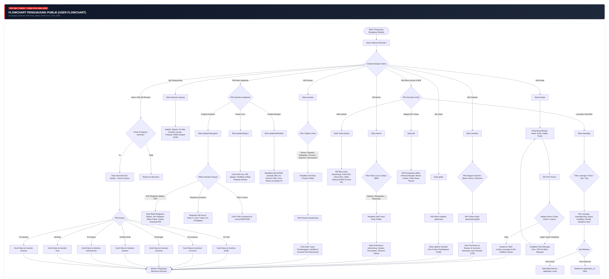
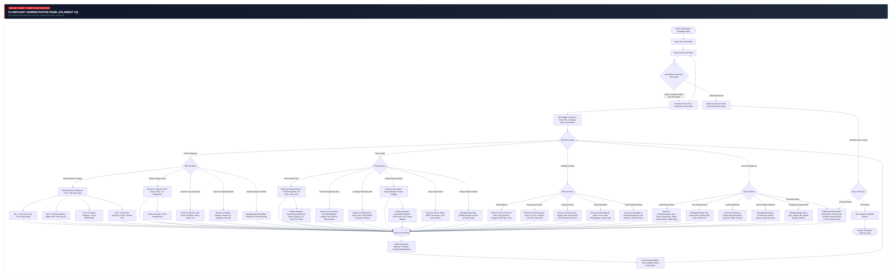

# DOKUMENTASI SISTEM INFORMASI TBSM SMKN 1 BANGSRI
## LAPORAN FLOWCHART SISTEM LENGKAP (USER & ADMINISTRATOR)

**Aplikasi:** TBSM WEB — Sistem Informasi Vokasi & Bursa Kerja Khusus (BKK)  
**Institusi:** Konsentrasi Keahlian Teknik dan Bisnis Sepeda Motor (TBSM) — SMK Negeri 1 Bangsri  
**Kemitraan Industri:** Binaan Resmi PT Astra Honda Motor (AHM)  
**Teknologi:** Laravel 11/12, Filament PHP v3, Tailwind CSS v4, MariaDB 11.x, Alpine.js  

---

## DAFTAR ISI
1. [Pendahuluan & Ruang Lingkup Sistem](#1-pendahuluan--ruang-lingkup-sistem)
2. [Flowchart Pengunjung Publik (User Flowchart)](#2-flowchart-pengunjung-publik-user-flowchart)
   - [2.1 Diagram Alir Mermaid Pengunjung Publik](#21-diagram-alir-mermaid-pengunjung-publik)
   - [2.2 Rincian Alur Navigasi & Interaksi Publik](#22-rincian-alur-navigasi--interaksi-publik)
3. [Flowchart Administrator (Admin Panel Flowchart)](#3-flowchart-administrator-admin-panel-flowchart)
   - [3.1 Diagram Alir Mermaid Administrator](#31-diagram-alir-mermaid-administrator)
   - [3.2 Rincian Alur Pengelolaan & Audit Log](#32-rincian-alur-pengelolaan--audit-log)
4. [Tautan Terkait: Laporan Basis Data & ERD](#4-tautan-terkait-laporan-basis-data--erd)

---

## 1. PENDAHULUAN & RUANG LINGKUP SISTEM

Sistem Informasi TBSM SMKN 1 Bangsri dirancang sebagai portal terpadu berbasis web yang menghubungkan 4 pilar utama pemangku kepentingan (*stakeholders*):
1. **Calon Siswa & Publik:** Memperoleh informasi profil program keahlian, kurikulum industri Astra Honda Motor, sarana bengkel standar AHASS, direktori guru/instruktur, dan galeri prestasi siswa.
2. **Siswa Aktif & Guru:** Mengakses informasi silabus, profil instruktur bersertifikasi BNSP/AHM, penempatan Praktik Kerja Lapangan (PKL), dan materi modul unduhan.
3. **Alumni & Dunia Industri (DUDI):** Mengakses bursa kerja khusus (BKK), melacak jejak alumni (Tracer Study BMW: Bekerja, Melanjutkan, Wirausaha), dan memperluas kemitraan MoU link-and-match.
4. **Pengelola Sekolah / Admin:** Mengelola seluruh data statis dan dinamis sekolah secara mandiri melalui Filament PHP v3 Admin Panel yang dilengkapi audit log aktivitas (*Spatie ActivityLog*) serta halaman pengaturan profil akun admin.

Laporan ini memfokuskan dokumentasi arsitektur logika alur pengguna (*User Flowchart*) dan alur kerja pengelola sistem (*Admin Flowchart*).

---

## 2. FLOWCHART PENGUNJUNG PUBLIK (USER FLOWCHART)

### 2.1 Diagram Alir Mermaid Pengunjung Publik

> [!TIP]
> Berkas visualisasi gambar mandiri: **[FLOWCHART_USER.png](FLOWCHART_USER.png)** *(High-Res PNG)* dan **[FLOWCHART_USER.svg](FLOWCHART_USER.svg)** *(Vektor Scalable)*.

```mermaid
flowchart TD
    Start([Mulai: Pengunjung Mengakses Website]) --> AksesBeranda[Akses Halaman Beranda /]
    
    AksesBeranda --> NavbarInteraksi{Interaksi Navigasi Utama}
    
    %% 1. Beranda & Sub-Navbar
    NavbarInteraksi -->|Hover / Klik Tab Beranda| SubnavCheck{Posisi di Halaman Beranda?}
    SubnavCheck -->|Ya| TampilSubnav[Buka Horizontal Sub-Navbar: 7 Anchor Section]
    TampilSubnav --> PilihAnchor{Pilih Section}
    PilihAnchor -->|01 Profil| ScrollProfil[Scroll Halus ke #section-profile]
    PilihAnchor -->|02 Kurikulum| ScrollKurik[Scroll Halus ke #section-curriculum]
    PilihAnchor -->|03 Bengkel| ScrollBengkel[Scroll Halus ke #section-workshop]
    PilihAnchor -->|04 Mitra DUDI| ScrollMitra[Scroll Halus ke #section-partners]
    PilihAnchor -->|05 Prestasi| ScrollPrestasi[Scroll Halus ke #section-achievements]
    PilihAnchor -->|06 Berita| ScrollBerita[Scroll Halus ke #section-news]
    PilihAnchor -->|07 Instruktur| ScrollGuru[Scroll Halus ke #section-teachers]
    SubnavCheck -->|Tidak| RedirectBeranda[Redirect ke Beranda /]
    
    %% 2. Tentang Kami
    NavbarInteraksi -->|Klik Tentang Kami| PageTentang[Buka Halaman /tentang]
    PageTentang --> LihatProfilTentang[Jelajahi: Sejarah, Visi Misi, Karakter Lulusan, Pimpinan TBSM, Budaya 5S/5R]
    
    %% 3. Akademik
    NavbarInteraksi -->|Pilih Menu Akademik| DropdownAkademik{Pilih Sub-Menu Akademik}
    DropdownAkademik -->|Program Keahlian| PageProgram[Buka /akademik/program]
    PageProgram --> AksiProgram{Pilihan Interaksi Program}
    AksiProgram -->|Klik 'Ringkasan Silabus PDF'| OpenModalSilabus[Buka Modal Ringkasan Silabus: Jam Pelajaran, Materi Pokok, Tombol Download PDF]
    AksiProgram -->|Eksplorasi Kurikulum| TabKurikulum[Eksplorasi Tab Fase E Kelas X, Fase F Kelas XI & XII Magang]
    AksiProgram -->|Pilar & Lisensi| LihatLisensi[Lihat 4 Pilar Kompetensi & Lisensi BNSP/AHM]
    
    DropdownAkademik -->|Dewan Guru| PageGuru[Buka /akademik/guru]
    PageGuru --> LihatDetailGuru[Lihat Profil Guru, NIP, Jabatan, Sertifikasi & Mata Pelajaran Diampu]
    
    DropdownAkademik -->|Fasilitas Bengkel| PageFasilitas[Buka /akademik/fasilitas]
    PageFasilitas --> LihatAlatBengkel[Spesifikasi Alat AHASS: Hydraulic Bike Lift, Scanner HIDS, Kunci Momen & Standar K3]
    
    %% 4. Prestasi
    NavbarInteraksi -->|Klik Prestasi| PagePrestasi[Buka /prestasi]
    PagePrestasi --> FilterPrestasi{Filter Tingkat Lomba}
    FilterPrestasi -->|Semua / Sekolah / Kabupaten / Provinsi / Nasional / Internasional| RenderPrestasi[Tampilkan Grid Kartu Prestasi Terfilter]
    RenderPrestasi --> KlikDetailPrestasi[Pilih Prestasi /prestasi/slug]
    KlikDetailPrestasi --> DetailPrestasiView[Lihat Detail: Juara, Penyelenggara, Sertifikat & Carousel Foto Dokumentasi]
    
    %% 5. Industri & BKK
    NavbarInteraksi -->|Pilih Menu Industri & BKK| DropdownIndustri{Pilih Sub-Menu DUDI}
    DropdownIndustri -->|Mitra Industri| PageMitra[Buka /mitra-industri]
    PageMitra --> DetailMitra[Klik Mitra /mitra-industri/slug: Profil DUDI, Nomor MoU, Daftar Cabang AHASS & Kuota PKL]
    
    DropdownIndustri -->|Lowongan Kerja BKK| PageLoker[Buka /lowongan]
    PageLoker --> FilterLoker{Filter Lowongan: Posisi / Tipe / Gaji}
    FilterLoker --> DetailLoker[Klik Lowongan /lowongan/slug: Syarat Kualifikasi, Benefit, Deadline Lamar]
    DetailLoker --> LamarAction{Aksi Melamar}
    LamarAction -->|Kirim Email| MailtoLink[Buka Mail Client ke application_email]
    LamarAction -->|Form Eksternal| ExtLink[Redirect ke application_url Mitra]
    
    DropdownIndustri -->|Magang PKL Siswa| PagePKL[Buka /pkl]
    PagePKL --> DetailPKL[Klik Penempatan /pkl/id: Informasi Bengkel, Mentor Industri, Daftar Siswa Peserta]
    
    %% 6. Alumni
    NavbarInteraksi -->|Klik Alumni| PageAlumni[Buka /alumni]
    PageAlumni --> FilterAlumni{Filter Tahun Lulus & Status BMW}
    FilterAlumni -->|Bekerja / Melanjutkan / Wirausaha| GridAlumni[Tampilkan Data Tracer Study Terfilter]
    GridAlumni --> DetailAlumni[Buka Profil Alumni /alumni/slug: Jabatan, Perusahaan, Testimoni Sukses]
    
    %% 7. Galeri Media
    NavbarInteraksi -->|Klik Galeri| PageGaleri[Buka /galeri]
    PageGaleri --> PilihAlbum[Pilih Album Kegiatan /galeri/slug]
    PilihAlbum --> LightboxMedia[Buka Lightbox Interaktif Foto & Video Pembelajaran Praktik]
    
    %% 8. Unduhan Berkas
    NavbarInteraksi -->|Klik Unduhan| PageUnduhan[Buka /unduhan]
    PageUnduhan --> FilterKategoriUnduhan{Pilih Kategori Unduhan: Modul / Brosur / Dokumen}
    FilterKategoriUnduhan --> KlikUnduhFile[Klik Tombol Unduh /download/slug/file]
    KlikUnduhFile --> DownloadProcess[Kirim File Binary ke Browser & Increment download_count Otomatis di DB]
    
    %% 9. Kontak
    NavbarInteraksi -->|Klik Kontak| PageKontak[Buka /kontak]
    PageKontak --> InputFormKontak[Pengunjung Mengisi: Nama, Email, Subjek, Pesan]
    InputFormKontak --> SubmitKontak[Klik 'Kirim Pesan']
    SubmitKontak --> ValidasiInputKontak{Validasi Server & Rate Limiter 5 req/min}
    ValidasiInputKontak -->|Gagal / Spam Terdeteksi| WarningError[Tampilkan Flash Message Error / 429 Too Many Requests]
    WarningError --> InputFormKontak
    ValidasiInputKontak -->|Valid| SimpanPesanDB[Simpan ke Tabel contact_messages & Beri Notifikasi Sukses]
    
    %% Terminasi Alur
    SimpanPesanDB --> SelesaiUser([Selesai: Pengunjung Menerima Informasi])
    DownloadProcess --> SelesaiUser
    LightboxMedia --> SelesaiUser
    DetailAlumni --> SelesaiUser
    DetailPrestasiView --> SelesaiUser
    ScrollProfil & ScrollKurik & ScrollBengkel & ScrollMitra & ScrollPrestasi & ScrollBerita & ScrollGuru --> SelesaiUser
```

### 2.2 Rincian Alur Navigasi & Interaksi Publik

1. **Alur Beranda & Horizontal Sub-Navbar:**
   - Pengunjung mengakses URL utama `/`.
   - Komponen Navbar menyajikan navigasi tingkat atas. Saat cursor hover atau klik pada tombol "Beranda", sub-navbar horizontal memuat 7 link section cepat (*01 Profil*, *02 Kurikulum*, *03 Bengkel*, *04 Mitra DUDI*, *05 Prestasi*, *06 Berita*, *07 Instruktur*).
   - Pengunjung mengeklik salah satu section, JavaScript Alpine.js melakukan *smooth scrolling* langsung ke elemen ID target tanpa me-reload halaman.
   - Status pin horizontal sub-navbar dipertahankan dengan mekanisme klik-untuk-mengunci (*click-to-pin*) dan transisi CSS terakselerasi hardware.

2. **Alur Program Akademik & Modal Silabus:**
   - Pengunjung membuka `/akademik/program`.
   - Mengakses tab Kurikulum Fase E (Kelas X: Dasar Otomotif, Gambar Teknik), Fase F (Kelas XI: Pemeliharaan Mesin, Chasis, Kelistrikan Sepeda Motor), dan Fase F (Kelas XII: Troubleshooting Lanjutan & Magang Industri 6 Bulan).
   - Pengunjung dapat menekan tombol **"Ringkasan Silabus PDF"** yang memicu *modal pop-up* berisi alokasi jam pelajaran mingguan, capaian pembelajaran kompetensi inti, serta tautan unduh dokumen silabus format PDF.

3. **Alur Katalog Prestasi & Filter Level:**
   - Pengunjung membuka `/prestasi`.
   - Tersedia tombol filter kategori lomba: *Semua*, *Sekolah*, *Kabupaten*, *Provinsi*, *Nasional*, dan *Internasional*.
   - Saat item prestasi dipilih, sistem merender halaman detail `/prestasi/{slug}` yang menampilkan informasi kejuaraan, nama siswa peserta, penyelenggara lomba, serta *carousel* foto pendukung dokumentasi penyerahan piala/sertifikat.

4. **Alur Kemitraan DUDI, Lowongan Kerja BKK, dan PKL:**
   - Halaman `/mitra-industri` menampilkan daftar partner resmi dengan badge MoU aktif. Mengklik mitra membuka profil DUDI, nomor perjanjian kerjasama, daftar bengkel cabang AHASS terdekat, nomor kontak PIC, serta kuota siswa magang.
   - Portal `/lowongan` menampilkan peluang karir bagi alumni TBSM. Terdapat filter posisi mekanik, service advisor, partman, dan operator manufaktur. Tombol lamar mengarahkan ke form pendaftaran eksternal atau *mailto* resmi HRD.
   - Halaman `/pkl` menampilkan monitoring penempatan siswa pada bengkel mitra, mentor industri yang bertugas, dan status kemajuan magang.

5. **Alur Tracer Study Alumni (Status BMW):**
   - Halaman `/alumni` memuat visualisasi statistik keterserapan lulusan berdasarkan 3 pilar vokasi: **B**ekerja, **M**elanjutkan ke perguruan tinggi, dan **W**irausaha mandiri (BMW).
   - Pengunjung dapat memfilter alumni berdasarkan tahun kelulusan dan status pilar untuk melihat profil sukses dan rekam jejak karir.

6. **Alur Pusat Unduhan (Downloads) & Auto-Counter:**
   - Pengunjung membuka `/unduhan` dan memilih kategori berkas (*Modul Pembelajaran*, *Brosur Sekolah*, *Formulir PKL*).
   - Saat pengunjung menekan tombol unduh pada salah satu item, rute `GET /download/{slug}/file` memproses pengiriman file biner ke browser sekaligus menjalankan query increment atomic `download_count = download_count + 1` di database MariaDB.

7. **Alur Formulir Kontak & Anti-Spam Rate Limiting:**
   - Pengunjung membuka `/kontak`, mengisi form (nama, alamat email, subjek, pesan) lalu menekan tombol kirim.
   - Sistem memeriksa validasi data serta middleware `throttle:5,1` (maksimal 5 kali percobaan per menit per alamat IP).
   - Jika valid, pesan disimpan ke tabel `contact_messages` dengan status default `is_read = 0`, dan sistem memunculkan banner notifikasi sukses kepada pengunjung.

---

## 3. FLOWCHART ADMINISTRATOR (ADMIN PANEL FLOWCHART)

### 3.1 Diagram Alir Mermaid Administrator

> [!TIP]
> Berkas visualisasi gambar mandiri: **[FLOWCHART_ADMIN.png](FLOWCHART_ADMIN.png)** *(High-Res PNG)* dan **[FLOWCHART_ADMIN.svg](FLOWCHART_ADMIN.svg)** *(Vektor Scalable)*.

```mermaid
flowchart TD
    AdminStart([Mulai: Administrator Mengakses Web]) --> BukaLoginPage[Akses URL /admin/login]
    BukaLoginPage --> InputKredensial[Input Email & Kata Sandi]
    InputKredensial --> CekAutentikasi{Autentikasi Kredensial & Role Spatie}
    
    CekAutentikasi -->|Email / Password Salah atau Non-Admin| TolakLogin[Tampilkan Pesan Error: Credentials Do Not Match]
    TolakLogin --> InputKredensial
    
    CekAutentikasi -->|Otentikasi Berhasil| DashboardAdmin[Masuk ke Filament Admin Panel Dashboard /admin]
    DashboardAdmin --> PantauStatistik[Lihat Widget: Total Guru, Siswa PKL, Lowongan Aktif, Pesan Masuk]
    
    PantauStatistik --> NavigasiMenu{Pilih Menu Kelola}

    %% 1. Modul Profil & Akademik
    NavigasiMenu -->|Profil & Akademik| MenuAkademik{Pilih Sub-Menu}
    MenuAkademik -->|Kelola Halaman Program| PageManageProgram[ManageAcademicPrograms: Form 4 Tab Sticky Save]
    PageManageProgram --> EditTab1[Tab 1: Judul Hero, Rasio 70:30, Mitra Utama]
    PageManageProgram --> EditTab2[Tab 2: 4 Pilar Kompetensi, Silabus PDF, Peta Fase E-F]
    PageManageProgram --> EditTab3[Tab 3: 6 Program Unggulan, Lisensi BNSP/AHM]
    PageManageProgram --> EditTab4[Tab 4: 3 Jalur Karir, Roadmap 3 Tahun, Banner CTA]
    
    MenuAkademik -->|Master Program Studi| CrudProgram[Resource Programs: Form Nama, Kode, Lab Equipments]
    CrudProgram --> RelasiKompetensi[Kelola Hubungan 1:M ke Competencies]
    
    MenuAkademik -->|Direktori Guru & Instruktur| CrudGuru[Resource Teachers: NIP, Posisi, Sertifikasi, Status Kajur, Foto]
    
    MenuAkademik -->|Sarana & Fasilitas Bengkel| CrudFasilitas[Resource Facilities: Kategori, Standar K3, Kapasitas, Foto Alat]
    MenuAkademik -->|Header Halaman Fasilitas| PageManageFac[ManageAcademicFacilities: Deskripsi & Gambar Banner]

    %% 2. Modul Hubin & BKK
    NavigasiMenu -->|Hubin & BKK| MenuBKK{Pilih Sub-Menu}
    MenuBKK -->|Mitra Industri DUDI| CrudMitra[Resource IndustryPartners: Profil Perusahaan, No MoU, Logo, Level]
    CrudMitra --> CrudCabang[Relation Manager IndustryPartnerBranches: Alamat Cabang, PIC, Kuota PKL, Maps]
    
    MenuBKK -->|Dokumen Kerjasama MoU| CrudKerjasama[Resource Partnerships: Jenis MoU/Magang, Unggah File Dokumen, Masa Berlaku]
    
    MenuBKK -->|Lowongan Pekerjaan BKK| CrudLowongan[Resource JobVacancies: Judul Posisi, Gaji Min/Max, Deskripsi, Deadline]
    
    MenuBKK -->|Praktik Kerja Lapangan| CrudMagang[Resource Internships: Tempat Bengkel, Periode Tanggal]
    CrudMagang --> CrudPesertaMagang[Relation Manager InternshipParticipants: Nama Siswa, NIS, Status Magang]
    
    MenuBKK -->|Tracer Study Alumni| CrudAlumni[Resource Alumni: Status BMW, Perusahaan, Gaji, Kisah Sukses]
    MenuBKK -->|Kelola Halaman Industri| PageManageInd[ManageIndustryPage: Statistik Serapan Lulusan & Narasi Hubin]

    %% 3. Modul Publikasi & Media
    NavigasiMenu -->|Publikasi & Media| MenuPublikasi{Pilih Sub-Menu}
    MenuPublikasi -->|Artikel & Berita| CrudPost[Resource Posts: Rich Text Editor, Slug Otomatis, Kategori, Multi-Tags, Cover]
    MenuPublikasi -->|Pengumuman Resmi| CrudPengumuman[Resource Announcements: Judul, Isi Surat, Lampiran File PDF, Status Aktif]
    MenuPublikasi -->|Katalog Prestasi| CrudPrestasi[Resource Achievements: Tingkat Juara, Multi-Upload Foto Pendukung, Peserta]
    MenuPublikasi -->|Galeri Foto/Video| CrudGaleri[Resource GalleryAlbums: Album Foto & Video Pembelajaran, Aspect Ratio]
    MenuPublikasi -->|Pusat Unduhan Berkas| CrudUnduhan[Resource Downloads & DownloadCategories: File Dokumen, Reset Counter]

    %% 4. Modul Pesan & Pengaturan
    NavigasiMenu -->|Pesan & Pengaturan| MenuPengaturan{Pilih Sub-Menu}
    MenuPengaturan -->|Kotak Pesan Masuk| CrudPesan[Resource ContactMessages: Baca Pesan Pengunjung, Tandai 'Sudah Dibaca', Balas Email]
    MenuPengaturan -->|Hero Slider Beranda| PageHeroSlider[ManageHeroSlider: Atur Urutan Slide, Gambar High-Res, Tombol CTA]
    MenuPengaturan -->|Banner Header Halaman| PageHeaders[ManagePageHeaders: Kustomisasi Gambar Banner untuk Tiap Route]
    MenuPengaturan -->|Pengaturan Identitas Web| PageSettings[ManageSettings: Nama Situs, Telepon WA, Alamat Bengkel, Medsos]
    MenuPengaturan -->|Profil Akun Admin| PageProfile[EditProfile /admin/profile: Ubah Nama, Alamat Email, Verifikasi Password Saat Ini, Set Password Baru]
    MenuPengaturan -->|Audit Log Aktivitas| LogAktivitas[Resource ActivityLog: Pantau Siapa Mengubah Data Apa, Waktu & Event]

    %% Eksekusi Penyimpanan
    EditTab1 & EditTab2 & EditTab3 & EditTab4 --> EksekusiSimpan[(Simpan ke MariaDB)]
    CrudProgram & RelasiKompetensi & CrudGuru & CrudFasilitas & PageManageFac --> EksekusiSimpan
    CrudMitra & CrudCabang & CrudKerjasama & CrudLowongan & CrudMagang & CrudPesertaMagang & CrudAlumni & PageManageInd --> EksekusiSimpan
    CrudPost & CrudPengumuman & CrudPrestasi & CrudGaleri & CrudUnduhan --> EksekusiSimpan
    CrudPesan & PageHeroSlider & PageHeaders & PageSettings & PageProfile --> EksekusiSimpan

    EksekusiSimpan --> CatatAudit[Spatie ActivityLog Merekam Transaksi: created/updated/deleted]
    CatatAudit --> NotifikasiSukses[Filament Menampilkan Toast Notifikasi 'Saved Successfully']
    NotifikasiSukses --> NavigasiMenu

    DashboardAdmin -->|Klik Menu Akun / Avatar| DropdownUser{Menu Profil User}
    DropdownUser -->|Pilih 'Profil Saya'| PageProfile
    DropdownUser -->|Pilih 'Keluar'| LogoutAdmin[Aksi Logout & Invalidate Session]
    LogoutAdmin --> SelesaiAdmin([Selesai: Kembali ke Halaman Login])
```

### 3.2 Rincian Alur Pengelolaan & Audit Log

1. **Autentikasi & Otorisasi Berbasis Peran (RBAC):**
   - Administrator mengakses `/admin/login`. Form memvalidasi email dan kata sandi menggunakan hashing Bcrypt/Argon2id.
   - Model `User` mengimplementasikan Spatie `HasRoles`. Sistem memverifikasi bahwa akun memiliki role `admin`. Jika berhasil, sesi disimpan di tabel `sessions` dan diarahkan ke Dashboard.

2. **Pengelolaan Profil Akun Administrator (/admin/profile):**
   - Administrator dapat membuka halaman profil melalui dua akses:
     - Menu avatar pengguna di pojok kanan atas (*User Menu -> Profil Saya*).
     - Menu bilah sisi navigasi (*Pengaturan Sistem -> Profil Admin*).
   - Form profil terbagi menjadi dua bagian:
     - **Informasi Akun Admin:** Mengubah nama lengkap dan alamat email resmi administrator.
     - **Keamanan & Kata Sandi:** Mengubah kata sandi baru (minimal 8 karakter) dengan konfirmasi kata sandi dan verifikasi kata sandi saat ini (*current password*) untuk mencegah perubahan yang tidak terotorisasi.
   - Kata sandi dienkripsi otomatis secara aman (*Hashed*), dan sesi login tetap aktif tanpa memaksa logout.

3. **Pengelolaan Program Akademik 4-Tab (*ManageAcademicPrograms*):**
   - Halaman kustom Filament yang mengelola konfigurasi program secara sentral dengan fitur *Sticky Save Header*:
     - **Tab 1: Identitas & Rasio Praktik:** Konfigurasi headline hero, rasio 70% praktik : 30% teori, dan mitra pembina AHM.
     - **Tab 2: Pilar Kompetensi & Kurikulum:** Pengaturan 4 pilar teknis (Engine, Chasis, Electrical, Fuel Injection), dokumen silabus PDF, serta capaian pembelajaran Fase E dan Fase F.
     - **Tab 3: Program Unggulan & Sertifikasi:** Pengaturan 6 program unggulan dan 3 lisensi sertifikasi (BNSP LSP-P1, Honda Sertifikasi Level 1/2).
     - **Tab 4: Prospek Karir & Roadmap:** Pemetaan 3 jalur karir utama dan infografis roadmap pendidikan 3 tahun.

4. **Pengelolaan Kemitraan Industri & Jaringan Bengkel AHASS:**
   - Administrator menginput data DUDI di `IndustryPartnerResource`.
   - Menggunakan relasi `HasMany` ke `IndustryPartnerBranch`, admin dapat menambahkan banyak cabang bengkel resmi lengkap dengan alamat kecamatan, link Google Maps, nama PIC, nomor WhatsApp, dan kapasitas kuota magang siswa.
   - Pengelolaan dokumen kerjasama di `PartnershipResource` mencatat tanggal masa berlaku MoU dan mengunggah berkas perjanjian resmi bertanda tangan digital.

5. **Pengelolaan Bursa Kerja Khusus (BKK) & Pelacakan Alumni:**
   - Admin mempublikasikan lowongan kerja melalui `JobVacancyResource`, menentukan kualifikasi keahlian, tipe pekerjaan (*full-time, kontrak*), rentang gaji, dan tanggal kadaluarsa lowongan.
   - Admin mendata lulusan melalui `AlumniResource`, mencatat status pilar BMW (*Bekerja, Melanjutkan, Wirausaha*), nama industri tempat bekerja, jabatan, serta kisah inspiratif alumni untuk memotivasi adik kelas.

6. **Pengelolaan Konten Publikasi & Pusat Unduhan:**
   - Penulisan berita dan artikel di `PostResource` dilengkapi Rich Text Editor, penentuan kategori, relasi many-to-many dengan tags, unggah berkas thumbnail, serta status publikasi (*draft, review, published*).
   - Pengelolaan unduhan di `DownloadResource` memvalidasi tipe file dokumen (*PDF, DOCX, XLSX, ZIP*) dan ukuran file. Tersedia tombol untuk mereset counter jumlah unduhan.

7. **Audit Trail Otomatis (*Spatie ActivityLog*):**
   - Setiap operasi penyimpanan (`create`), pembaruan (`update`), maupun penghapusan (`delete`) pada model-model utama dicatat secara otomatis ke tabel `activity_log`.
   - Data log menyimpan ID admin pelaku (`causer_id`), nama tabel/model objek (`subject_type`, `subject_id`), tipe event, serta rekaman nilai kolom sebelum dan sesudah perubahan (`properties`).

---

## 4. TAUTAN TERKAIT: LAPORAN BASIS DATA & ERD

Untuk dokumentasi struktur basis data, relasi tabel, kunci asing, dan kamus data 26 tabel, silakan rujuk dokumen terpisah:
- **[ERD.md](ERD.md)** *(Direktori Dokumentasi)*
- **[../ERD.md](../ERD.md)** *(Root Proyek)*
