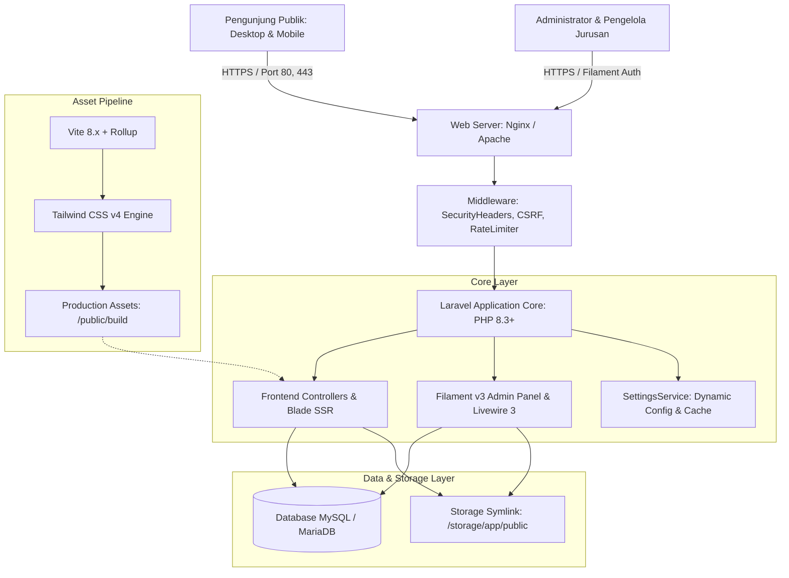
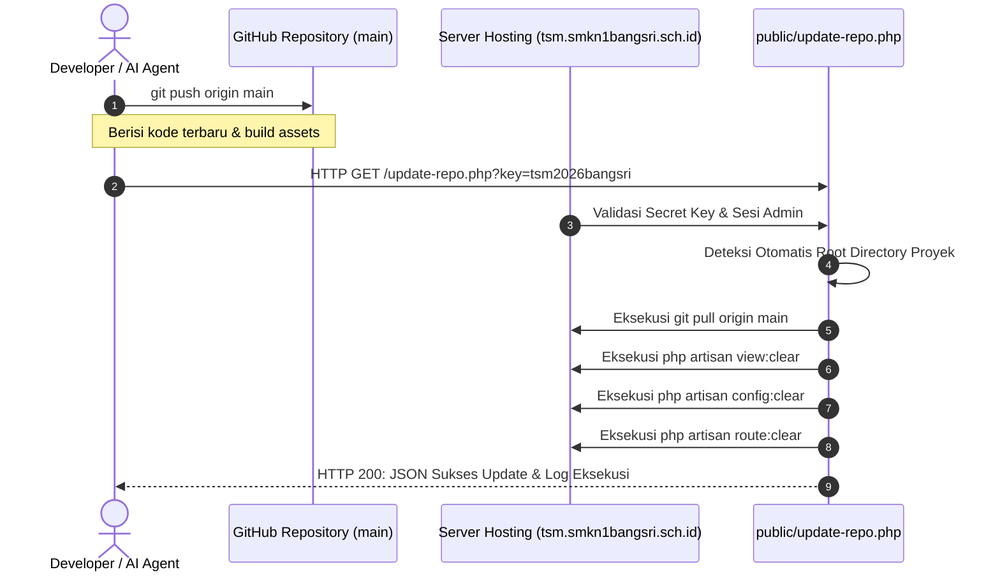

# Laporan 1: Arsitektur & Spesifikasi Sistem

**Sistem Informasi Terintegrasi Konsentrasi Keahlian Teknik Sepeda Motor (TSM)**  
**SMK Negeri 1 Bangsri — Binaan Resmi PT Astra Honda Motor (AHM)**

---

## 1. Ringkasan Eksekutif Sistem

Website Resmi Konsentrasi Keahlian Teknik Sepeda Motor (TSM) SMK Negeri 1 Bangsri dirancang dan diimplementasikan sebagai **Enterprise School Web Platform & Content Management System (CMS)** modern. Sistem ini memadukan kecepatan penyajian konten publik berbasis *Server-Side Rendering* (SSR) dengan kapabilitas panel manajemen data relasional yang komprehensif, aman, dan mudah dioperasikan.

Platform ini mengintegrasikan seluruh domain informasi vokasi: profil kurikulum berbasis kompetensi, data sarana laboratorium Teaching Factory (TeFa), basis data dewan guru, portofolio prestasi kejuaraan, direktori mitra industri (DUDI), portal lowongan kerja Bursa Kerja Khusus (BKK), sistem penelusuran lulusan (*Tracer Study*), publikasi berita/pengumuman, galeri dokumentasi, hingga pusat repositori berkas unduhan resmi.

---

## 2. Arsitektur Perangkat Lunak & Tech Stack

Sistem dibangun di atas fondasi teknologi *enterprise-grade* dengan konfigurasi sebagai berikut:

### 2.1 Backend Core
* **Framework:** **Laravel 11 / 12**
  * Memanfaatkan arsitektur MVC (Model-View-Controller) murni untuk pemisahan logika bisnis (*business logic*), representasi data, dan *layer* tampilan.
  * Menggunakan **Eloquent ORM** untuk interaksi basis data yang aman dari SQL Injection.
  * Dependency Injection dan Service Container terpusat (`App\Services\SettingsService`).
* **Bahasa Pemrograman:** **PHP 8.3+ (Dukungan penuh PHP 8.3.x hingga PHP 8.5.x)**
  * Memanfaatkan fitur modern: *typed properties, union types, match expressions, nullsafe operators*, dan *enums*.
  * Dilengkapi **Polyfill Internal (`App\Support\NumberPolyfill`)** untuk `Number::formatCurrency()` dan `NumberFormatter` (ICU intl), memastikan aplikasi dapat beroperasi normal tanpa *fatal error* pada lingkungan *shared hosting* cPanel yang tidak mengaktifkan modul `php-intl`.

### 2.2 Panel Administrasi (Backend CMS)
* **Engine:** **Filament v3** (berjalan di atas **Livewire 3**)
  * Menyediakan arsitektur manajemen data berbasis *Form Builder*, *Table Builder*, *Action Modals*, *Infolists*, dan *Widgets*.
  * Mendukung interaktivitas SPA (*Single Page Application*) secara reaktif tanpa penulisan JavaScript kustom.
  * Komponen *Rich Text Editor* (Trix/TinyMCE kompatibel), *File Upload* dengan kompresi otomatis, dan *Repeater Fields*.
  * Otentikasi terisolasi (`Filament\Pages\Auth\Login`) dengan *session guard* terpisah.

### 2.3 Frontend & Design System
* **Templating Engine:** **Laravel Blade**
  * Arsitektur komponen modular: `components/layouts/app.blade.php`, `components/navbar.blade.php`, `components/mobile-bottom-nav.blade.php`, dan `components/footer.blade.php`.
* **CSS Engine:** **Tailwind CSS v4** terkompilasi melalui `@tailwindcss/vite`
  * Palet warna eksklusif standar otomotif:
    * Merah Utama: `#DC2626` / `#B91C1C` (Aksen Brand Honda TSM)
    * Dark Charcoal: `#0F172A` / `#1B1B1E` (Tipografi & Elemen Kontras)
    * Muted Slate: `#64748B` / `#94A3B8` (Deskripsi & Metadata)
    * Surface Light: `#FAFAFA` / `#FBF8FC` (Background Utama Glassmorphic)
* **Interaktivitas Klien:** **Alpine.js v3** & **Vanilla JavaScript ES6+**
  * Penanganan *scroll behavior*, *header glassmorphism transition*, *dynamic modal dialogs*, dan *real-time DOM mobile navigation drawer*.
* **Tipografi:** Google Fonts berlisensi terbuka
  * Heading: **Chivo** (Display font berkarakter mekanikal presisi dan tegas)
  * Body: **Hanken Grotesk** (Sans-serif berkecepatan baca tinggi pada resolusi seluler)

### 2.4 Asset Pipeline & Build System
* **Bundler:** **Vite 8.x**
  * Kompilasi instan via *Rollup-based client environment*.
  * *Code-splitting*, *asset hashing* (`app-BUqVWZ_z.css`, `app-DlPlklK7.js`), dan optimasi *font preload*.
  * Menghasilkan artefak *pre-bundled* di direktori `public/build/` yang mandiri tanpa memerlukan Node.js aktif pada *production server*.

---

## 3. Desain Basis Data & Model Relasional

Sistem menggunakan skema basis data relasional (RDBMS) MySQL / MariaDB dengan *engine* InnoDB.

```mermaid
erDiagram
    USERS ||--o{ POSTS : "menulis"
    CATEGORIES ||--o{ POSTS : "mengelompokkan"
    TAGS }o--o{ POSTS : "melabeli"
    
    GALLERY_ALBUMS ||--o{ GALLERY_PHOTOS : "berisi"
    DOWNLOAD_CATEGORIES ||--o{ DOWNLOADS : "mengelompokkan"
    
    PROGRAMS {
        bigint id PK
        string title
        string slug
        string excerpt
        text content
        string icon
        string cover_image
        boolean is_active
        integer sort_order
    }
    
    TEACHERS {
        bigint id PK
        string name
        string nip
        string role
        string specialization
        string photo
        string bio
        boolean is_active
        integer sort_order
    }
    
    FACILITIES {
        bigint id PK
        string name
        string slug
        text description
        string cover_image
        json gallery_images
        boolean is_featured
    }
    
    INDUSTRY_PARTNERS {
        bigint id PK
        string name
        string slug
        string logo
        string partnership_type
        text description
        string website_url
        boolean is_featured
    }
    
    JOB_VACANCIES {
        bigint id PK
        bigint industry_partner_id FK
        string title
        string slug
        string job_type
        string location
        text requirements
        date deadline
        boolean is_active
    }
    
    ALUMNIS {
        bigint id PK
        string name
        year graduation_year
        string current_activity
        string company_or_campus
        string position
        string photo
        text testimonial
        boolean is_featured
    }
    
    ACHIEVEMENTS {
        bigint id PK
        string title
        string slug
        string competition_level
        string rank
        year year
        string participant_name
        string photo
    }
    
    CONTACT_MESSAGES {
        bigint id PK
        string name
        string email
        string phone
        string subject
        text message
        boolean is_read
        timestamp created_at
    }
```

### Entitas Utama Basis Data:
1. **Pengaturan Global (`settings`)**: Konfigurasi dinamis `key-value` untuk identitas sekolah, logo, favicon, kontak, tagline, sosial media, dan teks legalitas.
2. **Hero Slider (`hero_sliders`)**: Spanduk animasi halaman depan, berisi gambar banner, judul aksen, tombol aksi (CTA), dan nomor urut.
3. **Akademik & Pengajar (`teachers`, `programs`, `facilities`)**: Data personil guru, kompetensi kurikulum, dan fasilitas laboratorium TeFa.
4. **Kemitraan & Karir (`industry_partners`, `job_vacancies`, `internships`)**: Data industri rekanan (AHM, AHASS), bursa lowongan kerja BKK, dan penempatan PKL siswa.
5. **Jejaring Mutu (`achievements`, `alumnis`)**: Bukti prestasi kejuaraan regional/nasional dan hasil pelacakan lulusan (*Tracer Study*).
6. **Publikasi & Media (`posts`, `announcements`, `gallery_albums`, `gallery_photos`, `downloads`)**: Saluran berita artikel, maklumat resmi, album visual, dan dokumen silabus.
7. **Layanan Komunikasi (`contact_messages`)**: Penampung pesan dan pertanyaan pengunjung situs publik.

---

## 4. Jalur Routing, Middleware & Skema Keamanan

### 4.1 Jalur Routing
* **Publik (`routes/web.php`)**:
  * Beranda: `/` (`Frontend\HomeController@index`)
  * Profil: `/tentang` (`Frontend\HomeController@about`)
  * Akademik: `/akademik/program`, `/akademik/guru`, `/akademik/fasilitas`
  * Kemitraan & Karir: `/mitra-industri`, `/pkl`, `/lowongan`
  * Prestasi & Alumni: `/prestasi`, `/alumni`
  * Media & Informasi: `/galeri`, `/berita`, `/pengumuman`, `/unduhan`
  * Komunikasi: `/kontak` (GET untuk tampilan, POST untuk simpan pesan)
  * Utility: `/sitemap.xml`, `/robots.txt`
* **Admin CMS (`vendor/filament/...`)**:
  * Prefix terproteksi: `/admin` (Resource URL terenkripsi dengan CSRF token dan validasi *session*).

### 4.2 Middleware Pipeline & Proteksi Keamanan
1. **`App\Http\Middleware\SecurityHeaders`**:
   Diinjeksikan pada setiap HTTP response untuk memitigasi serangan siber:
   * `X-Content-Type-Options: nosniff`: Mencegah MIME-type sniffing.
   * `X-Frame-Options: SAMEORIGIN`: Melindungi sistem dari serangan *Clickjacking*.
   * `Referrer-Policy: strict-origin-when-cross-origin`: Menjaga privasi pengalihan data.
   * `Content-Security-Policy (CSP)`: Mengontrol sumber eksekusi script, style font, dan koneksi eksternal.
2. **Anti Cross-Site Scripting (XSS)**: Seluruh output data pada Blade diproses menggunakan sanitasi otomatis `{{ $data }}` yang mengonversi karakter berbahaya menjadi entitas HTML.
3. **Anti Cross-Site Request Forgery (CSRF)**: Seluruh formulir POST (termasuk form kontak dan login) wajib menyertakan token `@csrf`.
4. **Rate Limiting**: Membatasi frekuensi submit formulir kontak guna menangkal serangan *spamming* dan *Denial of Service* (DoS).

---

## 5. Infrastruktur Deployment & Pemeliharaan Hosting

Website ini dirancang fleksibel untuk dapat berjalan baik pada infrastruktur **VPS (Virtual Private Server)** berbasis Docker/Linux maupun lingkungan **Shared Hosting cPanel/DirectAdmin** tradisional:

### Mekanisme Kunci Pemeliharaan:
1. **Pembaruan Sekali Klik (`update-repo.php`)**:
   Dilengkapi mekanisme pengenalan direktori cerdas (*multi-level root directory detection*) dan pengamanan token rahasia (`?key=...`) sehingga pembaruan fitur di hosting dapat dijalankan instan tanpa harus membuka terminal SSH cPanel.
2. **Build Portabilitas (`build_folder_only.zip` & `public/build/`)**:
   Seluruh kompilasi aset CSS dan JavaScript dilakukan di sisi lokal/staging dan dipaketkan ke dalam git, mengeliminasi kebutuhan instalasi Node.js dan NPM pada server hosting.
3. **Penyimpanan Berkas Terpusat (`public/storage`)**:
   Menggunakan symlink Laravel yang aman (`php artisan storage:link`) untuk mengisolasi file upload sensitif dari akses direktori sistem utama.
