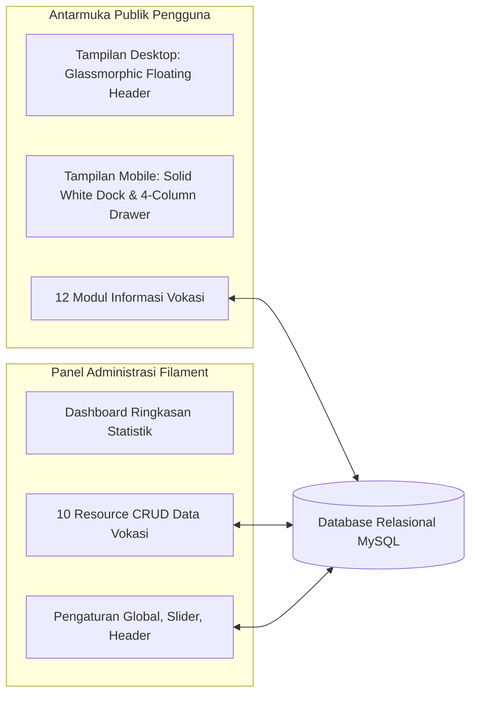
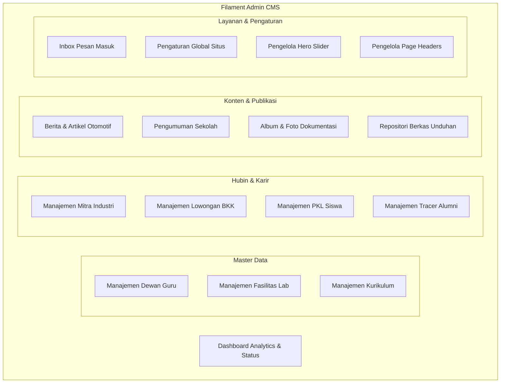

# Laporan 2: Fitur & Modul Fungsional Website

**Sistem Informasi Terintegrasi Konsentrasi Keahlian Teknik Sepeda Motor (TSM)**  
**SMK Negeri 1 Bangsri — Binaan Resmi PT Astra Honda Motor (AHM)**

---

## 1. Arsitektur Antarmuka Ganda (Dual-Interface)

Website ini mengadopsi konsep antarmuka ganda yang terpisah secara tegas antara **Antarmuka Publik (Frontend)** yang dirancang untuk kecepatan navigasi dan estetika visual modern, serta **Panel Administrasi (Backend CMS)** yang mengutamakan kelengkapan kontrol data dan efisiensi kerja pengelola sekolah:

---

## 2. Fitur Antarmuka Publik (Frontend)

### 2.1 Sistem Navigasi Responsif Cerdas (Adaptive Dual-Navigation)
Sistem navigasi disesuaikan secara khusus berdasarkan karakteristik perangkat pengguna:
* **Mode Desktop (`min-width: 1024px`)**:
  * *Glassmorphic Adaptive Header*: Mengambang (*floating*) di atas konten.
  * *Hero State*: Saat berada di bagian paling atas hero slider, navbar berlatar transparan dengan gradasi hitam halus (`bg-gradient-to-b from-black/80 to-transparent`) dan teks putih tajam ber-drop shadow.
  * *Scrolled State*: Saat halaman digeser melewati hero slider, navbar secara otomatis bertransisi mulus menjadi bilah *light glassmorphic* (`bg-[#FBF8FC]/95 backdrop-blur-md`) dengan teks gelap kontras.
  * Indikator garis merah dinamis muncul saat hover dan pada tautan aktif.
  * Tombol aksi permanen: **"Hubungi Kami"** berwarna merah Honda.
* **Mode Mobile (`max-width: 1023px`)**:
  * *Top App Bar*: Header atas bersih dengan logo resmi TSM dan tombol cepat **"Hubungi Kami"** (menggantikan tombol hamburger tradisional).
  * *Solid Bottom Navigation Dock*: Bilah navigasi bawah permanen dengan latar belakang **100% Solid Putih (`#ffffff`)** tebal (mencegah tembus pandang atau distorsi konten teks/gambar di baliknya). Terdiri dari 5 tab utama: **Beranda, Program, Guru, Fasilitas, dan Menu**.
  * *Sliding Menu Drawer (Grid 4 Kolom)*: Menekan tombol **"Menu"** akan memunculkan laci kontrol (*drawer*) dari bawah yang bergeser ke atas secara elegan:
    * Berisi **12 modul menu terstruktur dalam format 4 kolom × 3 baris** dengan ikon persegi modern.
    * Latar belakang *scrim* gelap lembut tanpa mengaburkan (*blur*) seluruh layar, menjaga pengalaman pengguna tetap responsif dan bebas hambatan visual.

---

### 2.2 Modul Halaman Beranda Utama (`/`)
Halaman beranda disusun berdasarkan alur psikologi konversi informasi (*AIDA: Attention, Interest, Desire, Action*):

| Seksi Beranda | Fungsi & Komponen | Nilai Informasi bagi Pengguna |
| :--- | :--- | :--- |
| **Hero Slider Banner** | Slider interaktif gambar resolusi tinggi dengan judul aksen, deskripsi, dan tombol CTA ganda (*Lihat Fasilitas* & *Kemitraan Industri*). | Menyajikan identitas visual kelas industri dan program unggulan binaan Astra Honda Motor secara instan. |
| **Statistik Prestisius** | Kartu angka pencapaian: Rasio praktik 70% vs teori 30%, akreditasi, dan jumlah bengkel binaan rekanan. | Memberikan keyakinan rasional (*social proof*) mengenai keunggulan kualitas pendidikan vokasi TSM. |
| **Sambutan Kepala Program** | Foto resmi, kutipan visi kejuruan, dan tanda tangan digital Ketua Konsentrasi Keahlian. | Memperkenalkan kepemimpinan akademik dan komitmen mencetak teknisi profesional berkarakter 5R. |
| **4 Pilar Kompetensi** | Kartu modular ringkasan: Mesin (*Engine*), Sasis (*Chassis*), Kelistrikan (*Electrical*), dan Manajemen Bengkel. | Memudahkan calon siswa memahami apa saja keahlian nyata yang akan dipelajari selama 3 tahun. |
| **Fasilitas Unggulan** | Showcase laboratorium servis berkursi hidrolik standar bengkel resmi AHASS. | Menunjukkan kelengkapan alat kerja mekanik nyata yang digunakan siswa dalam praktikum harian. |
| **Kemitraan Industri** | Logo resmi PT Astra Honda Motor (AHM) dan jaringan AHASS se-Karesidenan Pati. | Membuktikan legalitas kurikulum industri dan kepastian tempat magang/penyaluran kerja. |
| **Tradisi Juara** | Galeri pencapaian prestasi lomba keterampilan siswa (LKS) dan kompetisi Safety Riding Astra Motor. | Rekam jejak keunggulan kompetitif siswa TSM di tingkat regional maupun nasional. |
| **Berita & Pengumuman** | Artikel terhangat, dokumentasi kegiatan servis kunjung, dan pengumuman resmi sekolah. | Menjaga website tetap dinamis, hidup, dan selalu terbarui (*up-to-date*). |
| **Footer Komprehensif** | Identitas institusi, peta navigasi internal, tautan sosial media, dan teks hak cipta resmi. | Memastikan kemudahan akses informasi kontak dan meningkatkan skor SEO situs. |

---

### 2.3 Modul Profil & Identitas Kejuruan (`/tentang`)
* **Sejarah Kerjasama AHM**: Dokumentasi perjalanan jurusan sejak berdiri hingga menjadi sekolah binaan resmi PT Astra Honda Motor pada tahun 2016.
* **Visi & Misi Kejuruan**: Peta haluan jangka panjang pembinaan karakter teknisi otomotif roda dua.
* **Budaya Kerja Industri 5R**: Edukasi standar operasional bengkel: *Ringkas, Rapi, Resik, Rawat, Rajin*, serta kepatuhan pemakaian Alat Pelindung Diri (APD).

---

### 2.4 Modul Akademik & Kurikulum Terpadu (`/akademik/program`)
* **Detail 4 Pilar Kompetensi Teknis**:
  1. *Sistem Mesin*: Pembongkaran/overhaul silinder, kalibrasi sistem injeksi bahan bakar PGM-FI, pendingin radiator.
  2. *Sistem Sasis*: Pengereman hidrolik CBS/ABS, suspensi teleskopik/monoshock, roda dan balancing.
  3. *Sistem Kelistrikan*: Analisa kerusakan scanner HIDS (Honda Intelligent Diagnostic System), Smart Key, alarm, pengisian aki.
  4. *Pengelolaan Bengkel*: Service Advisor (SA), administrasi faktur kerja, manajemen persediaan suku cadang resmi (Honda Genuine Parts).
* **Peta Kurikulum Merdeka Fase E & F**: Tab interaktif kelas X, XI, dan XII yang memetakan jam belajar teori, praktikum TeFa, dan magang PKL.
* **Silabus Resmi & Unduhan Kurikulum**: *Modal popup* interaktif yang menyediakan unduhan dokumen silabus pembelajaran dalam format PDF.
* **Sertifikasi Profesi**: Penjelasan skema sertifikasi kelulusan resmi: **UKK**, **BNSP / LSP-P1 berlogo Garuda**, dan **Sertifikat Mekanik Astra Honda Motor**.

---

### 2.5 Modul Laboratorium & Fasilitas Bengkel (`/akademik/fasilitas`)
* Direktori sarana praktikum lengkap dengan foto beresolusi tinggi dan spesifikasi teknis:
  * Ruang TeFa Servis Sepeda Motor (Hydraulic Bike Lift berstandar bengkel resmi AHASS).
  * Laboratorium Kelistrikan & Simulator EFI PGM-FI.
  * Ruang Overhaul Mesin & Pengukuran Presisi.
  * Unit Alat Uji Diagnostik Digital (HIDS, Multitester Digital, Gas Analyzer).

---

### 2.6 Modul Dewan Guru & Instruktur (`/akademik/guru`)
* Bagan struktur organisasi program keahlian TSM SMKN 1 Bangsri.
* Kartu profil dewan guru: foto resmi, NIP, jabatan struktural (Kepala Jurusan, Kepala Lab, Bendahara, Wali Kelas), spesialisasi bidang ajar, dan riwayat pelatihan di Astra Motor Training Center.

---

### 2.7 Modul Kemitraan Industri & Bursa Kerja Khusus (`/mitra-industri`, `/pkl`, `/lowongan`)
* **Direktori Mitra DUDI (`/mitra-industri`)**: Profil perusahaan mitra yang menandatangani nota kesepahaman (MoU) dengan sekolah.
* **Informasi PKL / Magang (`/pkl`)**: Ketentuan Praktik Kerja Lapangan 6 bulan penuh di jaringan AHASS, logbook kegiatan, dan standar etika industri.
* **Portal Lowongan Kerja BKK (`/lowongan`)**: Pengumuman rekrutmen tenaga kerja teknisi dan staf industri terverifikasi dari Bursa Kerja Khusus (BKK). Dilengkapi informasi persyaratan kualifikasi, batas waktu pendaftaran, dan status lowongan aktif/tutup.

---

### 2.8 Modul Prestasi & Tracer Study Alumni (`/prestasi`, `/alumni`)
* **Galeri Prestasi (`/prestasi`)**: Arsip piala kejuaraan LKS Otomotif, Kontes Mekanik Honda SMK, dan Lomba Safety Riding beserta nama siswa dan tahun perolehan.
* **Tracer Study Alumni (`/alumni`)**: Database penelusuran karir lulusan, testimoni alumni yang sukses bekerja di jaringan AHASS, pabrik perakitan, wirausahawan bengkel mandiri, maupun yang melanjutkan studi ke perguruan tinggi teknik.

---

### 2.9 Modul Galeri, Berita & Pusat Unduhan Dokumen
* **Galeri Visual (`/galeri`)**: Dokumentasi album kegiatan praktikum, upacara pelepasan PKL, kunjungan industri, dan perayaan sekolah.
* **Berita & Maklumat Resmi (`/berita`, `/pengumuman`)**: Artikel seputar dunia otomotif dan pengumuman resmi sekolah dengan fitur pencarian judul dan filter kategori.
* **Pusat Unduhan (`/unduhan`)**: Repositori berkas digital publik (formulir izin magang, brosur PPDB, kalender pendidikan, modul ajar) dengan penghitung jumlah unduhan otomatis.

---

### 2.10 Modul Interaksi & Formulir Kontak (`/kontak`)
* Formulir kirim pesan langsung dengan validasi data masukan (Nama, Email, Nomor Telepon, Subjek, dan Isi Pesan).
* Peta alamat terintegrasi dan tautan cepat ke WhatsApp serta kanal YouTube resmi sekolah.

---

## 3. Fitur Panel Administrasi (Backend CMS)

Panel administrasi dikelola menggunakan **Filament v3** yang aman, terisolasi pada URL `/admin`, dan dilengkapi kapabilitas:

### 3.1 Dashboard Monitoring
* Widget status server dan konektivitas website.
* Metrik agregat jumlah berita aktif, lowongan kerja BKK, data guru, berkas unduhan, dan pesan masuk yang belum dibaca (*unread counter*).

### 3.2 Modul CRUD Sumber Daya (Resources)
1. **Guru & Instruktur**: Tambah, ubah, hapus profil guru, upload foto dengan kompresi, penetapan spesialisasi ajar, dan pengurutan nomor tampilan.
2. **Fasilitas & Lab**: Manajemen inventaris laboratorium, deskripsi sarana, foto sampul, dan multi-upload galeri fasilitas.
3. **Program Keahlian**: Manajemen ringkasan kompetensi, icon, dan dokumen kurikulum.
4. **Mitra Industri**: Pencatatan profil DUDI, logo resmi, jenis kemitraan, dan tautan website industri.
5. **Lowongan Karir (BKK)**: Form lowongan kerja dengan *Rich Text Editor* untuk rincian kualifikasi kerja, pemilihan mitra penyedia, tanggal kadaluarsa, dan sakelar status aktif/non-aktif.
6. **Prestasi & Alumni**: Pengarsipan kejuaraan lomba serta pengelolaan data penelusuran lulusan dan testimoni.
7. **Berita, Pengumuman, Kategori & Tag**: Editor artikel dengan format teks kaya, pemilihan gambar unggulan (*featured image*), status publikasi, dan pengaturan taksonomi kategori.
8. **Galeri Dokumentasi**: Pembuatan album kegiatan dengan fitur unggah multi-foto (*bulk photo upload*).
9. **Berkas Unduhan**: Manajemen file dokumen PDF/DOC dengan pengelompokan kategori dan pelacakan unduhan.
10. **Pesan Kontak Masuk**: Penampung formulir kontak publik dengan penanda status dibaca/belum dibaca dan fitur respon cepat ke email pengirim.

### 3.3 Halaman Pengaturan Khusus (Custom Settings Pages)
* **General Settings**: Mengubah nama konsentrasi keahlian, logo sekolah, favicon, email dinas, nomor telepon, alamat kantor, akun media sosial, serta teks hak cipta footer secara instan tanpa menyentuh kode program.
* **Manage Hero Slider**: Menambah, mengedit, mengatur nomor urut (*drag-and-drop sort*), dan mengaktifkan banner promosi di halaman depan.
* **Manage Page Headers**: Menyesuaikan gambar latar belakang spanduk dan judul deskripsi pada setiap halaman publik.
