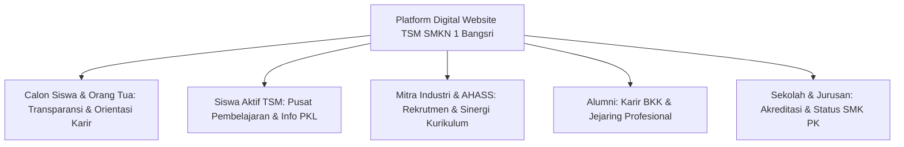

# Laporan 3: Kegunaan, Manfaat & Dampak Strategis Website

**Sistem Informasi Terintegrasi Konsentrasi Keahlian Teknik Sepeda Motor (TSM)**  
**SMK Negeri 1 Bangsri — Binaan Resmi PT Astra Honda Motor (AHM)**

---

## 1. Filosofi & Orientasi Kegunaan

Website Konsentrasi Keahlian Teknik Sepeda Motor (TSM) SMK Negeri 1 Bangsri dibangun bukan sekadar sebagai brosur digital statis, melainkan sebagai **Instrumen Strategis Vokasi (*Strategic Vocational Enabler*)**. Platform ini berfungsi sebagai jembatan hidup (*link and match*) yang menghubungkan kurikulum pendidikan kejuruan dengan dinamika kebutuhan industri otomotif nyata di era Revolusi Industri 4.0.

Sistem dirancang untuk menjawab tantangan klasik pendidikan vokasi: kesenjangan informasi kurikulum (*information gap*), keterbatasan akses penempatan kerja bagi lulusan, sulitnya pelacakan rekam jejak alumni (*tracer study*), serta minimnya portofolio digital yang dapat diakses secara terbuka oleh mitra industri berskala nasional.

---

## 2. Analisis Kegunaan bagi Pemangku Kepentingan (Stakeholders)

### 2.1 Bagi Calon Siswa & Wali Murid (Orang Tua)
Keputusan memilih jurusan di jenjang SMK adalah investasi masa depan anak. Website ini memberikan kepastian informasi (*assurance of quality*) melalui:
1. **Transparansi Kompetensi Belajar**: Orang tua dapat melihat secara gamblang bahwa anak mereka tidak hanya diajarkan teori, melainkan komposisi praktikum dominan 70% yang mencakup 4 pilar teknis (Sistem Mesin PGM-FI, Sasis Rem CBS/ABS, Kelistrikan Digital Smart Key, dan Administrasi Manajemen Bengkel).
2. **Kejelasan Kemitraan Industri Resmi**: Memastikan kepada masyarakat bahwa TSM SMKN 1 Bangsri merupakan sekolah binaan resmi **PT Astra Honda Motor (AHM)** sejak 2016, bukan sekadar klaim pemasaran, dibuktikan dengan portofolio MoU, kurikulum industri terstandar, dan sarana bengkel standar AHASS.
3. **Gambaran Pasti Prospek Karir**: Mengikis stigma lama bahwa lulusan otomotif hanya menjadi "tambal ban". Website memaparkan 3 jalur nyata karir lulusan:
   * Teknisi Resmi Bengkel AHASS (dengan sertifikasi kompetensi AHM).
   * Tenaga Ahli Manufaktur & Perakitan Otomotif.
   * Wirausahawan Bengkel Mandiri (*Technopreneur*).
4. **Pusat Informasi PPDB Bebas Simpang Siur**: Brosur resmi, persyaratan masuk, tata tertib kejuruan, dan kontak panitia dapat diunduh langsung tanpa risiko informasi perantara/calo.

---

### 2.2 Bagi Siswa Aktif TSM
Website menjadi media pendukung pembelajaran (*learning companion*) dan pusat informasi operasional:
1. **Akses Dokumen Silabus & Kurikulum**: Siswa dapat mengunduh dokumen silabus resmi untuk mengetahui target capaian kompetensi per semester.
2. **Kesiapan Praktik Kerja Lapangan (PKL)**: Modul PKL memberikan panduan lengkap mengenai prosedur magang 6 bulan penuh di jaringan AHASS, tata cara pengisian logbook harian, dan etika standar kerja industri 5R (*Ringkas, Rapi, Resik, Rawat, Rajin*).
3. **Sosialisasi Budaya Kerja & Safety Riding**: Materi keselamatan berkendara (*safety riding*) dan kepatuhan APD (Alat Pelindung Diri) bengkel dapat diakses siswa sebagai panduan keselamatan kerja harian di laboratorium.
4. **Ruang Apresiasi & Motivasi Prestasi**: Nama dan foto siswa peraih juara lomba LKS Otomotif atau kompetisi mekanik Honda diabadikan di galeri prestasi, membangun rasa bangga almamater (*school pride*) dan memacu kompetisi sehat antar-angkatan.

---

### 2.3 Bagi Mitra Dunia Usaha & Dunia Industri (DUDI & AHASS)
Bagi mitra korporasi seperti PT Astra Honda Motor, Main Dealer Astra Motor, dan jaringan bengkel resmi AHASS:
1. **Verifikasi Standar Kompetensi Lulusan**: Industri dapat melakukan audit cepat (*online audit*) terhadap keselarasan kurikulum yang diajarkan di SMKN 1 Bangsri dengan standar AMTC (*Astra Motor Training Center*).
2. **Efisiensi Jalur Rekrutmen Tenaga Kerja (Direct Sourcing)**: Melalui portal Bursa Kerja Khusus (BKK) pada website, pihak HRD bengkel atau industri dapat mempublikasikan lowongan kerja terverifikasi langsung ke target pelamar yang memiliki keterampilan yang sesuai.
3. **Akuntabilitas Kemitraan Vokasi**: Showcase logo mitra industri dan dokumentasi penyerahan bantuan unit praktik/peralatan menjadi bukti nyata pelaksanaan program *Corporate Social Responsibility* (CSR) industri yang transparan dan tepat sasaran.

---

### 2.4 Bagi Alumni TSM
Hubungan sekolah dengan lulusan tidak terputus saat wisuda, melainkan difasilitasi secara berkesinambungan:
1. **Portal Lowongan Kerja Khusus (BKK)**: Alumni yang ingin meningkatkan karir (*career switch*) atau mencari peluang penempatan baru dapat mengakses info lowongan terverifikasi kapan saja.
2. **Platform Tracer Study Akuntabel**: Alumni dapat memperbarui status pekerjaan terkini (apakah bekerja di AHASS, industri manufaktur, berwirausaha, atau kuliah), yang mempermudah pelaporan indikator kinerja kelulusan sekolah kepada dinas pendidikan.
3. **Jejaring Wirausaha Bengkel Mandiri**: Membuka peluang sinergi pasokan suku cadang resmi atau pertukaran wawasan bisnis antaralumni yang telah mendirikan bengkel servis mandiri di berbagai daerah.

---

### 2.5 Bagi Pengelola Jurusan & Manajemen Sekolah SMKN 1 Bangsri
Dari sudut pandang tata kelola kelembagaan (*institutional governance*):
1. **Pemenuhan Instrumen Akreditasi & Evaluasi Diri Sekolah (EDS)**: Website menyediakan data terpusat dan terpublikasi mengenai profil tenaga pendidik, sarana prasarana laboratorium, kurikulum industri, dan data penelusuran lulusan yang siap dijadikan bukti fisik saat visitasi asesor akreditasi BAN-SM.
2. **Mendukung Portofolio SMK Pusat Keunggulan (SMK PK)**: Sebagai konsentrasi keahlian binaan industri, keberadaan sistem informasi modern yang mencerminkan budaya digital dan kemitraan aktif DUDI menjadi poin krusial dalam penilaian status SMK Pusat Keunggulan dari Kemendikbudristek.
3. **Efisiensi Komunikasi Humas & Hubungan Industri (Hubin)**: Bagian Humas tidak lagi disibukkan oleh pertanyaan berulang mengenai syarat magang, profil guru, atau brosur PPDB; seluruh berkas resmi telah terdigitalisasi di pusat unduhan.
4. **Pemberdayaan Pengelolaan Konten Mandiri**: Melalui panel admin Filament yang intuitif, guru dan staf program keahlian dapat memperbarui data berita, prestasi baru, atau foto galeri secara mandiri tanpa ketergantungan teknis kepada pihak programmer eksternal.

---

## 3. Matriks Dampak Strategis Sistem

| Aspek Penilaian | Kondisi Sebelum Adanya Website Terintegrasi | Transformasi Setelah Penggunaan Website TSM |
| :--- | :--- | :--- |
| **Penyampaian Profil Jurusan** | Mengandalkan brosur cetak terbatas yang cepat usang dan sebarannya sempit di area lokal. | Etalase digital berjangkauan global 24/7 dengan dokumentasi visual resolusi tinggi dan fitur interaktif. |
| **Keterbukaan Kurikulum** | Kurikulum hanya tersimpan dalam dokumen arsip kurikulum kantor jurusan; sulit diakses wali murid. | Peta kurikulum interaktif (Fase E & F) dan silabus PDF resmi dapat ditinjau dan diunduh langsung oleh publik. |
| **Penyaluran Kerja & BKK** | Lowongan ditempel di papan pengumuman fisik sekolah; alumni luar kota sering terlambat menerima info. | Portal lowongan kerja digital terintegrasi yang dapat diakses secara *real-time* dari mana saja via ponsel. |
| **Pelacakan Jejak Alumni** | Pengumpulan data alumni dilakukan secara manual melalui pesan WhatsApp yang tercecer dan tidak terstruktur. | Halaman pelacakan alumni (*Tracer Study*) yang terorganisir, transparan, dan tersimpan aman di basis data. |
| **Aksesibilitas Mobile Pengguna** | Tampilan web desktop konvensional yang sulit dibaca di smartphone (*unresponsive* / teks mengecil). | Tampilan mobile *native-like* berkinerja tinggi dengan dock bawah solid putih dan drawer navigasi 4 kolom. |
| **Kemudahan Manajemen Konten** | Pembaruan data memerlukan akses ke kode sumber (*hardcoded*) yang rentan terjadi galat (*error*). | Panel CMS Filament modern yang memungkinkan staf sekolah mengelola artikel, guru, dan unduhan dengan aman. |

---

## 4. Kesimpulan Manfaat

Website Konsentrasi Keahlian TSM SMK Negeri 1 Bangsri berhasil mengukuhkan posisi institusi sebagai **pelopor pendidikan vokasi otomotif roda dua unggulan di Kabupaten Jepara dan sekitarnya**. 

Dengan mengombinasikan keandalan sistem backend berbasis Laravel 11/12, panel admin Filament v3 yang komprehensif, desain frontend mobile-first yang bersih dan solid, serta arsitektur konten yang berpusat pada *Link & Match* bersama PT Astra Honda Motor, website ini memberikan nilai tambah yang nyata, terukur, dan berkelanjutan bagi seluruh ekosistem pendidikan kejuruan.
