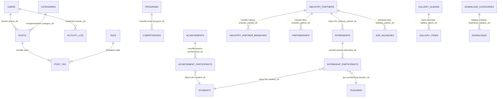
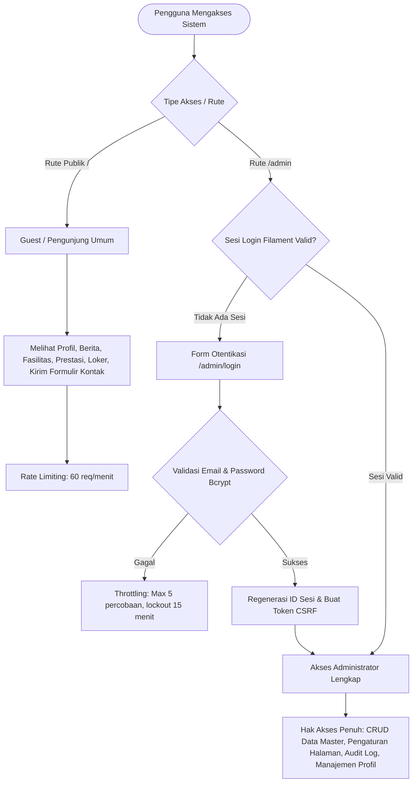

# LAPORAN PRESENTASI POIN 1
## STRUKTUR DATA, RELASI, INTEGRITAS DATA, ARSITEKTUR APLIKASI, DAN ROLE / HAK AKSES

**Aplikasi:** TBSM WEB — Portal Informasi Vokasi & Bursa Kerja Khusus (BKK)  
**Institusi:** Konsentrasi Keahlian Teknik dan Bisnis Sepeda Motor (TBSM) — SMK Negeri 1 Bangsri  
**Kemitraan Industri:** Binaan Resmi PT Astra Honda Motor (AHM)  
**Teknologi:** Laravel 11/12, Filament PHP v3, Livewire 3, Tailwind CSS v4, MariaDB 11.x, Spatie ActivityLog  

---

## 1. Arsitektur Aplikasi (Application Architecture)

Sistem dibangun menggunakan arsitektur modern **Multi-Tier Model-View-Controller (MVC) & Component-Driven Architecture**. Arsitektur ini memisahkan secara tegas antara lapisan penyajian (*presentation layer*), lapisan logika bisnis (*business logic layer*), dan lapisan persistensi data (*data persistence layer*).

```mermaid
graph TD
    subgraph Client Layer
        BrowserUser[Pengunjung Publik: Desktop, Tablet, Smartphone]
        BrowserAdmin[Administrator & Instruktur TBSM]
    end

    subgraph Security & Network Layer
        WebGateway[Nginx / Apache Web Server]
        MiddlewareGroup[Middleware Pipeline]
        SecurityHeaders[Security Headers & CSP]
        CSRFShield[CSRF Protection & EncryptCookies]
        RateLimiter[Throttle / Rate Limiting]
    end

    subgraph Application Core Layer (Laravel 11/12)
        RoutingEngine[Routing Engine: web.php & filament.php]
        
        subgraph Frontend Domain
            PublicControllers[Public Controllers: HomeController, NewsController, etc.]
            BladeComponents[Blade Component Engine & Tailwind CSS v4]
            AlpineClient[Alpine.js Micro-Interactivity]
        end

        subgraph Admin CMS Domain
            FilamentCore[Filament v3 Admin Panel Engine]
            LivewireCore[Livewire 3 Component Engine]
            FilamentResources[Filament Resources & Relation Managers]
            FilamentPages[Custom Pages & Form Schemas]
        end

        subgraph Service & Utility Layer
            SettingsService[SettingsService: Dynamic Configuration & Cache]
            ActivityLogger[Spatie ActivityLog: Audit Trail Engine]
            NumberPolyfill[App\Support\NumberPolyfill: ICU Formatter]
        end
    end

    subgraph Data & Storage Layer
        EloquentORM[Eloquent ORM: Models & Relations]
        Database[(MariaDB / MySQL Database: 26 Tables)]
        StorageDisk[Local Storage: /storage/app/public /storage/symlink]
    end

    BrowserUser --> WebGateway
    BrowserAdmin --> WebGateway
    WebGateway --> MiddlewareGroup
    MiddlewareGroup --> SecurityHeaders --> CSRFShield --> RateLimiter --> RoutingEngine

    RoutingEngine -->|Request Publik| PublicControllers
    RoutingEngine -->|Request Admin /admin| FilamentCore

    PublicControllers --> BladeComponents
    BladeComponents --> AlpineClient
    PublicControllers --> SettingsService
    PublicControllers --> EloquentORM

    FilamentCore --> LivewireCore
    LivewireCore --> FilamentResources
    LivewireCore --> FilamentPages
    FilamentResources --> EloquentORM
    FilamentPages --> SettingsService
    FilamentResources --> ActivityLogger

    EloquentORM --> Database
    PublicControllers --> StorageDisk
    FilamentResources --> StorageDisk
```

### Karakteristik Arsitektur Utama:
1. **Penyajian Cepat Berbasis SSR (Server-Side Rendering):** Halaman publik dirender langsung di server menggunakan Blade View Engine yang dioptimasi dengan Tailwind CSS v4 dan Vite, menghasilkan skor performa Core Web Vitals tinggi tanpa overhead SPA berat.
2. **Reaktivitas Tanpa API Boilerplate (Livewire 3 & Alpine.js):** Panel admin menggunakan Filament v3 berbasis Livewire 3 yang mengeksekusi mutasi komponen secara reaktif melalui websocket/XHR internal, sedangkan sisi frontend menggunakan Alpine.js untuk interaksi ringan (akordeon FAQ, mobile navigation drawer, hero slider, modal pop-up).
3. **Penyimpanan Terpusat & Caching Berbasis Layanan (`SettingsService`):** Seluruh konfigurasi global dinamis (logo, nama sekolah, kontak, headline) disimpan pada tabel `settings` dan di-cache dalam memori aplikasi menggunakan service layer khusus (`App\Services\SettingsService`), mereduksi query berulang ke basis data.

---

## 2. Struktur Data & Relasi Antar-Entitas (Entity Relationships)

Basis data sistem (`tbsm_db`) mencakup **26 tabel** yang dirancang memenuhi kaidah **Normal Form Ketiga (3NF)** guna meniadakan redundansi data.

> [!TIP]
> **Asset Slide Siap Pakai:** Untuk ditayangkan pada slide presentasi proyektor/layar lebar (16:9 Full HD), telah disediakan diagram visual beresolusi tinggi:
> - Format PNG Gambar HD: [`ERD_PRESENTASI.png`](ERD_PRESENTASI.png)
> - Format Vektor SVG: [`ERD_PRESENTASI.svg`](ERD_PRESENTASI.svg)



### Rincian Tabel dan Relasi Utama:
1. **Tabel `users` (Manajemen Akun Administrator & Staf)**
   - `id` (PK, BigInt Unsigned, Auto Increment)
   - `name` (Varchar 255): Nama lengkap administrator
   - `email` (Varchar 255, Unique): Alamat email resmi untuk otentikasi
   - `password` (Varchar 255): Hash kata sandi menggunakan algoritma Bcrypt
   - `remember_token`, `created_at`, `updated_at`
   - *Relasi:* `hasMany(Post::class, 'author_id')`

2. **Tabel `industry_partners` & `industry_partner_branches` (Kemitraan DUDI / AHASS)**
   - Relasi: **One-to-Many** (`industry_partners.id` -> `industry_partner_branches.industry_partner_id`).
   - *Kunci Asing:* `FOREIGN KEY (industry_partner_id) REFERENCES industry_partners(id) ON DELETE CASCADE`.
   - Menggambarkan 1 mitra induk (contoh: PT Astra Honda Motor) yang membawahi puluhan jaringan bengkel AHASS resmi di Jepara, Kudus, dan Pati.

3. **Tabel `posts`, `categories`, `tags`, dan `post_tag` (Publikasi Berita & Artikel)**
   - `posts` ke `categories`: **Many-to-One** (`posts.category_id` -> `categories.id` ON DELETE RESTRICT).
   - `posts` ke `tags`: **Many-to-Many** via tabel pivot `post_tag` (`post_id`, `tag_id`) dengan aturan `ON DELETE CASCADE`.

4. **Tabel `internships` & `internship_participants` (Sistem PKL / Praktik Industri)**
   - Relasi menghubungkan mitra industri, data gelombang PKL, siswa peserta, dan guru pembimbing (`teachers`).
   - Kunci Asing: `ON DELETE CASCADE` untuk data peserta saat data periode PKL dihapus.

5. **Tabel `achievements` & `achievement_participants` (Prestasi Kejuaraan Vokasi)**
   - Relasi: One-to-Many mendata kompetisi kejuaraan (seperti LKS Otomotif Nasional & Honda Technical Skill Contest) dan memetakan siswa peraih medali.

6. **Tabel `gallery_albums` & `gallery_items` (Dokumentasi Visual Sekolah)**
   - Relasi: One-to-Many dengan cascading delete untuk file media.

7. **Tabel `contact_messages` (Kotak Pesan Kontak Masuk)**
   - Menampung aspirasi, pertanyaan calon siswa, dan penawaran kemitraan industri dari form kontak publik lengkap dengan status keterbacaan (`is_read`).

---

## 3. Penjaminan Integritas Data (Data Integrity)

Sistem menerapkan prinsip **Defense in Depth** untuk menjamin integritas data pada 3 tingkatan berbeda:

### 3.1 Integritas Tingkat Basis Data (Database-Level Integrity)
1. **Foreign Key Constraints:** Menghindari data yatim (*orphan records*).
   - `ON DELETE CASCADE`: Diterapkan pada data anak yang bergantung mutlak pada induknya (contoh: menghapus album galeri otomatis menghapus seluruh item foto di dalamnya; menghapus postingan menghapus relasi tag di pivot `post_tag`).
   - `ON DELETE RESTRICT`: Diterapkan pada data relasi yang tidak boleh hilang sembarangan (contoh: kategori berita tidak dapat dihapus jika masih ada berita aktif yang bernaung di bawahnya).
2. **Unique Constraints:** Mencegah duplikasi data unik:
   - `users.email` (Unique)
   - `posts.slug`, `categories.slug`, `tags.slug`, `programs.slug`, `achievements.slug`, `job_vacancies.slug` (Unique Index untuk kebutuhan SEO dan akses deterministik).
3. **Default Values & Not Null Constraints:** Kolom penting seperti `status` memiliki nilai default `published` atau `draft`, serta boolean `is_active` bernilai default `true`.

### 3.2 Integritas Tingkat Model (Application/Model-Level Integrity)
1. **Type Casting Eloquent:** Memastikan tipe data dikonversi secara presisi:
   - `is_active` => `'boolean'`
   - `published_at` => `'datetime'`
   - `meta_keywords` => `'array'`
2. **Database Transactions (`DB::transaction`):** Mutasi multi-tabel (misalnya pembuatan berita beserta sinkronisasi tagar dan log audit) dibungkus dalam blok transaksi database. Jika terjadi kegagalan pada salah satu proses, seluruh perubahan akan di-*rollback* secara otomatis.

---

## 4. Role dan Hak Akses (Role & Access Control)

Sistem membagi batas otorisasi pengguna ke dalam 2 domain utama:



### Matriks Hak Akses (Access Control Matrix)

| Entitas Data / Modul | Pengunjung Publik (Guest) | Administrator Sekolah (Admin) |
| :--- | :---: | :---: |
| Halaman Beranda, Tentang, Akademik, Fasilitas, Industri | **Read-Only** (Melihat) | **Full Access** (Ubah Konten & Slider) |
| Portal Berita & Pengumuman | **Read-Only** + Filter & Cari | **Full Access** (Create, Read, Update, Delete) |
| Loker BKK & Informasi Kemitraan AHASS | **Read-Only** | **Full Access** (Kelola Mitra, Cabang, Loker) |
| Formulir Kontak (`/kontak`) | **Create** (Kirim Pesan) | **Read, Mark as Read, Delete** |
| Repositori Unduhan Silabus / Berkas | **Read & Download** | **Full Access** (Upload, Ganti, Hapus) |
| Audit Trail / Log Aktivitas (`activity_log`) | **No Access** (Diblokir) | **Read-Only** (Inspeksi Jejak Digital Pengguna) |
| Terminal DevOps (`update-repo.php`) | **No Access** | **Protected Key** (`DEPLOY_KEY` khusus server) |

---

## 5. Panduan Pembuktian & Demonstrasi di Depan Penguji

Saat penguji meminta bukti untuk **Poin 1**, lakukan demonstrasi berikut:

### Bukti 1: Membuktikan Relasi Basis Data & Integritas Kunci Asing
1. **Buka Terminal / Database Client (HeidiSQL/TablePlus/phpMyAdmin/Terminal Artisan):**
   Jalankan perintah migration status atau cek foreign keys:
   ```bash
   php artisan migrate:status
   ```
2. **Tunjukkan Struktur Skema:**
   Buka file migrasi [contoh: `database/migrations/2026_09_02_000003_create_industry_tables.php`](file:///home/Rayy/Project/Github/TBSM%20WEB/toweb/database/migrations/) dan perlihatkan sintaks:
   ```php
   $table->foreignId('industry_partner_id')->constrained()->cascadeOnDelete();
   ```
   *Jelaskan kepada penguji bahwa jika data industri dihapus, seluruh cabang relasinya terhapus bersih tanpa menyisakan data sampah.*

### Bukti 2: Membuktikan Arsitektur Kode (MVC & Services)
1. Perlihatkan controller publik di [`app/Http/Controllers/HomeController.php`](file:///home/Rayy/Project/Github/TBSM%20WEB/toweb/app/Http/Controllers/HomeController.php).
2. Tunjukkan bagaimana controller memanggil service [`App\Services\SettingsService`](file:///home/Rayy/Project/Github/TBSM%20WEB/toweb/app/Services/SettingsService.php) untuk efisiensi caching.
3. Tunjukkan view modular Blade di [`resources/views/components/frontend/home/`](file:///home/Rayy/Project/Github/TBSM%20WEB/toweb/resources/views/components/frontend/home/).

### Bukti 3: Membuktikan Proteksi Hak Akses (Otentikasi)
1. Buka browser pada mode **Incognito Window**.
2. Akses URL: `http://localhost:8000/admin`.
3. Tunjukkan bahwa sistem secara otomatis mencegat request dan me-redirect ke `http://localhost:8000/admin/login`.
4. Masukkan kredensial salah untuk membuktikan proteksi pesan galat dan throttling.
5. Masukkan kredensial admin yang benar: `admin@smkn1bangsri.sch.id` untuk membuktikan pengalihan ke dashboard admin.
