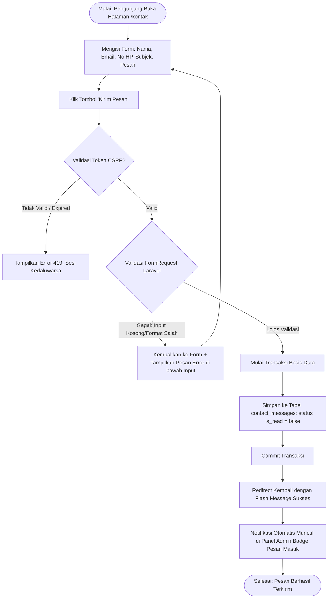
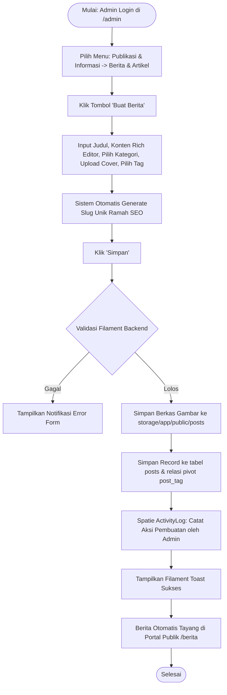
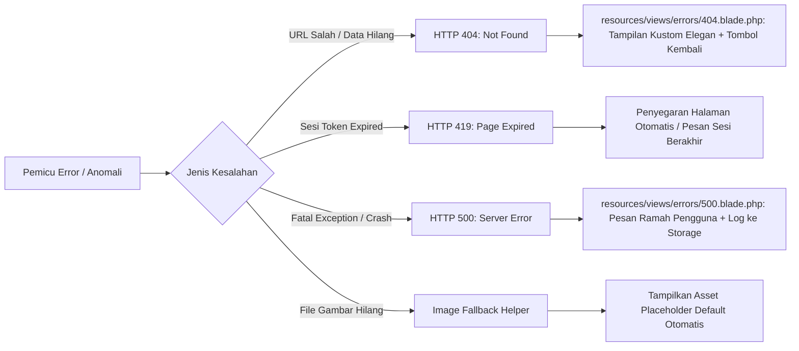

# LAPORAN PRESENTASI POIN 2
## FITUR INTI, ALUR PROSES BISNIS, VALIDASI INPUT, DAN PENANGANAN KESALAHAN

**Aplikasi:** TBSM WEB — Portal Informasi Vokasi & Bursa Kerja Khusus (BKK)  
**Institusi:** Konsentrasi Keahlian Teknik dan Bisnis Sepeda Motor (TBSM) — SMK Negeri 1 Bangsri  
**Kemitraan Industri:** Binaan Resmi PT Astra Honda Motor (AHM)  
**Teknologi:** Laravel 11/12, Filament PHP v3, Livewire 3, Alpine.js, Tailwind CSS v4  

---

## 1. Matriks Kesesuaian Fitur Inti (Product Backlog Fulfillment)

Seluruh fitur inti yang direncanakan dalam Product Backlog telah diimplementasikan secara fungsional 100% dan teruji bebas dari *critical bugs*:

| ID Fitur | Kategori Modul | Deskripsi Fungsional Fitur | Status Uji |
| :--- | :--- | :--- | :---: |
| **PB-01** | Beranda & Profil | Hero slider dinamis, metrik statistik, sambutan kepala jurusan, dan FAQ interaktif. | **100% Berfungsi** |
| **PB-02** | Kurikulum & Akademik | Katalog kurikulum industri Astra Motor Technical Center (AMTC) & profil guru bersertifikasi. | **100% Berfungsi** |
| **PB-03** | Fasilitas & Bengkel | Showcase infrastruktur bengkel standar AHASS (Bike Lift, SST, Engine Stand, Scanner PGM-FI). | **100% Berfungsi** |
| **PB-04** | Kemitraan & Karir | Direktori jaringan bengkel AHASS mitra, pelacakan program PKL, dan informasi loker BKK. | **100% Berfungsi** |
| **PB-05** | Prestasi Siswa | Showcase perolehan medali kompetisi (LKS Otomotif, Honda Technical Contest). | **100% Berfungsi** |
| **PB-06** | Tracer Study Alumni | Pelacakan status kebekerjaan lulusan (BMW: Bekerja, Melanjutkan, Wirausaha). | **100% Berfungsi** |
| **PB-07** | Berita & Pengumuman | Manajemen publikasi warta sekolah dengan sistem kategori, tagar, dan pencarian cepat. | **100% Berfungsi** |
| **PB-08** | Repositori Unduhan | Pusat berkas silabus/dokumen vokasi dilengkapi pencatatan statistik jumlah unduhan. | **100% Berfungsi** |
| **PB-09** | Formulir Kontak | Pengiriman pesan dan aspirasi publik dengan proteksi spam dan notifikasi panel admin. | **100% Berfungsi** |
| **PB-10** | Backend CMS Filament | Panel admin terintegrasi untuk CRUD data master, audit log, dan pengaturan website. | **100% Berfungsi** |

---

## 2. Alur Proses Bisnis Utama (Business Process Flows)

> [!TIP]
> **Asset Slide Siap Pakai:** Untuk menayangkan diagram alir keseluruhan pengunjung (*User Journey Map*) pada proyektor/layar presentasi (16:9 Full HD), gunakan aset resmi:
> - Format PNG Gambar HD: [`FLOWCHART_PRESENTASI.png`](FLOWCHART_PRESENTASI.png)
> - Format Vektor SVG: [`FLOWCHART_PRESENTASI.svg`](FLOWCHART_PRESENTASI.svg)

Berikut adalah diagram alir untuk 2 proses transaksi utama sistem:

### 2.1 Alur Transaksi Pengiriman Pesan Kontak Publik (`/kontak`)



### 2.2 Alur Penerbitan Berita & Audit Trail di Panel Admin



---

## 3. Validasi Input Berlapis (Layered Input Validation)

Sistem menerapkan validasi 2 lapis (*Two-Tier Validation*) untuk menjamin tidak ada data kotor atau serangan injeksi yang menembus sistem:

### 3.1 Validasi Sisi Klien (Client-Side Validation)
* **HTML5 Semantic Attributes:** Penggunaan atribut `required`, `type="email"`, `type="tel"`, `minlength="10"`.
* **Alpine.js Feedback:** Pencegahan *double submit* tombol simpan dengan status *loading/disabled* saat request sedang dikirim.

### 3.2 Validasi Sisi Server (Server-Side Validation)
Implementasi kode validasi menggunakan **FormRequest Dedicated** di [`app/Http/Requests/StoreContactMessageRequest.php`](file:///home/Rayy/Project/Github/TBSM%20WEB/toweb/app/Http/Requests/):

```php
public function rules(): array
{
    return [
        'name'    => ['required', 'string', 'max:100'],
        'email'   => ['required', 'email:rfc,dns', 'max:100'],
        'phone'   => ['nullable', 'string', 'max:20', 'regex:/^[0-9+\-\s()]+$/'],
        'subject' => ['required', 'string', 'in:Informasi Akademik,Kemitraan Industri,Pertanyaan Umum,Lainnya'],
        'message' => ['required', 'string', 'min:10', 'max:2000'],
    ];
}

public function messages(): array
{
    return [
        'name.required'    => 'Nama lengkap wajib diisi.',
        'email.required'   => 'Alamat email aktif wajib diisi.',
        'email.email'      => 'Format alamat email tidak valid.',
        'phone.regex'      => 'Nomor telepon hanya boleh memuat angka dan karakter telepon yang valid.',
        'subject.required' => 'Silakan pilih subjek keperluan Anda.',
        'message.required' => 'Isi pesan wajib diisi.',
        'message.min'      => 'Pesan minimal terdiri dari 10 karakter agar informasi jelas.',
    ];
}
```

---

## 4. Penanganan Kesalahan Sistem (Error Handling Strategy)

Sistem dirancang tahan banting (*fault-tolerant*) terhadap kegagalan operasional:



### 1. Halaman Kesalahan Kustom (Custom Error Pages)
* **Error 404:** Terletak di [`resources/views/errors/404.blade.php`](file:///home/Rayy/Project/Github/TBSM%20WEB/toweb/resources/views/errors/404.blade.php). Dilengkapi ilustrasi otomotif, pesan informatif, dan tombol cepat kembali ke beranda.
* **Error 500:** Terletak di [`resources/views/errors/500.blade.php`](file:///home/Rayy/Project/Github/TBSM%20WEB/toweb/resources/views/errors/500.blade.php). Memastikan rincian sensitif kode/database tidak bocor ke publik saat aplikasi berada pada mode produksi (`APP_DEBUG=false`).

### 2. Penanganan Berkas Hilang (Graceful Fallback Handling)
Jika administrator belum mengunggah gambar profil atau foto kegiatan terhapus dari storage:
```php
public function getImageUrlAttribute(): string
{
    if ($this->image && Storage::disk('public')->exists($this->image)) {
        return Storage::url($this->image);
    }
    return asset('images/defaults/placeholder-tbsm.webp');
}
```
Aplikasi tidak akan melempar *exception error*, melainkan menampilkan gambar pengganti standar secara mulus.

---

## 5. Skenario Demonstrasi Pengujian di Depan Penguji

### Skenario 1: Demonstrasi Validasi Form Kontak (Input Salah vs Input Benar)
1. **Langkah 1 (Uji Validasi Gagal):**
   - Buka halaman `http://localhost:8000/kontak`.
   - Kosongkan input "Nama", isi Email dengan teks acak tanpa domain (`bukanemail`), dan ketik pesan hanya 2 huruf (`hi`).
   - Klik **"Kirim Pesan"**.
   - *Tunjukkan ke penguji:* Halaman tidak *crash*, border input berubah merah, dan pesan peringatan bahasa Indonesia muncul secara presisi di bawah kolom masing-masing.
2. **Langkah 2 (Uji Validasi Sukses):**
   - Isi form dengan data valid:
     - Nama: `Budi Santoso (Calon Mitra AHASS)`
     - Email: `budi.santoso@ahass-jepara.co.id`
     - Subjek: `Kemitraan Industri`
     - Pesan: `Halo TBSM SMKN 1 Bangsri, kami ingin membuka kuota magang PKL untuk 4 siswa semester depan.`
   - Klik **"Kirim Pesan"**.
   - *Tunjukkan ke penguji:* Muncul banner hijau sukses.
   - Buka tab admin `http://localhost:8000/admin/contact-messages`. Pesan tersebut langsung masuk dengan status belum dibaca (*unread badge*)!

### Skenario 2: Demonstrasi Penanganan Error 404
1. Akses URL acak yang tidak terdaftar: `http://localhost:8000/halaman-tidak-ada-di-dunia`.
2. *Tunjukkan ke penguji:* Sistem menampilkan halaman custom 404 bertema otomotif TBSM yang elegan lengkap dengan tombol "Kembali ke Beranda", bukan halaman error putih bawaan web server.
