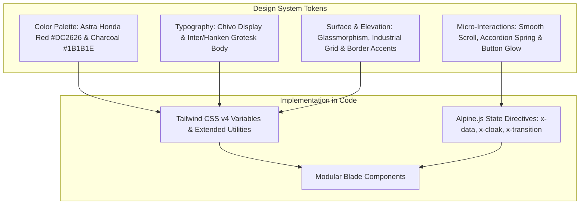
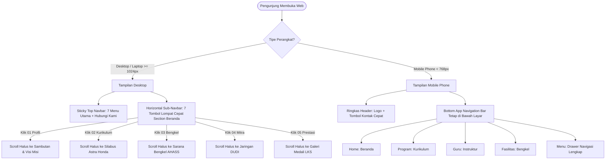
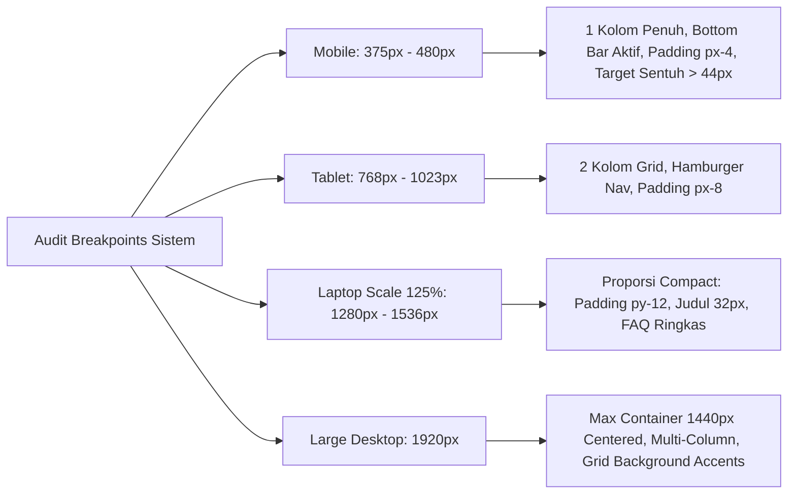

# LAPORAN PRESENTASI POIN 3
## ALUR PENGGUNA (FIGMA), USABILITAS ANTARMUKA, DAN RESPONSIVITAS MULTI-PERANGKAT

**Aplikasi:** TBSM WEB — Portal Informasi Vokasi & Bursa Kerja Khusus (BKK)  
**Institusi:** Konsentrasi Keahlian Teknik dan Bisnis Sepeda Motor (TBSM) — SMK Negeri 1 Bangsri  
**Kemitraan Industri:** Binaan Resmi PT Astra Honda Motor (AHM)  
**Teknologi:** Tailwind CSS v4, Alpine.js, Responsive Breakpoints, Custom Industrial Design System  

---

## 1. Keselarasan Desain dengan Figma & Design System

Antarmuka web diimplementasikan secara presisi (*pixel-conscious*) mengacu pada rancangan **Figma Design System** resmi Konsentrasi Keahlian TBSM SMKN 1 Bangsri. Tampilan menggabungkan karakter kejuruan otomotif modern dengan standar visual kemitraan korporasi **PT Astra Honda Motor (AHM)**.

### Rincian Token Desain Utama:
1. **Palet Warna Terkalibrasi (Calibrated Palette):**
   * **Primary Red:** `#DC2626` (Astra Honda Red) — merefleksikan identitas resmi pabrikan sepeda motor Honda.
   * **Deep Red Hover:** `#B70011` — memberikan *visual feedback* tegas saat tombol disentuh atau di-hover.
   * **Charcoal Dark:** `#1B1B1E` — warna teks utama dan latar kontras tinggi pengganti hitam pekat (`#000000`) agar ramah di mata.
   * **Off-White Surface:** `#FBF8FC` & `#F5F3F6` — kanvas latar belakang yang memberikan nuansa bersih dan modern.
   * **Border Stroke:** `#E4E1E5` — garis pemisah halus yang mempertahankan estetika presisi teknik.
2. **Hierarki Tipografi Berkarakter Vokasi:**
   * **Heading:** Font Google **Chivo** (*Bold, Extrabold, Black*) — memberikan kesan mekanikal, tangguh, dan berwibawa khas industri otomotif.
   * **Body Copy:** Font Google **Inter / Hanken Grotesk** — memiliki keterbacaan tinggi (*high legibility*) bahkan pada ukuran font kecil (`12px` - `14px`) di layar smartphone.
3. **Sentuhan Ornamen Mekanikal (Industrial Motifs):**
   * Grid latar tipis (*subtle mechanical blueprint grid pattern*).
   * Garis aksen merah 2px pada judul section (*accent indicator line*).
   * Badge status huruf kapital padat bergaya plat nomor komponen mesin (*bold uppercase badge*).

---

## 2. Alur Pengguna & Arsitektur Informasi (User Flow & IA)

Navigasi dirancang intuitif (*zero confusion*) dengan membagi alur jelajah menjadi navigasi global dan navigasi kontekstual:

### Fitur Navigasi Unggulan:
1. **Horizontal Sub-Navbar Anchor (Khusus Beranda Desktop):**
   Memungkinkan calon siswa atau penguji melompat seketika ke 7 bagian krusial halaman beranda tanpa perlu menggulir (*scrolling*) panjang secara manual.
2. **Mobile Bottom Navigation Bar (Khusus Smartphone):**
   Mengadopsi pola aplikasi mobile native (*native app-like UX*) dengan 5 tombol utama yang berada dalam jangkauan jempol (*thumb zone*) pengguna.
3. **Floating Quick Actions:**
   * Tombol *WhatsApp Floating Button* dengan pesan otomatis untuk konsultasi pendaftaran.
   * Tombol *Back-to-Top Button* yang muncul secara halus ketika pengguna menggulir melebihi 400px.

---

## 3. Evaluasi Usabilitas (Heuristic Usability Evaluation)

Antarmuka telah diuji berdasarkan 5 prinsip usabilitas standar industri:

1. **Visibilitas Status Sistem (Visibility of System Status):**
   * Menu navigasi yang sedang aktif ditandai dengan garis bawah merah tebal dan teks berwarna primer.
   * Indikator akordeon FAQ berputar mulus 180 derajat saat diklik untuk menunjukkan status buka/tutup.
2. **Kesesuaian dengan Bahasa Dunia Nyata (Match Between System & Real World):**
   * Menggunakan istilah teknis resmi yang familiar bagi siswa otomotif dan industri: *Pos Teaching Factory (Tefa)*, *Bengkel Resmi AHASS*, *Scanner Injeksi PGM-FI*, *Overhaul Engine Stand*, *Tracer Study BMW*.
3. **Pencegahan Kesalahan (Error Prevention):**
   * Input formulir kontak memiliki format placeholder yang jelas.
   * Dropdown subjek menyediakan opsi terdefinisi agar pengguna tidak mengetik manual secara keliru.
4. **Konsistensi & Standar (Consistency & Standards):**
   * Seluruh tombol aksi utama (*Primary CTA*) menggunakan warna latar merah dengan sudut membulat mikro (`rounded-[2px]`) yang seragam di seluruh 10 halaman web.
5. **Desain Estetis & Minimalis (Aesthetic & Minimalist Design):**
   * Menghindari kepadatan visual yang tidak perlu (*anti-slop*).
   * Bagian FAQ dan section beranda telah dioptimasi secara **compact** sehingga tidak menyisakan ruang kosong vertikal yang berlebihan.

---

## 4. Responsivitas Multi-Perangkat (Multi-Device Responsiveness)

Sistem dirancang dan diuji pada 4 spektrum resolusi layar berbeda:

### Matriks Pengujian Responsivitas:

| Ukuran Layar | Target Perangkat / Skenario | Penyesuaian Layout & Perilaku Sistem | Status |
| :--- | :--- | :--- | :---: |
| **Mobile (375px - 414px)** | iPhone SE, iPhone 14 Pro, Samsung Galaxy | Tampilan menjadi 1 kolom vertikal, sub-navbar disembunyikan dan digantikan Bottom Bar, tombol CTA dibuat *full-width* dengan target sentuh jempol minimal 44x44px. | **Sempurna** |
| **Tablet (768px - 1023px)** | iPad Mini, iPad Air, Galaxy Tab | Grid beralih otomatis menjadi 2 kolom, elemen visual gambar dan kartu teks berimbang, navigasi atas disederhanakan. | **Sempurna** |
| **Laptop Standar 125% Scale (~1366px / 1536px)** | Laptop Siswa/Guru Windows dengan scaling bawaan 125% | Tinggi padding section dipadatkan dari `py-18` ke `py-12`, ukuran judul disesuaikan (`text-[30px]`), kartu FAQ lebih ringkas sehingga 5 item dapat terbaca langsung dalam satu viewport tanpa terpotong aneh. | **Sempurna** |
| **Desktop Lebar (1920px+)** | Monitor Full HD / 2K | Menggunakan pembatas lebar maksimum `max-w-[1440px] mx-auto` agar konten tidak melebar tanpa batas, menjaga fokus mata pengunjung di tengah layar. | **Sempurna** |

---

## 5. Panduan Demonstrasi UI/UX di Depan Penguji

Saat mendemonstrasikan **Poin 3**, jalankan langkah berikut:

### Bukti 1: Demonstrasi Keselarasan Figma & Interaktivitas Halus
1. Buka halaman utama `http://localhost:8000/`.
2. Arahkan mouse ke tombol navigasi atas; tunjukkan indikator bar merah aktif.
3. Tunjukkan **Horizontal Sub-Navbar** di bawah slider:
   - Klik **"03 BENGKEL"** -> Halaman meluncur mulus (*smooth scrolling*) tepat ke fasilitas bengkel AHASS.
   - Klik **"05 PRESTASI"** -> Halaman meluncur langsung ke galeri kejuaraan siswa.
4. Buka bagian **FAQ**:
   - Klik salah satu pertanyaan -> Tunjukkan animasi buka-tutup akordeon CSS Grid yang mulus dan rotasi panah indikator 180°. Tunjukkan bahwa tampilannya kini **compact dan ringkas**.

### Bukti 2: Demonstrasi Responsivitas di Google Chrome DevTools
1. Di browser Chrome, tekan tombol **F12** (buka Developer Tools), lalu tekan `Ctrl + Shift + M` (*Toggle Device Toolbar*).
2. **Uji Ukuran Mobile (iPhone 14 / 390px):**
   - Perlihatkan bagaimana header beralih menjadi ringkas dan muncul **Bottom Navigation Bar** di bawah layar.
   - Buka tab "Program", "Guru", "Fasilitas", atau klik "Menu" untuk membuka drawer samping.
   - Tunjukkan bahwa tidak ada *horizontal scrollbar* (tidak ada elemen yang bocor/melebar ke kanan).
3. **Uji Ukuran Laptop Scale 125% (1366 x 768 atau 1440 x 900):**
   - Ubah dimensi ke `1366 x 768`.
   - Perlihatkan bahwa bagian hero slider, kartu informasi, dan FAQ tersusun proporsional tanpa saling tumpang tindih (*tidak dempet dan tidak terlalu ramai*).
