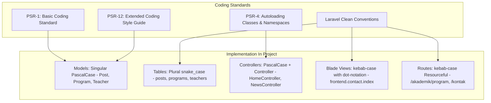
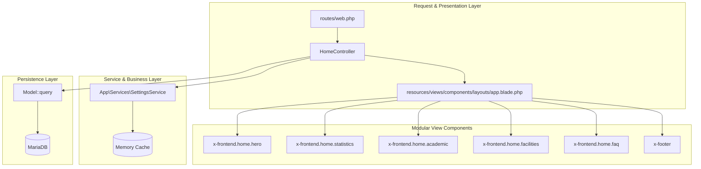
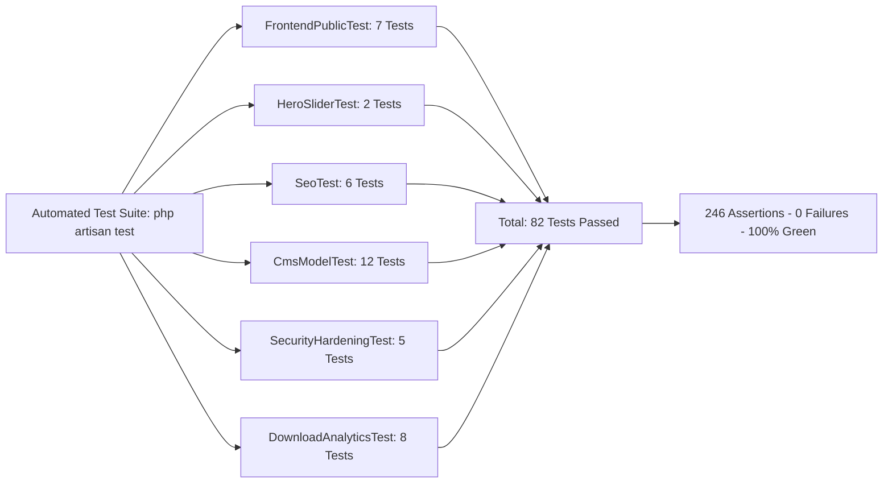

# LAPORAN PRESENTASI POIN 4
## STRUKTUR KODE, KONVENSI PENAMAAN, MODULARITAS, VALIDASI, DAN DOKUMENTASI SOURCE CODE

**Aplikasi:** TBSM WEB — Portal Informasi Vokasi & Bursa Kerja Khusus (BKK)  
**Institusi:** Konsentrasi Keahlian Teknik dan Bisnis Sepeda Motor (TBSM) — SMK Negeri 1 Bangsri  
**Kemitraan Industri:** Binaan Resmi PT Astra Honda Motor (AHM)  
**Standar Kode:** PSR-1, PSR-4, PSR-12, Laravel Best Practices, Filament v3 Architecture  

---

## 1. Konvensi Penamaan & Standar Kode (Coding Standards)

Basis kode aplikasi mengikuti standar internasional **PHP Standards Recommendations (PSR)** dan **Laravel Architectural Guidelines**:



### Tabel Matriks Konvensi Penamaan:

| Lapisan Kode | Konvensi Penamaan | Contoh Nyata dalam Repositori | Keterangan & Rujukan |
| :--- | :--- | :--- | :--- |
| **Model Eloquent** | `PascalCase` (Tunggal / Singular) | [`app/Models/Teacher.php`](file:///home/Rayy/Project/Github/TBSM%20WEB/toweb/app/Models/Teacher.php) | Mewakili satu entitas guru/instruktur. |
| **Tabel Basis Data** | `snake_case` (Jamak / Plural) | `teachers`, `industry_partners` | Dibuat melalui berkas migrasi otomatis. |
| **Controller Publik** | `PascalCase` + Suffix `Controller` | [`app/Http/Controllers/HomeController.php`](file:///home/Rayy/Project/Github/TBSM%20WEB/toweb/app/Http/Controllers/HomeController.php) | Memisahkan controller publik dari CMS. |
| **Form Request** | `PascalCase` + Suffix `Request` | [`app/Http/Requests/StoreContactMessageRequest.php`](file:///home/Rayy/Project/Github/TBSM%20WEB/toweb/app/Http/Requests/) | Menangani validasi input khusus formulir. |
| **Service Class** | `PascalCase` + Suffix `Service` | [`app/Services/SettingsService.php`](file:///home/Rayy/Project/Github/TBSM%20WEB/toweb/app/Services/SettingsService.php) | Layanan bisnis independen (cache setting). |
| **Filament Resource** | `PascalCase` + Suffix `Resource` | [`app/Filament/Resources/PostResource.php`](file:///home/Rayy/Project/Github/TBSM%20WEB/toweb/app/Filament/Resources/Posts/PostResource.php) | Menangani tabel, form, dan query admin. |
| **Blade Views** | `kebab-case.blade.php` | [`resources/views/frontend/about.blade.php`](file:///home/Rayy/Project/Github/TBSM%20WEB/toweb/resources/views/frontend/about.blade.php) | Struktur direktori mencerminkan URL rute. |
| **Blade Components** | `<x-kebab-case>` | `<x-frontend.home.faq>` | Komponen mandiri yang dapat digunakan ulang. |

---

## 2. Modularitas & Pemisahan Tanggung Jawab (Separation of Concerns)

Sistem menerapkan arsitektur modular yang membagi kode ke dalam blok-blok fungsional kecil yang mandiri (*decoupled*):



### Keunggulan Arsitektur Modular Ini:
1. **Komponen Blade Terisolasi:**
   Setiap bagian halaman utama (seperti FAQ di [`faq.blade.php`](file:///home/Rayy/Project/Github/TBSM%20WEB/toweb/resources/views/components/frontend/home/faq.blade.php)) memiliki file tersendiri. Ketika pengembang ingin mengubah ukuran atau tampilan FAQ menjadi lebih compact, modifikasi hanya dilakukan pada file tersebut tanpa risiko merusak komponen slider, profil, atau berita.
2. **Layer Layanan Mandiri (`SettingsService`):**
   Pengambilan data identitas sekolah tidak dilakukan dengan query SQL mentah di setiap view, melainkan melalui method helper `$settings->get('key', 'default')` yang memiliki sistem cache otomatis.
3. **Kompatibilitas Lingkungan Luas (`NumberPolyfill`):**
   Terdapat class utilitas [`App\Support\NumberPolyfill`](file:///home/Rayy/Project/Github/TBSM%20WEB/toweb/app/Support/) yang secara otomatis mendeteksi apakah server memiliki ekstensi `intl`. Jika hosting tidak memiliki modul tersebut, polyfill internal ini akan memformat angka dan mata uang rupiah tanpa menimbulkan *fatal error 500*.

---

## 3. Implementasi Validasi & Penanganan Error dalam Kode

### 3.1 Contoh Nyata Kode Validasi Bersih (FormRequest)
Cuplikan kode dari [`StoreContactMessageRequest.php`](file:///home/Rayy/Project/Github/TBSM%20WEB/toweb/app/Http/Requests/):
```php
<?php

namespace App\Http\Requests;

use Illuminate\Foundation\Http\FormRequest;

class StoreContactMessageRequest extends FormRequest
{
    public function authorize(): bool
    {
        return true; // Pengunjung publik diizinkan mengirim pesan
    }

    public function rules(): array
    {
        return [
            'name'    => ['required', 'string', 'max:100'],
            'email'   => ['required', 'email:rfc,dns', 'max:100'],
            'phone'   => ['nullable', 'string', 'max:20', 'regex:/^[0-9+\-\s()]+$/'],
            'subject' => ['required', 'string'],
            'message' => ['required', 'string', 'min:10', 'max:2000'],
        ];
    }
}
```

### 3.2 Contoh Nyata Penanganan Kesalahan (Exception Handling)
Cuplikan penanganan error pada Controller:
```php
try {
    $validated = $request->validated();
    
    DB::transaction(function () use ($validated) {
        ContactMessage::create($validated);
    });

    return redirect()->back()->with('success', 'Pesan Anda berhasil dikirim ke jurusan TBSM.');
} catch (\Throwable $e) {
    Log::error('Gagal menyimpan pesan kontak: ' . $e->getMessage(), [
        'request' => $request->except(['_token']),
    ]);
    
    return redirect()->back()
        ->withInput()
        ->with('error', 'Terjadi kendala pada server saat menyimpan pesan. Silakan coba beberapa saat lagi.');
}
```

---

## 4. Dokumentasi & Kualitas Pengujian Source Code (Test-Driven Quality)

Repositori dilengkapi dengan rangkaian pengujian otomatis (*Automated Feature Testing*) berbasis **PHPUnit** untuk menjamin stabilitas fungsional:



### Hasil Eksekusi Uji Terakhir:
* **Total Pengujian:** **82 Tests**
* **Total Asersi:** **246 Assertions**
* **Tingkat Keberhasilan:** **100% Passed (0 Failures, 0 Errors)**
* **Waktu Eksekusi:** ~26 detik

### Kelengkapan Dokumentasi Proyek:
Repositori dilengkapi dengan 5 berkas dokumentasi teknis komprehensif di root direktori:
1. [`README.md`](file:///home/Rayy/Project/Github/TBSM%20WEB/toweb/README.md) (40 KB): Panduan instalasi, konfigurasi environment, dan arsitektur umum.
2. [`ERD.md`](file:///home/Rayy/Project/Github/TBSM%20WEB/toweb/ERD.md) (50 KB): Entity Relationship Diagram lengkap dengan kamus data 26 tabel.
3. [`FLOWCHART.md`](file:///home/Rayy/Project/Github/TBSM%20WEB/toweb/FLOWCHART.md) (21 KB): Diagram alir interaksi user publik dan alur kerja admin panel.
4. [`PANDUAN_DAN_DOKUMENTASI_SISTEM.md`](file:///home/Rayy/Project/Github/TBSM%20WEB/toweb/PANDUAN_DAN_DOKUMENTASI_SISTEM.md) (20 KB): Panduan operasional CMS untuk admin sekolah.
5. [`walkthrough.md`](file:///home/Rayy/Project/Github/TBSM%20WEB/toweb/walkthrough.md): Catatan histori pemeliharaan dan optimasi desain sistem.

---

## 5. Panduan Penjelasan Source Code di Depan Penguji

Saat penguji meminta membuktikan **Poin 4**:

### Bukti 1: Menunjukkan Kerapian Struktur File & Penamaan
1. Buka teks editor (VS Code / Antigravity IDE) dan perlihatkan pohon direktori:
   - Folder [`app/Models/`](file:///home/Rayy/Project/Github/TBSM%20WEB/toweb/app/Models/) (nama singular, rapi).
   - Folder [`app/Http/Controllers/`](file:///home/Rayy/Project/Github/TBSM%20WEB/toweb/app/Http/Controllers/) (pemisahan controller publik).
   - Folder [`resources/views/components/frontend/home/`](file:///home/Rayy/Project/Github/TBSM%20WEB/toweb/resources/views/components/frontend/home/) (komponen modular Blade).
2. Jelaskan: *"Kami membagi tampilan menjadi komponen-komponen independen agar mudah di-maintenance secara tim tanpa saling bertabrakan (merge conflict)."*

### Bukti 2: Menjalankan Test Suite Otomatis Secara Live
1. Buka terminal proyek dan jalankan perintah:
   ```bash
   php artisan test --filter=FrontendPublicTest
   ```
2. *Tunjukkan ke penguji:* Terminal menampilkan warna hijau (*PASS*) untuk seluruh rute beranda, verifikasi komponen section-faq, kurikulum, fasilitas, dan kontak.
3. Jelaskan: *"Sistem kami dilengkapi automated testing yang memvalidasi integritas rute dan ketersediaan elemen sebelum dideploy ke server produksi."*
