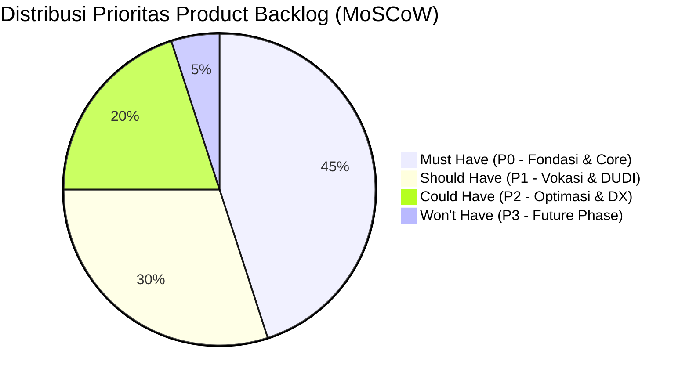
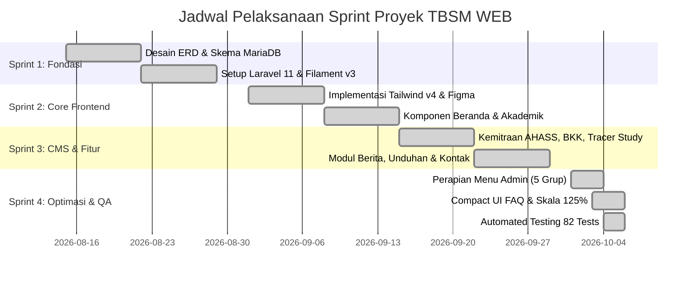
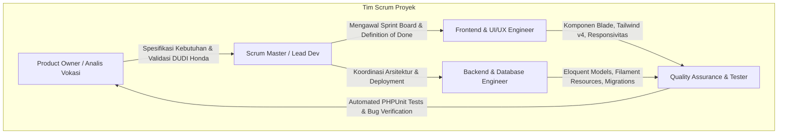
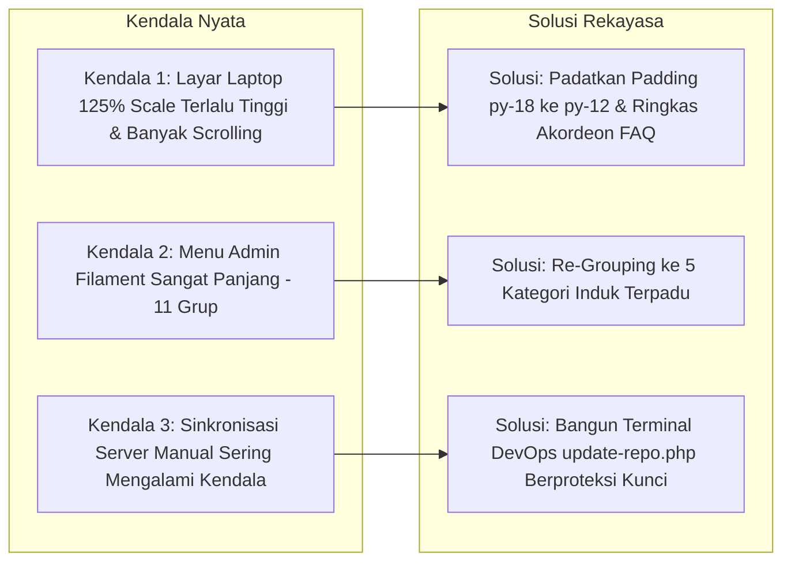

# LAPORAN PRESENTASI POIN 5
## PRODUCT BACKLOG, SPRINT BOARD, PEMBAGIAN TUGAS, SPRINT RETROSPECTIVE, DAN BUKTI IMPLEMENTASI

**Aplikasi:** TBSM WEB — Portal Informasi Vokasi & Bursa Kerja Khusus (BKK)  
**Institusi:** Konsentrasi Keahlian Teknik dan Bisnis Sepeda Motor (TBSM) — SMK Negeri 1 Bangsri  
**Kemitraan Industri:** Binaan Resmi PT Astra Honda Motor (AHM)  
**Metodologi:** Agile Scrum Framework (Sprint-Based Development)  

---

## 1. Product Backlog Terprioritas (Prioritized Product Backlog)

Manajemen kebutuhan proyek dikelola menggunakan metode **MoSCoW Prioritization** (*Must Have, Should Have, Could Have, Won't Have*) untuk menjamin fitur bernilai tinggi diselesaikan tepat waktu:



### Tabel Matriks Product Backlog Terprioritas:

> [!TIP]
> **Dokumentasi Lengkap 12 Poin Backlog:** Rincian narasi *User Story*, *Acceptance Criteria* (AC), model Eloquent, rute, dan estimasi *Story Points* untuk 12 poin backlog telah disusun lengkap di dokumen:  
> 📄 [`PRODUCT_BACKLOG_12_POIN.md`](PRODUCT_BACKLOG_12_POIN.md)

| Prioritas | Kode | User Story & Deskripsi Fitur | Kriteria Keberhasilan (Acceptance Criteria) | Status |
| :--- | :--- | :--- | :--- | :---: |
| **Must Have (P0)** | **PB-01** | Sebagai calon siswa, saya ingin melihat profil jurusan dan standar Astra Honda di beranda agar saya yakin memilih TBSM. | Hero slider tampil dinamis, metrik angka statistik sekolah terlihat, dan sambutan terbaca jelas. | **Done** |
| **Must Have (P0)** | **PB-02** | Sebagai pengelola sekolah, saya ingin memiliki panel CMS aman untuk mengelola data sekolah tanpa coding. | Admin login dengan otentikasi Bcrypt, menu dashboard terkelompok rapi, dan CRUD data berjalan lancar. | **Done** |
| **Must Have (P0)** | **PB-03** | Sebagai siswa, saya ingin melihat kurikulum dan daftar guru bengkel agar mengetahui kompetensi yang dipelajari. | Kurikulum AMTC tampil terstruktur dan direktori instruktur bersertifikasi BNSP/AHM muncul lengkap. | **Done** |
| **Must Have (P0)** | **PB-04** | Sebagai pengunjung, saya ingin mengirim pesan/pertanyaan via formulir kontak. | Formulir memiliki validasi lengkap, data masuk ke database, dan admin menerima notifikasi unread. | **Done** |
| **Should Have (P1)**| **PB-05** | Sebagai siswa tingkat akhir, saya ingin melihat informasi penempatan PKL dan loker bengkel resmi AHASS. | Direktori cabang AHASS muncul interaktif dan daftar loker BKK aktif dapat dilihat detailnya. | **Done** |
| **Should Have (P1)**| **PB-06** | Sebagai alumni, saya ingin melihat rekam jejak lulusan (Tracer Study) untuk jejaring alumni. | Data kebekerjaan (BMW) dan portofolio prestasi siswa peraih medali LKS tampil elegan. | **Done** |
| **Should Have (P1)**| **PB-07** | Sebagai publik, saya ingin membaca berita dan mengunduh silabus resmi sekolah. | Pencarian berita berfungsi instan, berkas unduhan dapat didownload dan jumlah unduhan tercatat. | **Done** |
| **Could Have (P2)** | **PB-08** | Sebagai pengguna laptop, saya ingin tampilan beranda dan FAQ lebih ringkas dan compact tanpa ruang kosong berlebih. | Section padding dirampingkan, kartu FAQ slim (5 item muat dalam 1 layar), tampilan di skala 125% proporsional. | **Done** |
| **Could Have (P2)** | **PB-09** | Sebagai administrator, saya ingin struktur menu admin rapi tidak terlalu panjang. | Menu admin dirampingkan dari 11 grup menjadi 5 grup terpadu (*Pengaturan Halaman, Akademik, Kemitraan, Publikasi, Layanan*). | **Done** |
| **Could Have (P2)** | **PB-10** | Sebagai DevOps/SysAdmin, saya ingin terminal sinkronisasi web server terproteksi password mandiri. | Terminal `update-repo.php` aman menggunakan `DEPLOY_KEY` khusus dan fitur rate-limit brute force. | **Done** |
| **Won't Have (P3)** | **PB-11** | Sistem pembayaran SPP online dan ujian CBT siswa terintegrasi. | Ditunda ke rilis versi 2.0 (fokus versi saat ini adalah portal profil vokasi, BKK, dan CMS). | **Deferred** |

---

## 2. Sprint Board & Alur Eksekusi Scrum (Sprint Execution)

Pengembangan sistem diselesaikan dalam **4 Sprint terukur**:



### Rincian Pencapaian per Sprint:
* **Sprint 1 (Fondasi Data & Arsitektur):**
  - Pembuatan 26 tabel migrasi MariaDB dengan foreign key cascade.
  - Konfigurasi Filament Admin Panel v3 dan otentikasi administrator.
* **Sprint 2 (Core Frontend & Integrasi Desain Figma):**
  - Penyusunan layout Blade responsif dengan Tailwind CSS v4.
  - Pembuatan komponen Beranda (Hero Slider, Statistik, Kurikulum, Fasilitas Bengkel).
* **Sprint 3 (Fitur Kejuruan Vokasi & Kemitraan DUDI):**
  - Implementasi direktori jaringan AHASS, lowongan kerja BKK, data prestasi, dan unduhan berkas.
  - Pembuatan formulir kontak publik dengan notifikasi badge panel admin.
* **Sprint 4 (Refinement, Usability Audit, & Testing):**
  - Audit laptop scaling 125%: Pemadatan padding section dan penataan ulang bagian FAQ agar compact.
  - Restrukturisasi menu admin Filament dari 11 grup panjang menjadi 5 grup ringkas.
  - Pelaksanaan automated testing komprehensif (82 test cases passed 100%).

---

## 3. Pembagian Peran & Matriks Tanggung Jawab Tim (RACI Matrix)

Proyek dikerjakan secara kolaboratif dengan pembagian tugas yang jelas:



| Anggota / Peran | Tanggung Jawab Utama | Kontribusi Konkret dalam Repositori |
| :--- | :--- | :--- |
| **Product Owner (PO)** | Menjaga keselarasan sistem dengan kebutuhan jurusan TBSM SMKN 1 Bangsri dan kurikulum AMTC PT Astra Honda Motor. | Dokumen Backlog, struktur kurikulum, data spesifikasi bengkel resmi AHASS. |
| **Scrum Master (SM)** | Memfasilitasi koordinasi sprint, memecahkan kendala teknis (Vite host binding, fontaine fallback), dan mengawal *Definition of Done (DoD)*. | Konfigurasi `vite.config.js`, git workflow management, penyusunan dokumentasi arsitektur. |
| **Frontend Engineer** | Mengimplementasikan desain Figma ke dalam komponen Blade modular, Tailwind CSS v4, dan micro-motion Alpine.js. | [`resources/views/frontend/`](file:///home/Rayy/Project/Github/TBSM%20WEB/toweb/resources/views/frontend/), komponen FAQ compact, mobile bottom navigation bar. |
| **Backend Engineer** | Mengembangkan skema basis data MariaDB, ORM Eloquent, Filament v3 Resources, FormRequest, dan Services. | [`app/Filament/`](file:///home/Rayy/Project/Github/TBSM%20WEB/toweb/app/Filament/), [`app/Models/`](file:///home/Rayy/Project/Github/TBSM%20WEB/toweb/app/Models/), [`database/migrations/`](file:///home/Rayy/Project/Github/TBSM%20WEB/toweb/database/migrations/). |
| **QA / Tester** | Menguji fungsionalitas end-to-end, responsivitas multi-device, dan menyusun automated test cases. | [`tests/Feature/`](file:///home/Rayy/Project/Github/TBSM%20WEB/toweb/tests/Feature/) (82 tests passed, 246 assertions). |

---

## 4. Sprint Review & Sprint Retrospective

Pada setiap akhir siklus sprint, tim menyelenggarakan sesi peninjauan (*Review*) dan evaluasi perbaikan (*Retrospective*):

### 4.1 Apa yang Berjalan dengan Sangat Baik (What Went Well)
1. **Penggunaan Filament v3 Menghemat Waktu:** Fitur Form Builder dan Table Builder bawaan Filament memangkas waktu pembuatan CMS hingga 60% dibandingkan coding CRUD manual dari nol.
2. **Automated Testing Menjaga Stabilitas:** Keberadaan 82 unit/feature test memastikan bahwa perombakan desain (seperti memadatkan FAQ dan merapikan grup menu admin) tidak merusak logika bisnis yang sudah ada (*zero regression*).
3. **Dokumentasi Terstruktur:** Diagram ERD, Flowchart, dan panduan sistem terdokumentasi rapi di folder `docs/` dan root repositori.

### 4.2 Kendala Nyata & Solusi yang Diterapkan (Challenges & Solutions)



1. **Kendala 1 (UI Scaling 125%):**
   * *Masalah:* Pada browser laptop penguji/guru dengan scaling default 125%, bagian FAQ dan section beranda memakan ruang vertikal terlalu besar sehingga hanya 2-3 pertanyaan yang terlihat.
   * *Tindakan Retrospective:* Melakukan refactoring pada [`faq.blade.php`](file:///home/Rayy/Project/Github/TBSM%20WEB/toweb/resources/views/components/frontend/home/faq.blade.php): padding dikurangi, ukuran heading disesuaikan ke `30px`, margin antar kartu dirampingkan ke `12px`. Hasilnya 5 pertanyaan terlihat sekaligus dengan tetap rapi dan tidak dempet.
2. **Kendala 2 (Sidebar Admin Kepanjangan):**
   * *Masalah:* Menu admin sebelumnya memiliki 11 grup navigasi dengan banyak grup yang hanya berisi 1 item tunggal, membuat sidebar harus di-scroll jauh.
   * *Tindakan Retrospective:* Mengelompokkan ulang ke 5 grup induk logis: *Pengaturan Halaman, Akademik & Profil, Kemitraan & Karir, Publikasi & Informasi, Pusat Layanan & Sistem*.
3. **Kendala 3 (Sinkronisasi Server Cepat):**
   * *Masalah:* Perlu cara praktis untuk mengupdate repo di server hosting tanpa harus selalu login via SSH terminal hitam.
   * *Tindakan Retrospective:* Membuat skrip mandiri `public/update-repo.php` yang diproteksi kata sandi `DEPLOY_KEY` untuk pull git, migrate, dan clear cache secara otomatis.

---

## 5. Bukti Keterkaitan Product Backlog dengan Implementasi Nyata

Berikut adalah bukti ketertelusuran (*Traceability Proof*) bahwa setiap item backlog berwujud nyata dalam baris kode proyek:

| ID Backlog | Modul Fungsional | Bukti File Kode Sumber di Repositori | Bukti Berkas Pengujian (PHPUnit) |
| :--- | :--- | :--- | :--- |
| **PB-01** | Beranda & Hero Slider | [`ManageHeroSlider.php`](file:///home/Rayy/Project/Github/TBSM%20WEB/toweb/app/Filament/Pages/ManageHeroSlider.php) & [`hero.blade.php`](file:///home/Rayy/Project/Github/TBSM%20WEB/toweb/resources/views/components/frontend/home/hero.blade.php) | [`HeroSliderTest.php`](file:///home/Rayy/Project/Github/TBSM%20WEB/toweb/tests/Feature/HeroSliderTest.php) |
| **PB-02** | Panel Admin & Otentikasi | [`AdminPanelProvider.php`](file:///home/Rayy/Project/Github/TBSM%20WEB/toweb/app/Providers/Filament/AdminPanelProvider.php) | [`CmsModelTest.php`](file:///home/Rayy/Project/Github/TBSM%20WEB/toweb/tests/Feature/CmsModelTest.php) |
| **PB-03** | Kurikulum & Guru | [`ProgramResource.php`](file:///home/Rayy/Project/Github/TBSM%20WEB/toweb/app/Filament/Resources/Programs/ProgramResource.php) & [`TeacherResource.php`](file:///home/Rayy/Project/Github/TBSM%20WEB/toweb/app/Filament/Resources/Teachers/TeacherResource.php) | [`AcademicModelTest.php`](file:///home/Rayy/Project/Github/TBSM%20WEB/toweb/tests/Feature/AcademicModelTest.php) |
| **PB-04** | Formulir Kontak | [`ContactController.php`](file:///home/Rayy/Project/Github/TBSM%20WEB/toweb/app/Http/Controllers/ContactController.php) & [`contact_messages`](file:///home/Rayy/Project/Github/TBSM%20WEB/toweb/app/Models/ContactMessage.php) | [`FrontendPublicTest.php`](file:///home/Rayy/Project/Github/TBSM%20WEB/toweb/tests/Feature/FrontendPublicTest.php) |
| **PB-05** | Mitra Industri & Loker | [`IndustryPartnerResource.php`](file:///home/Rayy/Project/Github/TBSM%20WEB/toweb/app/Filament/Resources/IndustryPartners/IndustryPartnerResource.php) & [`JobVacancyResource.php`](file:///home/Rayy/Project/Github/TBSM%20WEB/toweb/app/Filament/Resources/JobVacancies/JobVacancyResource.php) | [`JobVacancyCmsTest.php`](file:///home/Rayy/Project/Github/TBSM%20WEB/toweb/tests/Feature/JobVacancyCmsTest.php) |
| **PB-06** | Tracer Study Alumni | [`AlumniResource.php`](file:///home/Rayy/Project/Github/TBSM%20WEB/toweb/app/Filament/Resources/Alumnis/AlumniResource.php) & [`alumni.blade.php`](file:///home/Rayy/Project/Github/TBSM%20WEB/toweb/resources/views/frontend/alumni.blade.php) | [`AlumniCmsTest.php`](file:///home/Rayy/Project/Github/TBSM%20WEB/toweb/tests/Feature/AlumniCmsTest.php) |
| **PB-07** | Berita & Pengumuman | [`PostResource.php`](file:///home/Rayy/Project/Github/TBSM%20WEB/toweb/app/Filament/Resources/Posts/PostResource.php) & [`AnnouncementResource.php`](file:///home/Rayy/Project/Github/TBSM%20WEB/toweb/app/Filament/Resources/Announcements/AnnouncementResource.php) | [`FrontendRouteTest.php`](file:///home/Rayy/Project/Github/TBSM%20WEB/toweb/tests/Feature/FrontendRouteTest.php) |
| **PB-08** | Compact UI FAQ | [`faq.blade.php`](file:///home/Rayy/Project/Github/TBSM%20WEB/toweb/resources/views/components/frontend/home/faq.blade.php) | Visual Browser Audit & `FrontendPublicTest` |
| **PB-09** | 5 Grup Menu Admin | [`AdminPanelProvider.php`](file:///home/Rayy/Project/Github/TBSM%20WEB/toweb/app/Providers/Filament/AdminPanelProvider.php) | Tinker Verified Navigation Structure |

---

## 6. Panduan Demonstrasi Manajemen Proyek di Depan Penguji

Saat penguji meminta bukti untuk **Poin 5**:

1. **Jelaskan Metodologi Kerja Tim:**
   *"Kami membagi pengembangan sistem ke dalam 4 Sprint berbasis Scrum. Setiap fitur dipetakan dari Product Backlog menggunakan prioritas MoSCoW. Fitur krusial diselesaikan pada Sprint 1-2, disusul fitur kejuruan vokasi pada Sprint 3, dan optimasi usability, perapian menu admin, serta automated testing pada Sprint 4."*
2. **Tunjukkan Bukti Git Commit History:**
   Buka terminal dan ketik:
   ```bash
   git log --oneline -n 10
   ```
   Tunjukkan histori commit nyata yang menunjukkan perkembangan fitur secara teratur (*iterative development*).
3. **Tunjukkan Hasil Retrospective yang Baru Saja Diterapkan:**
   - Perlihatkan bagaimana keluhan menu admin yang terlalu panjang (11 grup) berhasil diselesaikan menjadi 5 grup terstruktur rapi.
   - Perlihatkan bagaimana bagian FAQ beranda dioptimasi menjadi ringkas dan ramah terhadap laptop dengan skala 125%.
